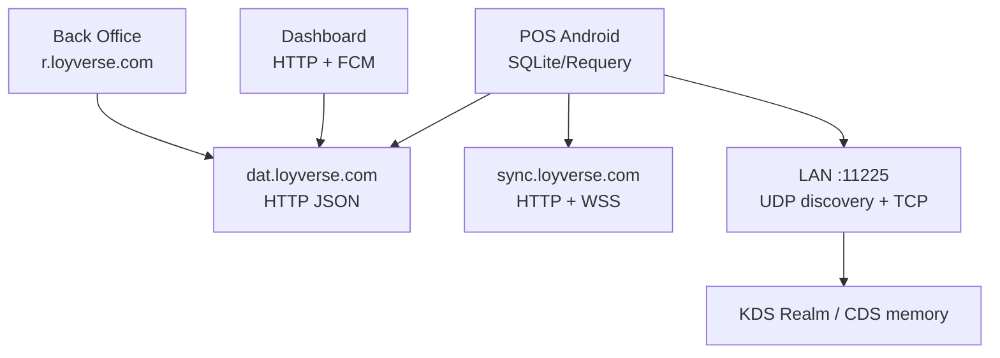
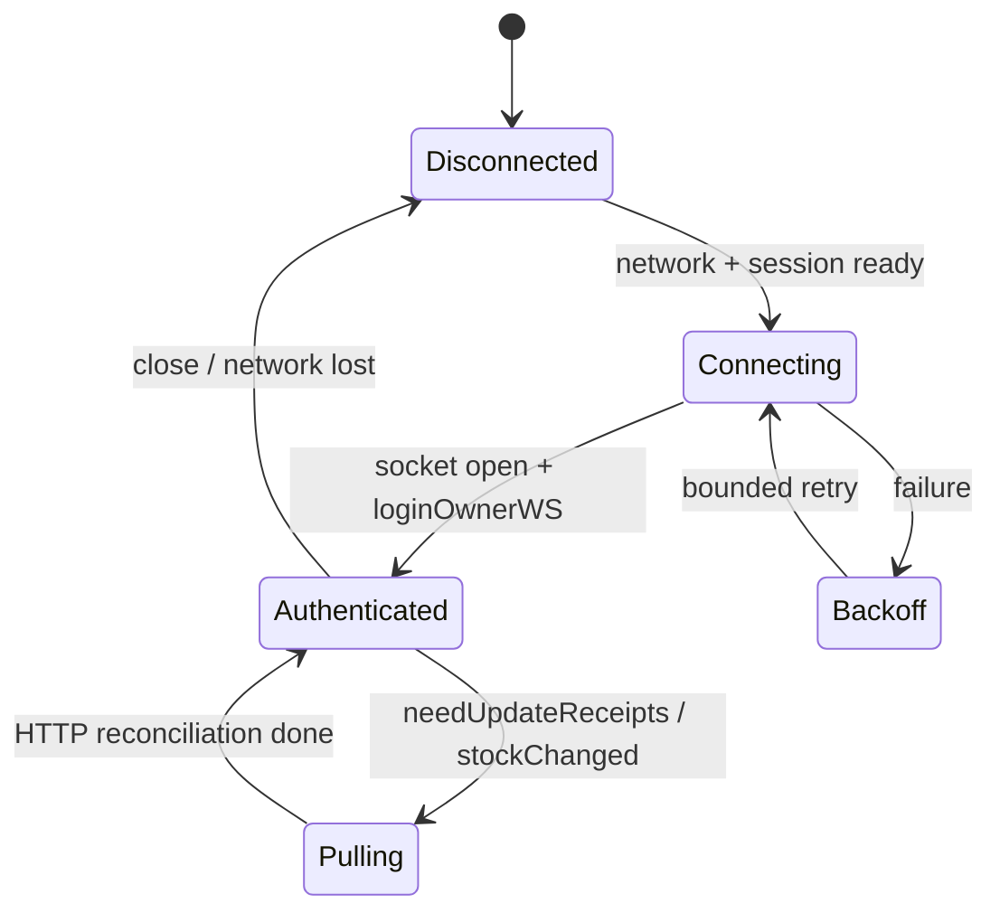
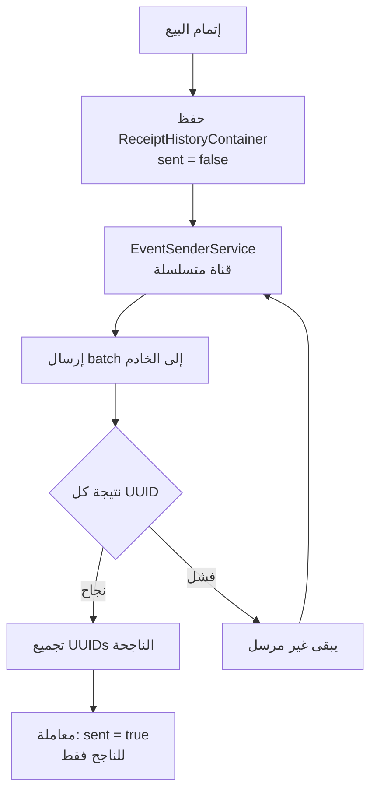

# دراسة البنية التقنية الفعلية لمنظومة Loyverse

## المرحلة الثانية فقط: المكتبات، التخزين المحلي، بروتوكولات الاتصال، DNS، وآليات المزامنة

| بند | القيمة |
|---|---|
| تاريخ لقطة الدراسة | 16 أغسطس 2026، بتوقيت الرياض |
| النطاق | Loyverse POS، Dashboard، KDS، CDS، وواجهة تسجيل الدخول العامة لـBack Office |
| نوع الدراسة | تحليل ساكن للحزم والموارد والشفرة المفككة، مع قياسات DNS وHTTP عامة، ومطابقة السلوك مع وثائق Loyverse الرسمية |
| المنصات المفككة فعلياً | Android؛ أربع حزم مستقلة |
| منصة الويب المفحوصة | واجهة الدخول العامة عند `https://r.loyverse.com`؛ من دون جلسة Back Office موثقة |
| خارج نطاق هذا الملف | كتالوج نقاط API، نمذجة موارد الخادم، Webhooks، وتفاصيل بوابات الدفع والطابعات والفوترة؛ هذه موضوع المرحلة الثالثة |

> هذه لقطة تقنية مرتبطة بالإصدارات والتاريخ أعلاه. لا تُعامل المكتبة الموجودة داخل APK على أنها جزء من قلب التطبيق تلقائياً؛ يميّز التقرير بين الاستخدام المباشر، وSDK مضمّن، واعتماد انتقالي لم تُثبت له علاقة بتخزين Loyverse الأساسي.

## 1. الخلاصة التنفيذية

1. **POS على Android تطبيق Kotlin/Java أصلي متعدد الطبقات**، يجمع واجهات Android التقليدية مع Jetpack Compose. قلب بياناته المحلي مبني على **SQLite عبر Requery ORM**، لا على Room. توجد Room وSQLDelight داخل الحزمة لأن بعض SDKs المضمّنة تستخدمهما، ولا يدل وجودهما على أن قاعدة POS المركزية مبنية عليهما.
2. يتعايش في POS **مساران للاتصال السحابي**: مسار أوامر أقدم يرسل JSON عبر OkHttp إلى `https://dat.loyverse.com`، ومسار أحدث مبني على Ktor تحت `https://dat.loyverse.com/pos/v1/`. كما يستخدم `wss://sync.loyverse.com/ws` للإشعارات الفورية وتحفيز سحب التغييرات، بينما تبقى البيانات الموثوقة منقولة عبر HTTP.
3. نموذج POS هو **local-first للعمليات المسموح بها دون اتصال**: تُكتب الإيصالات والأحداث محلياً أولاً مع علامات إرسال، ثم تُرسل على نحو متسلسل؛ لا تُعلَّم إلا العناصر التي أقر الخادم نجاحها. التذاكر المفتوحة تحتفظ بمعرّف مزامنة، وطابع حفظ، وآثار الحذف، وتدخل في تسوية معاملات محلية عند عودة الاتصال.
4. **KDS وCDS لا يتلقيان حركة الطلب المعتادة من السحابة**. يكتشفهما POS عبر UDP على المنفذ `11225`، ثم يتخاطب معهما عبر TCP على المنفذ نفسه، بإطارات شبيهة بـHTTP وJSON يمكن تشفيره بعد اقتران Diffie–Hellman/AES.
5. يستخدم KDS **Realm Kotlin** محلياً لحفظ الطلبات وحالتها؛ يستخدم CDS ذاكرة تشغيلية و`SharedPreferences` لمفاتيح الاقتران فقط؛ ويستخدم Dashboard `SharedPreferences` لحالة الحساب والإعدادات، ولم تظهر له قاعدة أعمال محلية أو طابور معاملات دون اتصال.
6. واجهة دخول Back Office الحالية مبنية على **AngularJS 1.8.3 وAngular Material 1.2.5** داخل حزمة Webpack مصغّرة. هذا إثبات لصدفة الدخول العامة فقط، وليس تعميماً غير مشروط على كل صفحات الجلسة الموثقة.
7. في لقطة DNS، كانت `dat` و`sync` و`r` أسماءً مستعارة إلى نطاقات `*.prod.eu.loyverse.com`، وتُحل إلى ثلاث عقد EC2 في `eu-central-1`، مع DNS مدار عبر Amazon Route 53. كوكيز `AWSALB` على `dat` قرينة مباشرة على موزع حمل AWS أمام الخدمة.

## 2. منهج الإثبات ودرجات الثقة

### 2.1 درجات الدليل

| الدرجة | مصدر الإثبات | ما تعنيه في هذا التقرير |
|---|---|---|
| A — مباشر | Manifest وDEX والموارد وBuildConfig وملفات إعداد مضمّنة وشيفرة مفككة من الحزمة ذات البصمة المذكورة | الخاصية موجودة في تلك الحزمة، أو يستدعيها مسار تطبيق محدد |
| B — قياس حي | DNS وHTTP والصفحة العامة المقاسة في 16 أغسطس 2026 | الحالة المنشورة وقت القياس؛ يمكن أن تتغير بعده |
| C — رسمي سلوكي | مركز مساعدة Loyverse وصفحات Google Play وApp Store | سلوك أو متطلب تعلنه Loyverse، من دون كشف التنفيذ الداخلي بالضرورة |
| D — استنتاج محدود | تركيب أكثر من دليل A/B/C | يُذكر صراحة بوصفه استنتاجاً، ولا يُرفع إلى حقيقة مفككة |

### 2.2 تصنيف وجود المكتبات

| التصنيف | معيار الإدراج | مثال |
|---|---|---|
| قلب التطبيق | استدعاءات من حزم Loyverse أو إعداد صريح للمكوّن | Requery في POS، Realm في KDS، OkHttp/Ktor في طبقات الاتصال |
| SDK مضمّن ومفعّل | مكوّنات Manifest أو ملفات إعداد أو استدعاءات دمج واضحة | Firebase، FullStory، Intercom، Stripe Terminal، Zettle |
| اعتماد انتقالي | أصناف موجودة في DEX لكن استخدامها يعود إلى SDK آخر، لا إلى نموذج أعمال Loyverse | Room وSQLDelight داخل وحدات الدفع/القياس |

فُكّت Binary AndroidManifest والموارد، وفُهرست ملفات DEX والأصناف والسلاسل، ثم فُككت مسارات التطبيق القابلة للتسمية بواسطة JADX 1.5.3. حُسبت البصمات من ملفات العينات نفسها. وفي الويب حُفظت استجابة HTML وملف البيئة وحزمة JavaScript ثم حُسبت بصماتها، بينما استُعلم DNS من محللين عامين منفصلين.

### 2.3 حدود الإثبات التقنية

- تحليل Android يثبت محتوى **الحزمة الأساسية** المستخرجة. بعض التطبيقات تعلن تقسيمات ABI والكثافة؛ لذلك غياب ملف `.so` من base APK لا يثبت غيابه من الحزمة المثبتة كاملة.
- لم تُحلّل ملفات IPA. ما يخص iOS في هذا الملف يقتصر على معرّفات الحزم والإصدارات والحدود الدنيا المنشورة في App Store، وعلى السلوك المشترك الذي تعلنه وثائق Loyverse.
- لم تُستخدم بيانات دخول في Back Office؛ لذا فحص الويب يثبت صدفة الدخول العامة وملفات البيئة التي تُحمّل قبل المصادقة فقط.
- قياس TLS المباشر من بيئة الفحص مرّ عبر وسيط CONNECT يقدّم شهادته الخاصة؛ لذلك لا ينسب التقرير مُصدر شهادة أو cipher إلى خوادم Loyverse. إثبات HTTPS/WSS مستمد من عناوين البناء وسياسة أمان الشبكة، لا من شهادة الوسيط.

## 3. الحزم المفحوصة وهوية البناء

### 3.1 حزم Android

| التطبيق | Package | الإصدار | versionCode | minSdk / targetSdk / compileSdk | الحجم | SHA-256 |
|---|---|---:|---:|---:|---:|---|
| POS | `com.loyverse.sale` | `2.73.1` | `419` | `24 / 36 / 36` | 106,333,214 بايت | `a6307d2aac4156634209b96c59b1acc098f89c995c5d7152279a1db9117525bd` |
| Dashboard | `com.loyverse.dashboard` | `1.13` | `37` | `21 / 36 / 36` | 6,959,326 بايت | `0c74167207b06f0cf3b1f9447488c7eec8c9bcc18c250a74115c1a8a763a7ba0` |
| KDS | `com.loyverse.kds` | `1.9` | `27` | `19 / 36 / 36` | 7,468,924 بايت | `6b4d158e11d0a2d00eb25254234b360a9d87f722053c4eab1d29533188b96448` |
| CDS | `com.loyverse.cds` | `1.8` | `22` | `19 / 36 / 36` | 7,397,450 بايت | `6c71804ebc66a4b8590758e662ec0c8d5e1a93efd8a447789e120be53a91c764` |

بصمات MD5 المساعدة للتحقق من تطابق ملفات العينة هي، بالترتيب نفسه: `661bc4f97efa39b72bf3b80a76b27db8`، `a216d46485c451a6eaed5adbebb499fe`، `593d8d7bd8d37b4339f740eb227d311f`، و`474108ce7e0dfea6f0fd0e457a0aaf0f`.

### 3.2 شهادة توقيع Android

تتشارك الحزم الأربع الشهادة نفسها:

| خاصية | القيمة المرصودة |
|---|---|
| SHA-256 لشهادة DER | `6ec2faea6ca7f3f2729fdb1dc8b85ce37bff97e6a8a8b470cea54a24b0f7919c` |
| Subject / Issuer | `CN=Unisystem, OU=Unisystem, O=Unisystem, L=Kyiv, ST=Unknown, C=UA` |
| نوع المفتاح | RSA |
| بداية الصلاحية | 4 ديسمبر 2013، 17:41:48 UTC |
| نهاية الصلاحية | 19 سبتمبر 2287، 17:41:48 UTC |

تطابق الشهادة دليل A على أن التطبيقات الأربع في العينات تنتمي إلى سلسلة توقيع Android واحدة.

### 3.3 ملفات ABI الأصلية

لم تحتو base APKs المفحوصة على مسار `lib/<abi>/*.so`. يعلن POS وKDS أن ABI split مطلوب، ولذلك لا تعني هذه النتيجة أن تثبيت Play الكامل خالٍ من native libraries؛ Realm وبعض SDKs قد تجلب JNI من split منفصل. لم يُنسب أي اسم native library إلى التطبيق من دون ملف split فعلي.

### 3.4 لقطة iOS المنشورة

| التطبيق | Bundle ID المنشور | الإصدار الظاهر في تاريخ الدراسة | الحد الأدنى المنشور |
|---|---|---:|---|
| POS | `com.loyverse.posapp` | `3.17` | iOS/iPadOS 15 |
| Dashboard | `com.loyverse.dashboard` | `1.31` | iOS/iPadOS 15 |
| KDS | `com.loyverse.kds` | `1.21` | iPadOS 12 |
| CDS | `com.loyverse.cds` | `1.15` | iOS/iPadOS 10 |

هذه البيانات موثقة في صفحات [POS](https://apps.apple.com/us/app/loyverse-pos-point-of-sale/id1070865387)، و[Dashboard](https://apps.apple.com/us/app/loyverse-dashboard-for-pos/id1046519533)، و[KDS](https://apps.apple.com/us/app/loyverse-kds-kitchen-display/id1218352383)، و[CDS](https://apps.apple.com/us/app/loyverse-cds-customer-display/id1273975167). لا توجد في هذه اللقطة أدلة ثنائية تكفي لإسناد مكتبات Android أو تنفيذه التخزيني إلى iOS.

## 4. الخريطة التقنية العامة



الأسهم تمثل مسارات اتصال مثبتة في العينات أو الواجهة العامة، ولا تعني أن كل مكوّن يستعمل مجموعة الأوامر نفسها.

# الجزء الأول: بنية تطبيقات Android

## 5. Loyverse POS

### 5.1 شكل التطبيق والبناء

| البند | النتيجة المباشرة |
|---|---|
| نقطة Application | `com.loyverse.AndroidApplication` |
| عدد ملفات DEX | 12 |
| عدد الأصناف التقريبي في العينة | 74,780 |
| لغة/نمط التنفيذ | Kotlin وJava؛ Coroutines وRxJava متعايشان |
| الحقن الاعتمادي | Dagger 2.57.2 |
| الواجهة | Android Views مع Jetpack Compose؛ ليست إعادة كتابة Compose كاملة |
| نمط الطبقات | حزم `presentation` و`domain` و`data` مع وحدات Dagger ومستودعات وحالات استخدام |
| التوجيه والحالة | AndroidX Navigation/Lifecycle، مع Paging في أجزاء القوائم |
| JVM المستهدف | Java 17 ظاهر في بيانات البناء |
| Build toolchain | Android Gradle Plugin 8.13.2، Gradle 8.14.3، Kotlin 2.2.0 |
| النسخ الاحتياطي | `allowBackup=false` |
| RTL | `supportsRtl=true` |
| الذاكرة | `largeHeap=true` |

### 5.2 مكتبات قلب POS المثبتة

| المجال | المكتبة/الإصدار المرصود | موضع الاستخدام الفعلي |
|---|---|---|
| قاعدة الأعمال المحلية | Requery ORM فوق SQLite | إنشاء `loyverseDB`، مخزن كيانات متزامن وآخر Coroutines، ومعاملات المستودعات |
| HTTP حديث | Ktor Client + OkHttp engine | عميل `/pos/v1/`، plugins للمصادقة والمهل وإعادة المحاولة والتسلسل |
| HTTP قديم/خاص | OkHttp | POST لأظرف الأوامر، long polling، وWebSocket |
| تسلسل البيانات | Gson وKotlinx Serialization JSON | Gson في المسار الأقدم وLAN/DTOs؛ Kotlinx JSON في عميل Ktor |
| عدم التزامن | Kotlin Coroutines 1.10.2 وRxJava | الخدمات المتسلسلة والمستودعات الحديثة، مع سلاسل Rx في المزامنات الأقدم |
| DI | Dagger 2.57.2 | وحدات البيانات والاتصال وحالات الاستخدام |
| الواجهة | Compose UI/Foundation/Material 1.9.2، Material3 1.4.0، Material Components 1.13.0 | شاشات حديثة إلى جانب Views القديمة |
| AndroidX | Navigation 2.9.3، Paging 3.3.6، Lifecycle 2.9.4، Core KTX 1.17.0 | التنقل ودورة الحياة والقوائم |
| صور ورسوم | Coil، Glide، Lottie | تحميل الصور والحركات |
| مسح الأكواد | ZXing | قراءة الباركود/QR |
| مراسلة وقياس | Firebase Analytics 22.5.0، Crashlytics، Messaging، Performance، Remote Config | قياس الأعطال والأداء والرسائل والإعداد البعيد |
| حماية تفاعلية | reCAPTCHA 18.9.2 | مكوّن حماية مضمّن |
| دعم/تسجيل جلسة | Intercom، Sentry، FullStory 1.64.1 | الدعم، الأخطاء، وتسجيل الجلسة وفق الإعداد المضمّن |

### 5.3 FullStory المضمّن

يحتوي `assets/fs-config.properties` على إعداد فعّال لمنطقة FullStory الأوروبية:

| المفتاح | القيمة/السلوك |
|---|---|
| المضيف | `eu1.fullstory.com` |
| ingestion | `mr.eu1.fullstory.com` |
| التطبيق | `app.eu1.fullstory.com` |
| معرّف المؤسسة العام في الإعداد | `o-Y1S-eu1` |
| التشغيل التلقائي للتسجيل | `RECORD_ON_START=false` |
| تقارير الأخطاء | `BUG_REPORTING_ENABLED=true` |
| حقن WebView | `WEBVIEW_INJECTION=true` |
| تكامل OkHttp | `OKHTTP_SUPPORT=true` |

الدليل يثبت وجود SDK وإعداده، ولا يثبت أن كل جلسة تُسجل؛ التشغيل يخضع لحالة runtime والإعداد البعيد والموافقة المتاحة في التطبيق.

### 5.4 SDKs الدفع الموجودة في الحزمة

ظهرت حزم ومكوّنات Manifest لـZettle/iZettle وStripe Terminal وStripe Tap to Pay/BBPOS وSaltPay/Teya وPayPal. هذا القسم يثبت **وجود وحدات الدمج داخل POS** فقط. لا يفصّل نقاطها النهائية أو نماذجها أو تدفقاتها، لأن تحليل التكاملات التفصيلي يقع في المرحلة الثالثة.

### 5.5 الاعتمادات الانتقالية التي لا تمثل قاعدة POS الأساسية

| المكتبة الموجودة | سبب عدم نسبتها إلى قلب التخزين |
|---|---|
| Room 2.6.1 وAndroidX SQLite 2.4.0 | مخططات Room المرصودة تخص، ضمن ما أمكن تسميته، `com.stripe.offlinemode.storage.OfflineDatabase` بإصدارات مخطط 1–7 |
| SQLDelight | أصنافها موجودة داخل وحدات SDK، من دون إنشاء قاعدة أعمال Loyverse منها |
| DataStore 1.1.3 | أجزاء Firebase Sessions/SDKs تستخدمه؛ إعدادات POS المسماة وقلبه يعتمدان Requery وSharedPreferences |
| WorkManager 2.9.1 | مكوّناته موجودة ويستخدمها بعض SDKs/المهام؛ خدمة إرسال أحداث POS الأساسية مبنية على Channel/Coroutine وليست دليلاً على طابور WorkManager مركزي |
| Retrofit، Moshi، Wire، Protobuf، Java-WebSocket | موجودة في الرسم الاعتمادي المضمّن؛ مسارات Loyverse المثبتة هنا تستخدم Ktor/OkHttp وGson/Kotlinx وOkHttp WebSocket |

### 5.6 صلاحيات وأجهزة تكشف حدود البنية

يطلب POS صلاحيات الإنترنت وحالة الشبكة والـWi‑Fi والكاميرا وBluetooth القديم والجديد وNFC والموقع والإشعارات وForeground Service من نوع data sync واستقبال الإقلاع وWake Lock والتخزين القديم وحالة الهاتف. ويعلن Bluetooth وUSB Host/Accessory والكاميرا وNFC والميكروفون وWi‑Fi والاتجاه الأفقي كميزات **غير إلزامية**. وجود `com.pax.permission.PRINTER` يثبت دعماً مضمّناً لبيئة PAX في هذه الحزمة، من دون تفصيل بروتوكول الطابعة في هذه المرحلة.

### 5.7 مقارنة مجموعات الصلاحيات

| التطبيق | الصلاحيات ذات الدلالة المعمارية |
|---|---|
| POS | Internet/Network/Wi‑Fi، Camera، Bluetooth/Connect/Scan، NFC، Location، Notifications، Foreground Data Sync، Boot، Wake Lock، legacy storage، Phone State |
| Dashboard | Internet/Network، Notifications، Vibrate، Wake Lock، FCM receive، Advertising ID |
| KDS | Internet/Network/Wi‑Fi، Read External Storage القديمة، Reorder Tasks، Wake Lock، Advertising ID |
| CDS | Internet/Network/Wi‑Fi، Wake Lock، Advertising ID |

لا يطلب KDS أو CDS صلاحية اكتشاف أجهزة قريبة عبر Bluetooth لأن بروتوكولهما المرصود IP/UDP/TCP على Wi‑Fi.

## 6. Loyverse Dashboard

### 6.1 البنية والمكتبات

| المجال | النتيجة |
|---|---|
| Application | تطبيق Android أصلي صغير مقارنة بـPOS |
| DI | Dagger 2.51.1 |
| التزامن | RxJava 1.3.8؛ وتوجد Coroutines داخل الاعتمادات |
| HTTP | OkHttp فعلي؛ Ktor/Gson/Protobuf موجودة في الحزمة بدرجات مختلفة |
| الرسوم | MPAndroidChart، نحو 221 صنفاً في البصمة المفككة |
| الصور | Glide |
| القياس/الإشعارات | Firebase Analytics 22.0.2، Crashlytics، Messaging، Performance |
| UI | Material Components 1.12، Core KTX 1.13 |
| أداة البناء | Android Gradle Plugin 8.5.2 |
| التخزين | `SharedPreferences` باسم `data`؛ لم تظهر قاعدة أعمال محلية ينشئها التطبيق |

وجود DataStore 1.0.0 يعود إلى Firebase Sessions في العينة؛ ليس هناك دليل على أن Dashboard ينقل بيانات تقاريره إلى مخزن DataStore محلي.

### 6.2 نموذج العمل

- يرسل طلبات JSON مضغوطة gzip إلى `https://dat.loyverse.com:443` عبر OkHttp.
- يطلب `Keep-Alive` ويضع `Content-Encoding: gzip` و`Content-Type: application/json`.
- يستخدم أظرف أوامر تحتوي نسخة التطبيق/العلامة والطابع الزمني، ويشتق `cookieHash` من cookie مع الطابع الزمني بالطريقة نفسها الموجودة في العميل القديم لـPOS.
- يستقبل FCM في `StockPushService`. الحمولة المرصودة من النوع `wares_updated` وتحمل بيانات المخزون والمنفذ؛ تُحوّل إلى خدمة/إشعار محلي.
- لا تظهر آلية طابور معاملات أعمال غير متصلة. المخزن المحلي يحفظ الحساب وبعض التنسيق والثيم وحالة الإشعارات، بينما التقارير نفسها network-first.

## 7. Loyverse KDS

### 7.1 البنية والمكتبات

| المجال | النتيجة |
|---|---|
| Application | `com.loyverse.kds.core.BaseApplication` |
| قاعدة البيانات | Realm Kotlin؛ ملف `default.realm`، schema version `2` |
| مخطط Realm | `OpenReceipt`، `ReceiptItem`، `Variant`، `DiningOption`، `Voided`، `Option` |
| DI | Dagger 2.51.1 |
| التزامن | Kotlin Coroutines 1.8.0 مع RxJava |
| الاتصال | OkHttp/Gson للسحابة وJava NIO/Socket للشبكة المحلية |
| UI | Material 1.12، Core KTX 1.13، Lifecycle 2.8.7 |
| القياس | Firebase Analytics 21.0 وCrashlytics 18.2.11 |
| أداة البناء | Android Gradle Plugin 8.13.2 |
| النسخ الاحتياطي/RTL/cleartext | `allowBackup=false`، `supportsRtl=false`، `usesCleartextTraffic=false` |

توجد وحدة Realm Sync ضمن الاعتماد الثنائي، لكن إعداد التطبيق المرصود يبني **Realm محلياً** من `RealmConfiguration`، ولا يحتوي على App Services/Atlas endpoint. لذلك لا يُنسب تزامن الطلبات إلى Realm Cloud.

### 7.2 ما يخزنه KDS

إلى جانب طلبات Realm، يستخدم ملف `SharedPreferences` باسم `settings` للمفاتيح التالية:

- `owner_id` و`cookie` و`account_email`.
- `display_name`.
- `warning_seconds` بقيمة افتراضية `240` ثانية.
- `late_seconds` بقيمة افتراضية `420` ثانية.
- `enable_sound` افتراضياً `true`.
- `enable_dark_theme`.
- URI ونص نغمة التنبيه.

تتطابق قيم 240/420 مع الإعدادين المنشورين في [دليل إعداد KDS](https://help.loyverse.com/help/kds-configuration).

## 8. Loyverse CDS

### 8.1 البنية والمكتبات

| المجال | النتيجة |
|---|---|
| Application | `com.loyverse.cds.AndroidApplication` |
| قاعدة أعمال محلية | لم تظهر قاعدة SQLite/Realm ينشئها CDS |
| حالة العرض | كائنات/Subjects في الذاكرة طوال الجلسة |
| التخزين الدائم | `SharedPreferences` باسم `preferences` لمادة الاقتران وهوية الطرف |
| الاتصال | UDP/TCP محلي، Gson، OkHttp/Ktor كاعتمادات مضمّنة |
| التزامن | Coroutines 1.7.1 وRxJava |
| UI | Material 1.12، Core KTX 1.13، Glide |
| القياس | Firebase Analytics 21.6.2، Crashlytics، Performance، Remote Config |
| أداة البناء | Android Gradle Plugin 8.5.0 |
| النسخ الاحتياطي/RTL/cleartext | `allowBackup=false`، `supportsRtl=true`، `usesCleartextTraffic=true` |

### 8.2 ما يبقى بعد إغلاق CDS

يحفظ التطبيق `private_key` و`remote_key` و`remote_device`، ممثلةً كمادة BigInteger/hex ومعرّف جهاز بعيد. أما التذكرة والعميل وحالة الدفع المعروضة فتُدار في الذاكرة ويعيد POS إرسال الحالة عند الاتصال. هذا يفسر تقنياً قدرة CDS على العمل من خلال LAN بلا اتصال سحابي، وهي خاصية تعلنها أيضاً [صفحة CDS في Google Play](https://play.google.com/store/apps/details?id=com.loyverse.cds).

# الجزء الثاني: Back Office وتقنيات الويب

## 9. واجهة الدخول العامة لـBack Office

### 9.1 العينة المقاسة

| العنصر | النتيجة في 16 أغسطس 2026 |
|---|---|
| العنوان | `https://r.loyverse.com` |
| HTML | 1,263 بايت؛ SHA-256: `f9518ac17a5f0ad471e49ff06389fb84ce037bb92e24c81c0c840fd51ef6c97c` |
| بنية الصفحة | `ng-app="loginApp"`، و`ui-view`، وثيم `md-theme="green-theme"` |
| حزمة التطبيق | `login.bundle.1481ec769812176e2af9.js` |
| حجم JavaScript | 901,155 بايت في القياس |
| SHA-256 للحزمة | `86752a71d7ff7c19000dccaae582ee382d403487e25c60ad0efe069b99f05c97` |
| نمط التجميع | Webpack؛ JavaScript مصغّر |
| خريطة المصدر | إشارة `sourceMappingURL` موجودة، لكن المسار المنشور أعاد `403 Forbidden` بحجم 153 بايت بدلاً من source map قابلة للاستخدام |
| خادم HTTP الظاهر | `nginx/1.31.3` في ترويسة الاستجابة |
| التخزين المؤقت | HTML بـ`Cache-Control: no-store`؛ ملف البيئة بقيمة إعادة تحقق فورية |

### 9.2 المكتبات المثبتة داخل حزمة الدخول

| المكتبة | الإصدار/الدليل |
|---|---|
| AngularJS | 1.8.3 |
| Angular Material | 1.2.5 |
| angular-translate | 2.19.1 |
| Lodash | قيمة النسخة المضمّنة `4.18.1` |
| UI-Router | وحدة AngularJS للتوجيه داخل الصفحة |
| LocalStorageModule | تخزين محلي مع cookie fallback |
| vcRecaptcha | تكامل reCAPTCHA |
| Angular modules | `ngCookies`، `ngAnimate`، `ngAria`، `ngMessages`، `ngSanitize` |
| Sentry Browser | CDN version 7.114.0 مع حزمة تهيئة Loyverse ذات hash البناء نفسه |
| الخط | Google Fonts Roboto |

تُظهر بيانات build المطبوعة من الحزمة: الفرع `release/2026-08-14`، النسخة `2026-08-14`، وdistribution `1754`. هذه معلومات build لواجهة الدخول المنشورة، وليست رقم إصدار تطبيق Android.

### 9.3 التخزين والبيئة قبل المصادقة

- إعداد LocalStorageModule الافتراضي يستخدم prefix باسم `ls`، و`localStorage`، مع fallback إلى cookie بعمر 30 يوماً ومسار `/`.
- تستعمل واجهة Loyverse الوحدة لحفظ اختيار اللغة.
- تُحمّل الواجهة `/env.json` من الأصل نفسه. ملف البيئة المقاس حجمه 1,018 بايت وبصمته `7e7c0be214e2dc114558d0c5dc03fde46462ca59cf56fad08c58d014c946e13f`، ويشير إلى خدمات Mixpanel وGoogle Analytics وChargebee EU وStripe وIntercom وSentry وUnleash و`store.loyverse.com`.
- لا يعيد التقرير نشر مفاتيح أو رموز إعداد الواجهة. وجودها يثبت عمليات الدمج، لكنه لا يثبت أن كل خدمة تستقبل كل حدث.
- الاستدعاءات التي ظهرت في حزمة الدخول relative إلى الأصل نفسه وتبدأ بمسارات مثل `/data/*`، وتشمل تسجيل الدخول والتسجيل واستعادة كلمة المرور. كتالوج المسارات والحمولات خارج نطاق المرحلة الثانية.

### 9.4 ما لا يثبته هذا الفحص

لا تسمح صدفة الدخول وحدها بالجزم بأن كل شاشة داخل Back Office تستخدم الحزمة نفسها أو أن صفحات ما بعد المصادقة لا تحمل micro-bundles أو أطر أخرى. النتيجة الصحيحة هي: **واجهة الدخول العامة الحالية AngularJS/Angular Material**؛ تقنية كل مساحة موثقة داخل الجلسة لم تُثبت في هذه اللقطة.

# الجزء الثالث: التخزين المحلي ونموذج البيانات التشغيلي

## 10. قاعدة POS المحلية

### 10.1 الإنشاء والإصدار والهجرة

| الخاصية | القيمة المرصودة |
|---|---|
| اسم قاعدة البيانات | `loyverseDB` |
| المحرك | SQLite عبر Requery |
| schema version | `65` |
| واجهة الوصول | `EntityDataStore` متزامن و`RequeryCoroutineEntityStore` لمسارات Coroutines |
| قاعدة قديمة | `LoyverseSale`؛ يوجد مسار ترحيل ثم حذف |
| تتبع إصدار سابق | `db_old_version` في SharedPreferences |
| علامة ترحيل إيصالات | `IS_RECEIPT_MIGRATION_REQUIRED` عند الانتقال من إصدار أقدم من 50 |

قاعدة `LoyverseSale` القديمة تتضمن مساراً لترحيل cookie مشفّر. التنفيذ القديم يستخدم `AES/CBC/PKCS5Padding`، ومفتاحاً مشتقاً بـMD5 من السلسلة `LOYVERSE` ومعرّف Firebase Installation واللاحقة `256`، مع IV ثابت مضمّن. هذا **مسار ترحيل قديم** وليس دليلاً على أن كل قاعدة `loyverseDB` الحالية مشفرة بهذا الأسلوب.

### 10.2 سجل كيانات Requery المثبت

أنشأ تطبيق POS سجل Requery بالكيانات التالية. جُمعت في عائلات للقراءة، لكن الأسماء هي أسماء النماذج المرصودة:

| العائلة | الكيانات المسجلة |
|---|---|
| الحساب والهوية | `Merchant`، `MerchantRole`، `OwnerCredentials`، `OwnerProfile`، `Customer`، `SettingsRepositorySingleton`، `KeyValue` |
| المتاجر والإعداد | `DiningOption`، `StoredDiningOption`، `PaymentType`، `PrinterSettings`، `KitchenCategory`، `PredefinedTicket`، `FavoritesItem`، `Hibernation` |
| الكتالوج | `Product`، `ProductVariation`، `ProductCategory`، `CategoryCustomTabSaleItem`، `ProductCustomTabSaleItem`، `ProductIngredient`، `Modifier`، `ModifierOption` |
| الضرائب والخصومات | `Tax`، `TaxDependencyOnDiningOption`، `Discount`، `DiscountCustomTabSaleItem` |
| التبويبات المزامنة | `SyncCustomTab`، `SyncCustomTabSaleItem`، `CustomSaleItemTab` |
| التذكرة المفتوحة | `ReceiptOpenContainer`، `DeletedOpenReceipt` |
| سجل البيع | `ReceiptHistoryContainer` |
| الوردية | `CurrentShift`، `CurrentShiftDiscount`، `CurrentShiftPayment`، `CurrentShiftTax`، `OpenShiftEvent`، `CloseShiftEvent`، `PayInOutEvent`، `ShiftHistoryEvent`، `ShiftPayment` |
| الحضور | `TimeCardEvent` |

ظهر أيضاً نموذج واحد مشوش الاسم لم تسمح الرموز المستخرجة بإعادته إلى اسم مجال موثوق؛ لم يُمنح اسماً افتراضياً.

### 10.3 الحاويات التي تحمل حالة المزامنة

| النموذج | حقول/علامات مزامنة بارزة | الوظيفة التقنية |
|---|---|---|
| `ReceiptHistoryContainer` | `localUUID`، `serverId`، `tsHistoried`، `printedNo`، `sent` | حفظ الإيصال التاريخي محلياً وتعقب ما أُرسل بنجاح |
| `ReceiptOpenContainer` | `localUUID`، `syncId`، `modified`، `tsSaved`، كائن `receipt` | نسخة العمل المحلية للتذكرة المفتوحة وربطها بنسخة المزامنة |
| التذكرة داخل الحاوية | معرّفات عناصر محذوفة، ومعرّفات خصومات عامة محذوفة، وعلامة تعديل | نقل الحذف كتغيير صريح بدلاً من اختفاء صامت للسطر |
| `DeletedOpenReceipt` | `syncId`، سبب الحذف، `merchantId`، timestamp | tombstone محلي لمزامنة حذف تذكرة كانت معروفة للخادم |
| `LastSync` | طوابع/حالة آخر مزامنة | تحديد full/differential sync ومسارات الاستئناف |
| أحداث الوردية/الدوام | UUID وحالة الإرسال ضمن المستودعات المرتبطة | إعادة إرسال أحداث shift/time clock المسموح بها دون اتصال |

### 10.4 SharedPreferences في POS

ظهرت ملفات من بينها `LVOwnerSettings`، و`POS_DATA_PROPERTIES`، و`APP_INFO`، و`USER_INDEPENDENT_SETTINGS`. تخزن الإعدادات الخفيفة وهوية/خصائص الجهاز وعلامات الهجرة وحالة المستخدم؛ ولا تحل محل قاعدة Requery للكتالوج والإيصالات والورديات.

## 11. مقارنة التخزين بين التطبيقات

| التطبيق | مخزن الأعمال | مخزن الإعدادات | ما يبقى محلياً | ما لم يظهر |
|---|---|---|---|---|
| POS | SQLite/Requery، `loyverseDB` v65 | عدة SharedPreferences | كتالوج، إعداد، عملاء، إيصالات، تذاكر، ورديات، أحداث، طوابع مزامنة | دليل على أن Room هو قلب القاعدة |
| Dashboard | لا قاعدة أعمال مرصودة | SharedPreferences `data` | owner/cookie hash/merchant/email/push/تنسيق المال/الثيم | cache تقارير منظّم أو طابور معاملات |
| KDS | Realm Kotlin، `default.realm` v2 | SharedPreferences `settings` | طلبات المطبخ والعناصر والحالة، وإعدادات الشاشة والصوت | Realm Cloud endpoint |
| CDS | حالة أعمال في الذاكرة | SharedPreferences `preferences` | مفاتيح الاقتران ومعرّف الطرف | سجل تذاكر دائم أو قاعدة SQLite/Realm |

# الجزء الرابع: بروتوكولات الاتصال

## 12. عناوين الخدمة المثبتة في POS

تحتوي `BuildConfig` في الحزمة على:

| الوظيفة | القيمة |
|---|---|
| Back Office | `https://r.loyverse.com` |
| خدمة البيانات | `https://dat.loyverse.com` |
| مزامنة التذاكر المفتوحة | `https://sync.loyverse.com` |
| WebSocket | `wss://sync.loyverse.com/ws` |

العناوين ثابتة في build الذي فُحص؛ لا يعني ذلك عدم وجود توجيه أو feature flags بعد الاتصال.

## 13. مسار HTTP القديم في POS

### 13.1 شكل النقل

- عميل OkHttp يرسل `POST` إلى عنوان الخدمة نفسه، بجسم JSON و`Content-Type: application/json`.
- يفرض `Cache-Control.FORCE_NETWORK`.
- يضيف الترويسة `X-APP-PLATFORM: android`.
- الطلبات مغطاة بأداة Firebase Performance instrumentation.
- يوجد عميل منفصل يحمل تسمية long polling إلى جانب العميل القياسي.

### 13.2 ظرف الأمر

الحقول العامة المرصودة:

| الحقل | المعنى |
|---|---|
| `cmd` | اسم الأمر |
| `timestamp` | طابع الطلب |
| `ver` | versionCode؛ قيمته `419` في عينة POS |
| `brandName` | `Loyverse` |

عند المصادقة يضاف، وفق السياق، `ownerId` و`outletId` و`cashRegisterId` و`devId` و`merchantId`. كما يُحسب:

```text
cookieHash = lowercase_hex(MD5(cookie + timestamp))
```

يضيف ظرف WebSocket `protocolVer = "3.0"`. هذا البروتوكول command-oriented؛ أسماء الأوامر والحمولات الكاملة موضوع كتالوج API في المرحلة الثالثة.

### 13.3 التعامل مع الاستجابة

- الحالة HTTP `451` تدخل مسار البلد المقيّد.
- الحالتان `502` و`504` تدخلان حالة عدم توفر الخدمة/المهلة.
- الأخطاء الأخرى تتحول إلى نموذج خطأ المجال، ولا تعني مجرد فشل parsing.

## 14. عميل Ktor الحديث في POS

### 14.1 الإعداد

| الخاصية | القيمة المرصودة |
|---|---|
| Base path | `https://dat.loyverse.com/pos/v1/` |
| المحرك | OkHttp |
| تسلسل المحتوى | Kotlinx JSON عبر ContentNegotiation |
| request timeout | 30,000 ms |
| connect timeout | 10,000 ms |
| مصادقة | `Authorization: Loyverse-v1 <token>` |
| منع تكرار الأثر | `Idempotency-Key` في كل طلب؛ يُحافظ على الموجود أو يُنشأ UUID |
| Cookies | plugin لإدارة cookies |

### 14.2 سلسلة plugins

ينشئ العميل DefaultRequest لـJSON، وفحص اتصال مخصصاً، وHTTP retry، وHttpTimeout، وContentNegotiation، ومكوّن مصادقة Loyverse، ومكوّن ترويسات، وidempotency، وcookies، وresponse validator. وهذا يثبت أن Ktor ليس اعتماداً انتقالياً فحسب بل عميل Loyverse فعلياً.

### 14.3 سياسة إعادة المحاولة

- حتى خمس محاولات لاستجابات 5xx، باستثناء حالتين خاصتين يعالجهما التطبيق منفصلتين.
- تأخير متزايد ومحدود بسقف 10 ثوانٍ في المسار المفكك.
- `Idempotency-Key` يبقى آلية منع تكرار الأثر عندما يُعاد طلب قابل للكتابة.

وجود عميل Ktor لا يلغي عميل الأوامر الأقدم؛ كلاهما مستدعى في build نفسه، ما يدل على انتقال تدريجي حسب المجال/حالة الاستخدام.

## 15. WebSocket ومزامنة POS الفورية

### 15.1 دورة الاتصال



### 15.2 التفاصيل المثبتة

- النقل OkHttp WebSocket إلى `wss://sync.loyverse.com/ws`.
- عند `onOpen` يرسل العميل أمر `loginOwnerWS` في JSON بواسطة Gson.
- إعادة الاتصال تتدرج ضمن سلسلة تبدأ عند ثانية واحدة وتُحد عند 64 ثانية، وتُبوّب بحالة الشبكة وخدمات النظام والجلسة.
- الرسائل الواردة تحتوي `cmd` و`result`.
- `needUpdateReceipts` يحفز مزامن التذاكر المفتوحة.
- `stockChanged` يحفز سحب المخزون وإرجاع استجابة المعالجة.
- الإغلاق الطبيعي يستخدم code `1000`.

الاستنتاج المباشر من المسارات هو أن WebSocket **قناة إشعار/invalidation**، بينما المصالحة ونقل الحالة الكاملة يمران في خدمات HTTP. لا توجد قرينة على أن قاعدة SQLite تُنسخ بايتياً عبر المقبس.

## 16. بروتوكول KDS على الشبكة المحلية

### 16.1 السحابة مقابل LAN

يستخدم KDS `https://dat.loyverse.com:443` لتسجيل الدخول والخروج والاستعادة. يرسل OkHttp JSON مضغوطاً بـgzip مع `Content-Encoding: gzip` و`Content-Type: application/json` و`Keep-Alive`. بعد ربط الحساب، تصل طلبات المطبخ اليومية من POS عبر الشبكة المحلية، لا عبر خدمة Realm سحابية.

### 16.2 الاكتشاف

| الخاصية | القيمة |
|---|---|
| النقل | UDP عبر `DatagramChannel` |
| المنفذ | `11225` |
| probe الحرفي | `LV_KITCHEN_DISPLAY_SCAN` |
| الرد | JSON يتضمن الاسم و`deviceId` |
| المحاولة | حتى خمس دورات، بفاصل يقارب 3 ثوانٍ في المسار المرصود |

تسمح واجهة Loyverse أيضاً بإدخال IP يدوياً عندما لا ينجح الاكتشاف، وهو ما توضحه [وثيقة إعداد KDS](https://help.loyverse.com/help/kds-configuration).

### 16.3 جلسة TCP والإطار

بعد الاكتشاف يفتح POS اتصال TCP. استجابة KDS تشبه HTTP وليست خادماً HTTP عاماً كاملاً:

```http
HTTP/1.1 200 OK
Content-Length: <bytes>
Device-ID: <id>
Content-Type: application/json | application/encrypted
Checksum: <SHA-1 uppercase hex>

<payload>
```

يُحسب `Checksum` بصيغة SHA‑1 uppercase hex لبايتات JSON الصريح. عند تفعيل التشفير تُرسل الحمولة المشفرة، بينما تظل قيمة التحقق مشتقة من النص قبل التشفير وفق مسار الكاتب المفكك.

### 16.4 أوامر المجال المرصودة

| DTO/أمر | الحقول البارزة | الغرض |
|---|---|---|
| `keyExchange` | المفتاح العام، `ownerId`، `currentTS` | بدء مادة جلسة الاقتران |
| `sendOrders` | `currentTs`، `ver`، `orders`، `deletedOrders`، `cmd` | إرسال snapshot/delta للطلبات والحذف |
| response | نتيجة/المعالجة | تأكيد قبول الرسالة |

### 16.5 الدمج داخل Realm

- تطابق الطلبات يتم عبر `syncId`، والعناصر عبر معرّفاتها.
- تعالج الرسالة `itemsToUpdate` والعناصر الملغاة `voidedItems` والحذف.
- تُدمج المتغيرات والخيارات وخيار تناول الطعام داخل نماذج Realm الستة.
- حالة التحضير/الإتمام محلية ودائمة في Realm؛ يمكن للتطبيق حذف/أرشفة الطلب وفق delta القادم.
- منفذ TCP يخدم من خلال pool بقيمة core واحدة، وحد أقصى 10 threads، وطابور 100، و`DiscardPolicy` عند الامتلاء، وkeep-alive دقيقة واحدة.

## 17. بروتوكول CDS على الشبكة المحلية

### 17.1 الاكتشاف

| الخاصية | القيمة |
|---|---|
| النقل/المنفذ | UDP، المنفذ `11225` |
| probe الحرفي | `LV_CUSTOMER_DISPLAY_SCAN` |
| استجابة المسح | JSON من نوع `ScanRequest`/رد المسح |
| حقول الهوية | `cmd=scan`، `deviceId`، `name`، `type=lv_customer_display`، `ver=1.0` |

يعتمد `deviceId` على Android ID في عينة CDS. تؤكد [وثيقة إعداد CDS](https://help.loyverse.com/help/customer-display-system) اشتراط وجود POS وCDS على شبكة Wi‑Fi واحدة، مع الاكتشاف التلقائي أو الإدخال اليدوي للعنوان.

### 17.2 خادم TCP

- ينشئ `ServerSocket` على `11225` ويقبل اتصالات POS.
- مهلة قراءة socket هي 60 ثانية.
- الطلب يبدأ بالسطر `POST / HTTP/1.1`، والرد `HTTP/1.1 200 OK`.
- الترويسات الفعلية هي `Content-Length` و`Device-ID` و`Content-Type` و`Checksum`.
- نوع المحتوى `application/json` قبل الاقتران/عند عدم التشفير، و`application/encrypted` بعده.
- checksum هو SHA‑1 uppercase hex للنص الصريح، مثل KDS.

### 17.3 الرسائل المثبتة

| العائلة | DTOs/الأثر |
|---|---|
| الاقتران | `PairingRequest`، `PairingResponse` |
| الحالة | `StateResponse` |
| التذكرة | `UpdateReceipt`، `ReceiptResponse` |
| العميل | `UpdateClient`، `ClientResponse` |
| الإلغاء | `Unpairing` |
| البقشيش | `ApplyTips` |

تُدمج تغييرات التذكرة في الذاكرة بحسب معرّفات التذكرة والعناصر. عند انقطاع العملية لا يوجد سجل تذاكر دائم في CDS؛ يعيد POS بناء الشاشة برسالة حالة/تحديث لاحقة.

### 17.4 نتائج البروتوكول

القيم المرصودة تشمل `ok` و`access_denied` و`pairing_denied` و`already_paired` و`unknown_command` و`decryption_error` و`version_not_supported`. يرفض CDS اختلاف النسخة الرئيسية للبروتوكول، بينما يسمح تفصيل minor بالتطور المتوافق وفق المقارنة المفككة.

## 18. التشفير والاقتران في KDS وCDS

يستخدم التطبيقان النمط نفسه:

1. تبادل Diffie–Hellman بالمولد `2` ومجموعة MODP مضمّنة بحجم 2048 بت.
2. أس خاص محلي مولّد كـprobable prime بحجم 128 بت في التنفيذ المرصود.
3. اشتقاق السر المشترك، وتحويله إلى بايتات من تمثيل hex.
4. SHA‑256 للسر لتكوين مفتاح AES.
5. تشفير الحمولة بـ`AES/CBC/PKCS5Padding`.
6. استخدام IV ثابت مضمّن نصه `loyverse4U4rRECE`.

هذا وصف حرفي للتنفيذ في عينتي Android. لا يُستنتج منه أن iOS يستخدم الأصناف أو مولد العشوائية نفسه، وإن كان يجب أن يتوافق معه على مستوى wire protocol لكي يقترن بـPOS.

## 19. بروتوكول Dashboard

| الخاصية | التنفيذ المرصود |
|---|---|
| الأصل | `https://dat.loyverse.com:443` |
| النقل | OkHttp POST |
| الحمولة | JSON/Gson مضغوط gzip |
| الترويسات | `Content-Encoding: gzip`، `Content-Type: application/json`، `Keep-Alive` |
| قيمة حقل البروتوكول في الظرف | `ver=92` في DTOs المفككة، و`brandName=Loyverse`؛ هذه ليست `versionCode=37` الخاصة بالـAPK |
| المصادقة القديمة | `cookieHash = MD5(cookie + timestamp)` بصيغة hex |
| مهلة الاتصال | 30 ثانية |
| إعادة الاتصال | `retryOnConnectionFailure=true` |
| Push | Firebase Cloud Messaging للمخزون والتنبيه المحلي |

يُنشئ العميل `X509TrustManager` لا ينفذ تحقق سلسلة الشهادة في `checkClientTrusted` أو `checkServerTrusted` ويعيد قائمة issuers فارغة، ثم يمرره إلى `SSLContext("TLS")`. بقي HostnameVerifier الافتراضي لـOkHttp؛ أي أن مطابقة اسم المضيف لم تُستبدل في المسار المفكك، لكن تحقق سلسلة X.509 معطّل بواسطة trust manager المخصص. هذه خاصية مباشرة للعينة وليست استنتاجاً من اختبار شبكي.

# الجزء الخامس: DNS والبنية المنشورة وسياسة النقل

## 20. لقطة DNS

أُجري الاستعلام في 16 أغسطس 2026 عبر محللين عامين مستقلين، وتطابقت البنية الأساسية. القيم التالية لقطة زمنية وليست عناوين ثابتة تعاقدياً.

### 20.1 أسماء الخدمات

| الاسم | CNAME | TTL المرصود | عناوين A المرصودة |
|---|---|---:|---|
| `dat.loyverse.com` | `dat.prod.eu.loyverse.com` | 60 ثانية | `18.192.19.140`، `3.69.133.57`، `63.185.70.113` |
| `sync.loyverse.com` | `sync.prod.eu.loyverse.com` | 60 ثانية | العناوين الثلاثة نفسها، بترتيب قد يختلف |
| `r.loyverse.com` | `r.prod.eu.loyverse.com` | 60 ثانية | العناوين الثلاثة نفسها، بترتيب قد يختلف |

لم يظهر سجل AAAA في الاستعلامات؛ كانت الإجابة CNAME مع مرجع authority/SOA. غياب AAAA في تلك اللحظة لا يثبت عدم نشر IPv6 لاحقاً.

### 20.2 PTR والبنية السحابية

| IP | PTR |
|---|---|
| `18.192.19.140` | `ec2-18-192-19-140.eu-central-1.compute.amazonaws.com` |
| `3.69.133.57` | `ec2-3-69-133-57.eu-central-1.compute.amazonaws.com` |
| `63.185.70.113` | `ec2-63-185-70-113.eu-central-1.compute.amazonaws.com` |

### 20.3 منطقة `prod.eu.loyverse.com`

| النوع | القيم المرصودة |
|---|---|
| NS | `ns-119.awsdns-14.com`، `ns-1241.awsdns-27.org`، `ns-2029.awsdns-61.co.uk`، `ns-714.awsdns-25.net` |
| TTL لـNS | 172,800 ثانية |
| SOA contact | `awsdns-hostmaster.amazon.com` |

تطابق NS/SOA مع Amazon Route 53، وتطابق PTR مع EC2 في Frankfurt `eu-central-1`. هذه ليست مجرد تسمية تسويقية؛ هي قياسات DNS مباشرة.

### 20.4 طبقة HTTP الأمامية

- `dat` أعاد لطلب GET/HEAD غير المدعوم الحالة `405` مع JSON يفيد بأن GET غير مسموح، ووضع cookies باسم `AWSALB` و`AWSALBCORS`. هذا دليل B على وجود Application Load Balancer من AWS في المسار المنشور.
- `sync` أعاد `405` لطلب GET/HEAD بدلاً من صفحة ويب؛ الخدمة مهيأة لمسارات/طرق تطبيقية محددة.
- `r` أعاد صفحة الدخول، وظهر `nginx/1.31.3` في الترويسة.
- شوهد HTTP/2 في مسار القياس عبر الوسيط، لكن لا يُستخدم ذلك لتحديد إعداد TLS النهائي في origin.

## 21. Network Security Config في Android

### 21.1 POS

على الرغم من أن Manifest يضع `usesCleartextTraffic=false`، فإن المورد الفعلي يحدد base config يسمح بالـcleartext للنطاقات غير المخصصة، ثم يفرض عدم السماح به لنطاقات Loyverse/S3 المحددة:

```xml
<network-security-config>
  <base-config cleartextTrafficPermitted="true" />
  <domain-config cleartextTrafficPermitted="false">
    <domain includeSubdomains="true">loyverse.com</domain>
    <domain>devloyversev2.s3.amazonaws.com</domain>
    <domain>loyversev2.s3.amazonaws.com</domain>
    <domain>stloyverse.s3.amazonaws.com</domain>
    <domain>data-prod-eu-loyverse-com.s3.amazonaws.com</domain>
  </domain-config>
  <debug-overrides>
    <trust-anchors>
      <certificates src="user" />
    </trust-anchors>
  </debug-overrides>
</network-security-config>
```

النتيجة التنفيذية على Android 7 فأحدث: نطاق `loyverse.com` وفروعه ونطاقات S3 المدرجة تُجبر على نقل مشفر؛ النطاق غير المدرج يخضع إلى base config التي تسمح بالـcleartext. شهادات المستخدم تُقبل فقط في build قابل للتصحيح بسبب `debug-overrides`.

### 21.2 Dashboard

يحدد المورد `cleartextTrafficPermitted=true` لـ`loyverse.com` مع subdomains، وستة نطاقات S3: dev وproduction وstage، إضافة إلى `data-prod-eu` و`data-dev-eu` و`data-stage-eu`. لا يحتوي المورد على base config خاص؛ ومع targetSdk 36 يبقى الافتراضي خارج هذه domains رافضاً للـcleartext، بينما يسمح الاستثناء للنطاقات المحددة به. Manifest نفسه يضع `usesCleartextTraffic=true`، لكن Network Security Config الأكثر تخصيصاً هو المرجع التطبيقي.

### 21.3 KDS وCDS

| التطبيق | سياسة Android السحابية | سبب الاتصال المحلي |
|---|---|---|
| KDS | `usesCleartextTraffic=false` ولا يوجد مورد NSC مخصص | دخوله السحابي HTTPS؛ Socket المحلي raw TCP لا يمر عبر HTTP cleartext policy بالطريقة نفسها |
| CDS | `usesCleartextTraffic=true` ولا يوجد مورد NSC مخصص | يستقبل framing محلياً عبر TCP من POS بلا TLS، ثم يطبّق تشفير الحمولة بعد الاقتران |

# الجزء السادس: وضع عدم الاتصال والمزامنة

## 22. نموذج POS: الكتابة المحلية أولاً

### 22.1 مسار الإيصال التاريخي



الخصائص المهمة:

- يحمل الإيصال `localUUID` قبل حصوله على `serverId`، ما يسمح بإنشائه بلا اتصال.
- يختار المرسل السجلات `sent=false`.
- `EventSenderService` يستخدم Coroutine `Channel` بسعة صفر مع `SupervisorJob`، فيحوّل المحفزات إلى مسار إرسال متسلسل بدلاً من تشغيل batches متضاربة.
- أخطاء العنصر المفرد في batch لا تُسقط نجاح العناصر الأخرى؛ تُجمع UUIDs التي أقرّ الخادم نجاحها في `LinkedHashSet`، ثم تُعلَّم هي فقط `sent=true`.
- يطبق النمط نفسه على أحداث الوردية وPay In/Out وTime Clock عبر مستودعات الحدث المناسبة، مع تنسيق علامات قدم/تزامن الوردية.

هذا التصميم يعطي **at-least-once delivery قبل الإقرار** على مستوى العميل. منع تكرار الأثر في المسار الحديث يعتمد أيضاً على `Idempotency-Key`. لا يثبت التحليل أن كل أمر قديم idempotent على الخادم؛ ما يثبت هو بقاء السجل غير مرسل حتى النجاح.

### 22.2 بدء المزامنة بعد تشغيل التطبيق

`SyncAfterStartCase` يقرر full sync أو differential sync بالاعتماد على طوابع آخر مزامنة وحالة البيانات outdated. يشمل مسار التحديث المثبت:

- المنتجات والمتغيرات والفئات والمعدلات.
- العملاء.
- المنافذ والتجار وملف المالك والأدوار.
- وسائل الدفع.
- التذاكر المعرفة مسبقاً وخيارات تناول الطعام.
- التبويبات المخصصة والمفضلة.
- إعدادات الطابعات/المطبخ والإعدادات المرتبطة.

ينقل `SynchronizeCase` أوامر الدفع/الإشعار القادمة من الخادم إلى المزامن الجزئي الموافق. لا يوجد مسار واحد يعيد تنزيل قاعدة كاملة دائماً؛ التطبيق يحتفظ بطوابع وحالات قدم لتحديد النطاق.

## 23. التذاكر المفتوحة

### 23.1 الحالة المحلية

كل `ReceiptOpenContainer` يربط `localUUID` بـ`syncId` عند توفر هوية مشتركة، ويحمل `modified` و`tsSaved` وكائن التذكرة. تحفظ التذكرة قوائم حذف صريحة لعناصر وخصومات، ويحفظ `DeletedOpenReceipt` tombstone عند حذف التذكرة نفسها.

### 23.2 المحرك

- `OpenReceiptsSynchronizer` يستقبل trigger صريحاً، وله retry مسلح بدلاً من loop غير محدود بلا حالة.
- مسار Rx يستخدم backpressure من نوع `LATEST` وجدولة مشتركة أحادية لتسلسل المصالحة.
- تسلسل reconnect/backoff يبدأ عند ثانية ويصل إلى 64 ثانية.
- توجد إعادة محاولة للعملية المفردة أقل من ثلاث مرات، مع تأخير ضمن نطاق 1–5 ثوانٍ في المسار المرصود.
- metadata الخاصة بالـcoroutine تتعقب `receiptToSend` وcursor/channel و`sentTsSavedBySyncId` و`receiptCount` و`isReSyncRequired`.
- تطبق المستودعات المصالحة داخل معاملات: تحديث/حذف التذاكر، وتثبيت timestamp الذي ثبت إرساله لكل `syncId`.

### 23.3 حدود إثبات حل التعارض

وجود `tsSaved` و`modified` و`sentTsSavedBySyncId` وآثار الحذف يثبت أن المصالحة **نسخية/زمنية ودلتاوية**. لكنه لا يكفي للجزم بقاعدة عامة من نوع “آخر كتابة تفوز” لكل حقل؛ بعض الفروع تعيد طلب resync أو تدمج الحذف والتحديث بحسب هوية العنصر. لذلك الوصف الدقيق هو:

| حالة | السلوك المثبت |
|---|---|
| تعديل محلي لم يُرسل | يبقى في الحاوية ويُعرض على مسار الإرسال |
| تعديل خادم/جهاز آخر | يصل trigger عبر WebSocket ثم تُسحب delta عبر HTTP |
| حذف عنصر/خصم | يُحمل كمعرّف حذف صريح داخل التذكرة |
| حذف تذكرة | يُحفظ tombstone في `DeletedOpenReceipt` حتى المصالحة |
| اختلاف لا يمكن تسويته في الدورة | يمكن رفع `isReSyncRequired` وبدء دورة إعادة مزامنة |

توضح وثيقة Loyverse أن مزامنة التذاكر بين أجهزة POS في المتجر نفسه لحظية وتتطلب الإنترنت؛ عند العمل بلا اتصال تبقى التذكرة محلية لذلك الجهاز حتى عودة الشبكة. [مزامنة التذاكر المفتوحة](https://help.loyverse.com/help/tickets-synchronizations).

## 24. ما يعمل وما يتوقف دون اتصال في POS

وفق التنفيذ المحلي والمرجع الرسمي [العمل دون اتصال](https://help.loyverse.com/help/offline-work-of-pos):

| الوظيفة | السلوك دون اتصال | الرابط بالبنية الداخلية |
|---|---|---|
| المبيعات النقدية/المسموح بها | تُنشأ محلياً وتظهر كغير مرسلة ثم ترفع تلقائياً بعد عودة الشبكة | `ReceiptHistoryContainer.sent=false` ثم EventSenderService |
| الورديات | يمكن تنفيذ أحداث محلية ثم إرسالها | كيانات shift/event وقنوات المرسل |
| التذاكر المفتوحة | تعمل على الجهاز المحلي؛ لا تتزامن مع جهاز POS آخر حتى عودة الإنترنت | `ReceiptOpenContainer` محلي وخدمة sync سحابية |
| الإيصال بالبريد | يُصفّ للإرسال بعد عودة الاتصال | أثر إرسال مؤجل بدلاً من SMTP محلي |
| تسجيل الخروج | يمنع في الحالة غير المتصلة | حماية من فقد session/بيانات غير مرسلة |
| رد المبيعات | غير متاح دون اتصال | يحتاج تحقق/سجل خادم وفق السلوك الرسمي |
| إنشاء/تعديل العملاء | غير متاح دون اتصال | ليس كل كيان cached مسموحاً بتحريره local-first |
| معالجة بطاقات عبر terminal | غير متاحة عموماً دون اتصال في سلوك Loyverse الأساسي | تعتمد على الطرف/الخدمة المتكاملة؛ وجود Stripe Offline SDK لا يغير القاعدة العامة المنشورة لكل تكامل |
| حالة المخزون المحدثة | غير متاحة/غير موثوقة دون اتصال | تغييرات المخزون تسحب من الخدمة، وWebSocket يحفز تحديثها |

وجود بعض SDKs دفع ذات وحدة offline داخل APK لا يثبت أن Loyverse يفعل الدفع offline لكل مزود أو بلد؛ التفعيل سلوك تكامل محدد ويقع تحليله في المرحلة الثالثة.

## 25. مزامنة KDS

### 25.1 مصدر الحقيقة والمسار

| الطبقة | الدور |
|---|---|
| POS | يكوّن `sendOrders` مع `orders` و`deletedOrders` وtimestamp/version |
| LAN | ينقل snapshot/delta عبر TCP، مشفراً بعد الاقتران |
| KDS | يدمج بالـ`syncId` ومعرّف العنصر داخل Realm |
| Realm | يحفظ الطلبات وحالة التحضير حتى إعادة التشغيل |

### 25.2 حالات الدمج

- طلب جديد: إنشاء graph Realm للطلب والعناصر والمتغيرات والخيارات.
- تحديث: مطابقة الطلب ثم تحديث العناصر المستهدفة في `itemsToUpdate`.
- Void: تسجيل/عرض العناصر الملغاة من `voidedItems` وفق نموذج `Voided`.
- حذف: معالجة `deletedOrders` وحذف/أرشفة النسخة المحلية.
- إتمام: الحالة التي يغيّرها KDS تبقى محلياً وتدخل في رد/تفاعل البروتوكول المرتبط، لا في قاعدة POS SQLite مباشرة.

إذا انقطع الإنترنت وبقيت شبكة LAN بين POS وKDS، لا يتطلب نقل الطلب المحلي الوصول إلى `dat.loyverse.com`. أما تسجيل الدخول الأول أو استعادة الحساب فتستخدم السحابة.

## 26. مزامنة CDS

CDS ليس مخزناً متزامناً متعدد النسخ؛ هو **عرض حالة تابع للـPOS**:

1. يكتشف POS الشاشة أو يتصل بعنوانها يدوياً.
2. يُنجز الاقتران ويحفظ الطرفان مادة الهوية/المفتاح.
3. يرسل POS `StateResponse`/تحديث التذكرة والعميل.
4. يدمج CDS delta في كائنات الذاكرة ويعيد رسم الشاشة.
5. يمكن أن يرسل العميل/الشاشة أثراً مثل `ApplyTips` حسب التدفق.
6. عند إعادة العملية، يعيد POS الحالة؛ لا يستعيد CDS تاريخاً من قاعدة محلية.

لذلك “يعمل دون اتصال” يعني عدم الحاجة إلى الإنترنت ما دامت الشبكة المحلية والاقتران بين الجهازين متاحين، لا أن CDS يحتفظ بنسخة سحابية مستقلة.

## 27. Dashboard وPush

FCM ينقل حدثاً من نوع `wares_updated` يحمل مخزوناً واسم/معرّف المنفذ إلى `StockPushService`، التي تشغل خدمة مناسبة وتبني إشعاراً محلياً. الحدث push **ليس مزامنة قاعدة محلية**؛ فتح/تحديث التقرير يبقى معتمداً على طلبات `dat.loyverse.com`. لا تظهر في التطبيق آلية مصالحة batches أو UUIDs غير مرسلة مماثلة لـPOS.

# الجزء السابع: خصائص أمن النقل والهوية كما هي منفذة

## 28. مصفوفة المصادقة والسلامة

| المسار | هوية/مصادقة | سرية النقل | سلامة/منع التكرار |
|---|---|---|---|
| POS legacy HTTP | owner/cookie hash مع timestamp ومعرّفات الجهاز/المتجر | HTTPS إلى `dat` | معالجة أخطاء؛ لا يظهر Idempotency-Key عاماً في هذا المسار |
| POS Ktor | `Authorization: Loyverse-v1 <token>` | HTTPS | UUID في `Idempotency-Key` وإعادة محاولة منضبطة |
| POS WebSocket | `loginOwnerWS` وظرف protocol 3.0 | WSS | رسائل نتيجة/أمر؛ يستخدم للتحفيز لا نسخ DB |
| Dashboard | cookie hash مع timestamp | HTTPS، مع trust manager لا يتحقق من السلسلة | gzip/JSON واستجابة أوامر؛ hostname verifier الافتراضي قائم |
| KDS/CDS قبل الاقتران | device ID ورسائل pairing | LAN raw TCP | SHA‑1 checksum للنص، ثم تبادل مفاتيح |
| KDS/CDS بعد الاقتران | هوية الجهاز ومفتاح مشتق | AES-CBC على الحمولة؛ لا TLS | checksum للنص واستجابات نتيجة؛ IV ثابت |

### 28.1 فروق يجب عدم خلطها

- MD5 في `cookieHash` يُستخدم كاشتقاق طلب قديم مرتبط بالطابع الزمني؛ ليس وصفاً لتخزين كلمة مرور المستخدم.
- SHA‑1 في LAN checksum يتحقق من الحمولة وفق البروتوكول؛ ليس توقيعاً عاماً بشهادة.
- AES في KDS/CDS يشفّر JSON داخل TCP؛ ترويسات الإطار المحلية تبقى مقروءة.
- `allowBackup=false` في POS/KDS/CDS يحد النسخ الاحتياطي القياسي للتطبيق، بينما Dashboard يضع `allowBackup=true` في العينة.

## 29. الخدمات الخارجية المرصودة

| الخدمة | POS | Dashboard | KDS | CDS | Back Office login |
|---|---:|---:|---:|---:|---:|
| Firebase Analytics | نعم | نعم | نعم | نعم | لا يظهر كقلب الحزمة المفحوصة |
| Firebase Crashlytics | نعم | نعم | نعم | نعم | Sentry ظاهر بدلاً منه في الصدفة |
| Firebase Messaging | نعم | نعم | أثر Firebase موجود، لا يُنسب له نقل الطلب | أثر SDK، لا يُنسب له نقل التذكرة | — |
| Firebase Performance | نعم | نعم | غير مركزي | نعم | — |
| Remote Config | نعم | غير مثبت في القلب | غير مثبت | نعم | Unleash/env config في الويب |
| Sentry | نعم | غير مثبت كقلب | غير مثبت | غير مثبت | نعم |
| Intercom | نعم | غير مثبت | غير مثبت | غير مثبت | نعم في البيئة/الحزمة |
| FullStory | نعم، إعداد EU | لا | لا | لا | غير مثبت في صدفة الدخول |

علامة “أثر SDK” لا تعني أن الخدمة تؤدي وظيفة الأعمال الأساسية؛ نقل طلبات KDS وتذكرة CDS مثبت على LAN.

# الجزء الثامن: نتائج حاسمة وحدود ما ثبت

## 30. إجابات مباشرة عن أسئلة المرحلة الثانية

| السؤال | الجواب المثبت |
|---|---|
| ما قاعدة POS الفعلية؟ | SQLite باسم `loyverseDB`، schema v65، يديرها Requery؛ ليست Room |
| هل POS يعمل local-first؟ | نعم للعمليات المسموح بها؛ الإيصال يُحفظ بمعرّف محلي وعلامة `sent=false` ثم يرسل |
| كيف يمنع تكرار الطلب الحديث؟ | `Idempotency-Key` بقيمة UUID في عميل Ktor |
| ما بروتوكولات POS السحابية؟ | HTTPS/JSON عبر OkHttp القديم وKtor الحديث، وWSS/JSON للإشعارات |
| ما وظيفة WebSocket؟ | تسجيل session وتلقي أوامر مثل تحديث التذاكر/المخزون لتحفيز HTTP sync |
| أين تُخزن تذاكر KDS؟ | Realm Kotlin محلي، `default.realm` schema v2 |
| هل KDS يستخدم Realm Cloud؟ | لا يوجد endpoint أو App Services config؛ Realm المرصود محلي |
| هل CDS لديه قاعدة تذاكر؟ | لا؛ الحالة في الذاكرة، والمفاتيح/هوية الاقتران في SharedPreferences |
| كيف يجد POS KDS/CDS؟ | UDP discovery على 11225 برسالتين magic مختلفتين، ثم TCP على 11225 |
| هل LAN يستخدم HTTP؟ | framing شبيه بـHTTP فوق raw TCP؛ ليس REST web server عاماً |
| كيف يُشفّر LAN؟ | DH 2048-bit، SHA‑256 لاشتقاق AES، ثم AES/CBC/PKCS5Padding مع IV ثابت |
| أين توجد الخدمات السحابية؟ | DNS يشير إلى بيئة `prod.eu` وثلاث عقد EC2 في `eu-central-1` مع Route 53 وقرينة ALB |
| ما تقنية Back Office؟ | واجهة الدخول العامة الحالية AngularJS 1.8.3/Angular Material 1.2.5؛ بقية الجلسة غير مثبتة |
| ما تخزين Dashboard؟ | SharedPreferences للإعداد/الهوية؛ لا قاعدة تقارير أو طابور offline مرصود |
| هل Android وiOS متماثلان داخلياً؟ | لا يوجد دليل ثنائي يثبت ذلك؛ تشابه السلوك لا يثبت تشابه المكتبات أو التخزين |

## 31. ما هو مثبت، وما بقي غير محسوم

### 31.1 مثبت بدرجة A أو B

- أسماء الحزم والإصدارات وSDK levels والشهادة والبصمات.
- Requery/SQLite في POS وRealm Kotlin في KDS وSharedPreferences/ذاكرة التشغيل في CDS وDashboard.
- عناوين `dat` و`sync` و`r` وWebSocket، وبنية عميل Ktor/OkHttp.
- شكل ظرف الأوامر والمصادقة القديمة والحديثة والمهل وإعادة المحاولة وidempotency.
- رسائل اكتشاف KDS/CDS والمنفذ والإطار والتشفير.
- أسماء DNS المستعارة والعقد وRoute 53 وقرينة ALB وقت القياس.
- AngularJS/Angular Material وإصدارات صدفة دخول Back Office.
- مسار queue/ack المحلي للإيصالات وأحداث الوردية، ومحرك التذاكر المفتوحة.

### 31.2 غير محسوم تقنياً في هذه المرحلة

- مكتبات iOS الفعلية، مخازنه، وإصدار بروتوكوله الداخلي؛ لم تُفكك IPA.
- مخطط خوادم Loyverse وقواعدها الداخلية ولغة خدماتها؛ لا تكشف APKs ذلك بصورة موثوقة.
- قاعدة التعارض الحقلية النهائية على الخادم عند كتابة جهازين للكيان نفسه؛ العميل يكشف timestamps/tombstones/resync، لا منطق الخادم الكامل.
- صفحة Back Office بعد المصادقة وما إذا كانت كل وحداتها AngularJS نفسها.
- TLS cipher suites وشهادة origin الحالية؛ لم تُقاس من مسار بلا وسيط.
- الملفات الأصلية في ABI splits؛ التحليل يخص base APKs، مع الإقرار بوجود native code محتمل داخل splits لبعض SDKs.
- تفعيل SDK دفع بعينه لكل دولة/حساب؛ وجود الكود داخل الحزمة لا يساوي تفعيله.

## 32. خريطة مواضع الدليل داخل العينات

| النتيجة | موضع الدليل القابل للتتبع |
|---|---|
| عناوين POS الأربعة | `com.loyverse.presentation.BuildConfig` |
| قاعدة `loyverseDB` وschema 65 | وحدة Dagger للبيانات `com.loyverse.data.di.module` |
| سجل كيانات Requery | النموذج المولّد المشار إليه من `tc.g` |
| ظرف OkHttp القديم | `com.loyverse.data.communicator.i0` والمساعِدات المرتبطة |
| Ktor `/pos/v1/` | مصنع HttpClient وplugins داخل طبقة `data`/`communicator` |
| FullStory | `assets/fs-config.properties` |
| Stripe Offline Room | `assets/com.stripe.offlinemode.storage.OfflineDatabase/1.json` حتى `7.json` |
| Network Security Config | مورد XML المشار إليه من Manifest لكل من POS وDashboard |
| KDS Realm | وحدة DI المفككة `p4.c` و`RealmConfiguration` |
| Dashboard TLS client | العميل `a3.C0490d` ومصنع TLS في `N2.m` |
| Back Office | HTML عند `r.loyverse.com` وحزمة `login.bundle.1481ec769812176e2af9.js` و`/env.json` |

بعض أسماء الأصناف قصيرة لأن R8/ProGuard شوّشها؛ لذلك رُبطت النتيجة بالوظيفة والاستدعاءات والموارد، لا بدلالة الاسم وحده.

## 33. ملحق: خصائص Manifest المقارنة

| الخاصية | POS | Dashboard | KDS | CDS |
|---|---:|---:|---:|---:|
| `allowBackup` | false | true | false | false |
| `supportsRtl` | true | true | false | true |
| `usesCleartextTraffic` في Manifest | false | true | false | true |
| Network Security Config خاص | نعم | نعم | لا | لا |
| Firebase Messaging component | نعم | نعم | موجود كاعتماد/ليس نقل الطلب | موجود كاعتماد/ليس نقل الشاشة |
| قاعدة أعمال محلية | Requery/SQLite | لا | Realm | لا |
| اتصال LAN مخصص | POS عميل KDS/CDS | لا | نعم | نعم |

## 34. مصادر السلوك والإصدارات الرسمية

- [العمل دون اتصال في Loyverse POS](https://help.loyverse.com/help/offline-work-of-pos)
- [مزامنة التذاكر المفتوحة](https://help.loyverse.com/help/tickets-synchronizations)
- [إعداد Loyverse KDS](https://help.loyverse.com/help/kds-configuration)
- [إعداد Loyverse CDS](https://help.loyverse.com/help/customer-display-system)
- [Google Play — POS](https://play.google.com/store/apps/details?id=com.loyverse.sale)
- [Google Play — Dashboard](https://play.google.com/store/apps/details?id=com.loyverse.dashboard)
- [Google Play — KDS](https://play.google.com/store/apps/details?id=com.loyverse.kds)
- [Google Play — CDS](https://play.google.com/store/apps/details?id=com.loyverse.cds)
- [App Store — POS](https://apps.apple.com/us/app/loyverse-pos-point-of-sale/id1070865387)
- [App Store — Dashboard](https://apps.apple.com/us/app/loyverse-dashboard-for-pos/id1046519533)
- [App Store — KDS](https://apps.apple.com/us/app/loyverse-kds-kitchen-display/id1218352383)
- [App Store — CDS](https://apps.apple.com/us/app/loyverse-cds-customer-display/id1273975167)

## 35. خاتمة المرحلة الثانية

البنية المرصودة ليست تطبيقاً واحداً بتقنية موحدة؛ إنها منظومة من أربعة عملاء Android مختلفين تقنياً، وخدمة ويب عامة، ومسارين سحابيين متعايشين، وبروتوكول LAN خاص للأجهزة الطرفية. يحتفظ POS بالحالة التشغيلية الكاملة محلياً عبر Requery/SQLite ويعتمد المزامنة الانتقائية مع acknowledgements، بينما يختار KDS Realm، ويكتفي CDS بحالة ذاكرة ومادة اقتران، ويبقى Dashboard عميلاً شبكياً خفيفاً مع إعدادات محلية وFCM.

**انتهت المرحلة الثانية هنا. لم يبدأ تحليل المرحلة الثالثة أو كتالوج API والتكاملات.**
