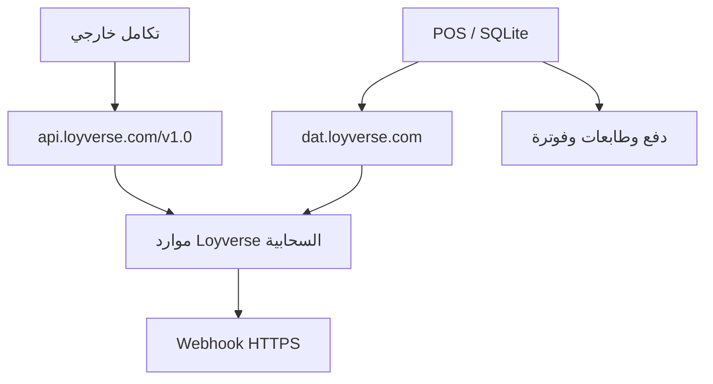
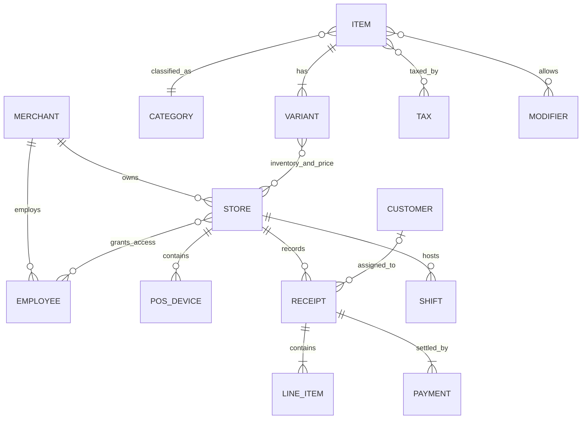
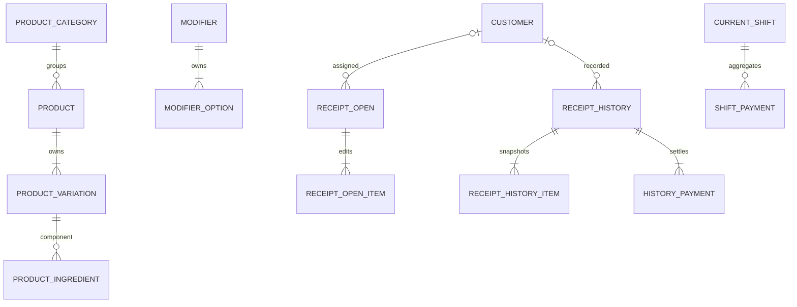
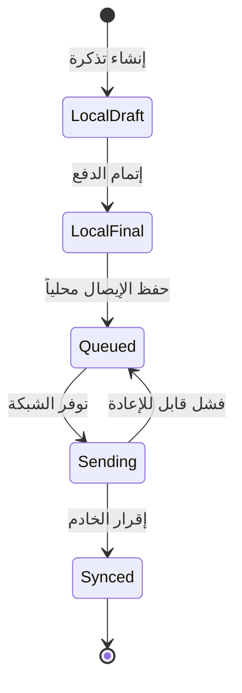
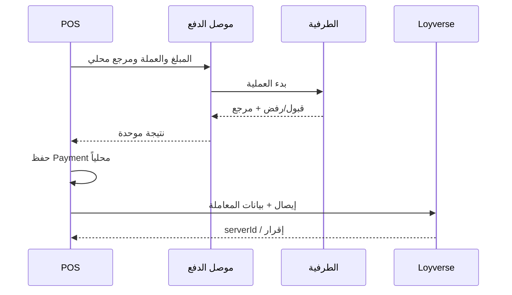
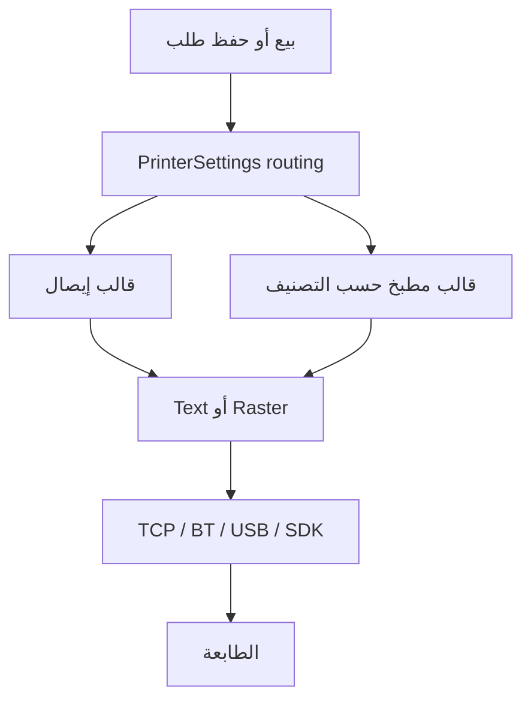
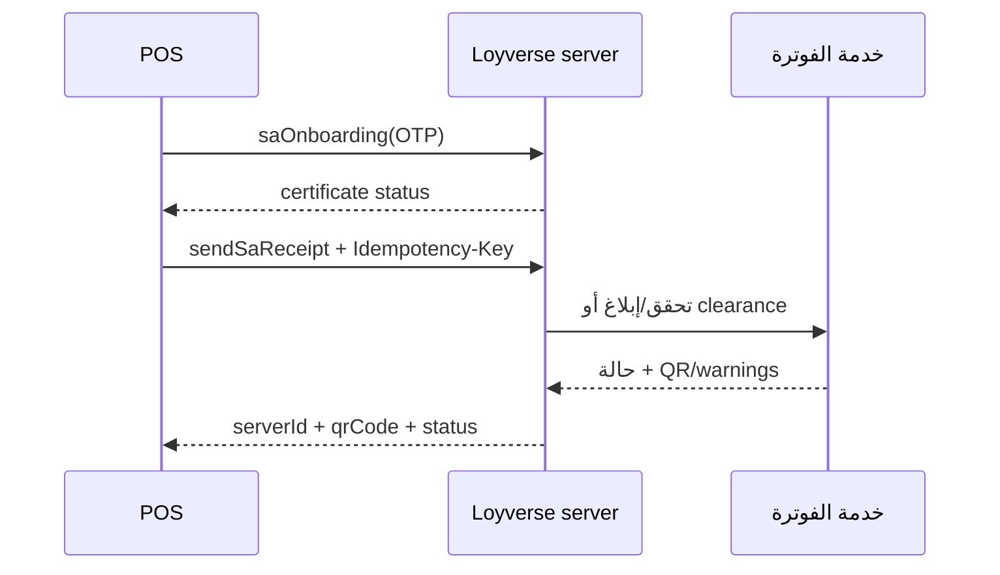

# دراسة قواعد البيانات وواجهات API والتكاملات في Loyverse

## المرحلة الثالثة فقط: نمذجة البيانات، نقاط النهاية، Webhooks، الدفع، الطباعة، والفوترة

| بند | القيمة |
|---|---|
| تاريخ لقطة الدراسة | 16 أغسطس 2026، بتوقيت الرياض |
| النطاق | Loyverse POS، واجهة Loyverse API العامة، طبقة اتصال POS الداخلية، Webhooks، بوابات الدفع، الطابعات، والفوترة السعودية |
| عينة Android الأساسية | `com.loyverse.sale`، الإصدار `2.73.1`، `versionCode=419` |
| قاعدة POS المحلية | SQLite باسم `loyverseDB`، إصدار مخطط `65`، عبر Requery ORM |
| مواصفة API العامة | OpenAPI 3.0، الإصدار المنشور `1.0`، عند `https://api.loyverse.com/v1.0` |
| خارج النطاق | تحليل الشاشات وUI/UX، وتحليل المكتبات وDNS العام؛ عولجا في المرحلتين الأولى والثانية |

> يميّز التقرير بدقة بين العقد العام المنشور، والمسارات الداخلية المرصودة داخل حزمة Android، وكيانات التخزين المحلي. المسارات الداخلية ليست جزءاً من عقد Loyverse API العام وقد تتغير مع أي إصدار.

## 1. الخلاصة التنفيذية

1. لدى Loyverse ثلاث طبقات بيانات متعايشة: **API عام** لتكاملات الأطراف الخارجية، و**API داخلي خاص بتطبيق POS** يجمع مسار أوامر JSON قديماً مع REST أحدث مبنياً على Ktor Resources، و**قاعدة SQLite محلية** تجعل البيع والتذاكر والورديات قابلة للعمل دون اتصال ضمن الحدود الوظيفية للتطبيق.
2. العقد العام المنشور يحتوي على **34 مساراً و57 عملية HTTP** حول التاجر والمتاجر والموظفين والعملاء والموردين والكتالوج والمخزون والإيصالات والورديات وأجهزة POS وWebhooks. نمط التعديل الشائع هو `POST` إلى مسار المجموعة بعنوان «Create or update»، وليس `PUT/PATCH` العام المعتاد.
3. نموذج الكتالوج محوره `Item → Variant`. المخزون علاقة مركبة بين `Variant` و`Store`، والسلعة المركبة علاقة ذاتية بين متغير مُنتَج ومتغيرات مكوّنة. الأسعار والتوافر وحدود المخزون يمكن تخصيصها لكل متجر داخل المتغير.
4. الإيصال العام هو مستند بيع/استرداد يحفظ **لقطات** للسطور والضرائب والخصومات والمدفوعات، لا مجرد مراجع حية إلى الكتالوج. في POS توجد بنية منفصلة للتذكرة المفتوحة وأخرى للإيصال المؤرشف، مع معرّفات محلية وخادمية وآثار حذف وحالة إرسال.
5. Webhooks العامة تدعم خمسة أنواع أحداث: تحديث الأصناف، العملاء، المخزون، الإيصالات، وإنشاء الورديات. توقيع `HMAC-SHA1` موجود للـWebhooks المنشأة في سياق تطبيق OAuth، بينما Webhooks المرتبطة برمز وصول شخصي لا تحمل ذلك التوقيع.
6. طبقة POS الداخلية ترسل أوامر تشغيلية إلى `dat.loyverse.com`، وتستعمل REST أحدث تحت `/pos/v1/`. تحتوي العينة على 90 اسم أمر داخلي تشمل البيع والاسترداد والمزامنة والطابعات والدفع والفوترة السعودية والإسبانية.
7. تكامل الدفع يميز بين طرفية غير مدمجة—حيث يُدخل المبلغ يدوياً ويُسجَّل النوع فقط—وبوابة مدمجة تنقل المبلغ وتستقبل نتيجة المعاملة. عينة Android تحتوي وحدات Zettle وSumUp وTeya/SaltPay وStripe Terminal/BBPOS المستخدمة خلف ميزة Loyverse Payments، إلى جانب سجل تفصيلي لبيانات التفويض والبطاقة والقارئ.
8. الطباعة على Android تدعم عائلات اتصال `TCP` وBluetooth وUSB وطابعات Sunmi/PAX وSDKs داخلية، مع بروتوكولات `ESC_POS` وStar وواجهات الأجهزة المدمجة. إعداد الطابعة محلي قابل للمزامنة ويشمل توجيه الإيصالات أو طلبات المطبخ، التصنيفات، العرض، والقطع وفتح الدرج.
9. للفوترة السعودية مستويان ظاهرَان: QR تقليدي بخمسة حقول TLV/Base64، ومسار أحدث في التطبيق لإدخال OTP وإدارة شهادة بحالات `ACTIVE/REVOKED/EXPIRED` وإرسال البيع والاسترداد إلى خادم Loyverse مع مفتاح منع تكرار. لم يظهر عنوان ZATCA مباشر داخل حزمة العميل؛ الاتصال الحكومي اللاحق يتم خلف خدمة Loyverse.

## 2. مصادر الإثبات ودرجات الثقة

| الدرجة | المصدر | الدلالة |
|---|---|---|
| A — عقد عام | [وثائق Loyverse API](https://developer.loyverse.com/docs/) و[ملف OpenAPI المنشور](https://developer.loyverse.com/docs/API-Reference__v1.0.yaml) و[مجموعة Postman](https://developer.loyverse.com/docs/Loyverse_API.postman_collection.json) | نقطة نهاية أو حقل أو قيد معلن لتكاملات الأطراف الخارجية |
| B — أثر مباشر | DEX والموارد والشيفرة المفككة وقوالب التسلسل من APK المحدد أعلاه | كيان أو أمر أو مسار موجود في إصدار Android المفحوص |
| C — سلوك رسمي | مركز مساعدة Loyverse وصفحات التكاملات | تدفق أو نطاق جغرافي أو نموذج جهاز تعلنه Loyverse |
| D — استنتاج محدود | تركيب دليلين أو أكثر من A/B/C | نتيجة بنيوية مذكورة بصفتها استنتاجاً، لا كعقد منشور |

### 2.1 حدود اللقطة الفنية

- لا تُخلط أسماء أوامر POS الداخلية مع `api.loyverse.com/v1.0`: الأولى خاصة بالتطبيق ولا تظهر في وثائق المطورين.
- تحليل المسارات الداخلية **ساكن**؛ يثبت تكوين الطلبات في APK، لكنه لا يدّعي أن كل ميزة مفعّلة لكل حساب أو بلد.
- لا توجد عينة IPA ضمن هذا التحليل. ما يخص iOS في التكاملات مأخوذ من قائمة Loyverse الرسمية، لا من تفكيك ثنائي لـiOS.
- تعداد أنواع الدفع في ملف OpenAPI أضيق من قائمة التكاملات المنشورة حالياً؛ يسجل التقرير الاختلاف بدلاً من دمج المصدرين في قائمة مصطنعة واحدة.
- لم تظهر مخططات قواعد بيانات Back Office أو الخادم في المنتجات المنشورة. لذلك يصف قسم قاعدة البيانات المخطط المحلي المثبت في POS ونموذج الموارد العام، ولا ينسب محركاً أو جداول داخلية إلى خادم Loyverse بلا دليل.

### 2.2 بصمات مواد الإثبات

| المادة | SHA-256 |
|---|---|
| APK الخاص بـLoyverse POS 2.73.1 | `a6307d2aac4156634209b96c59b1acc098f89c995c5d7152279a1db9117525bd` |
| OpenAPI `API-Reference__v1.0.yaml` | `99083473e795c5406c65420781904e2befbb55a7e840f8466e93d20cd0e977e4` |
| مجموعة Postman المنشورة | `be062fd991b78c3917d9bb5cf719c2a40c94480afe188d87ef2072f9b1ffe218` |

## 3. خريطة طبقات البيانات والاتصال



| المستوى | العميل المعتاد | الشكل | المصادقة/الهوية | الوظيفة |
|---|---|---|---|---|
| API العام | تطبيقات الشركاء والمالك | REST/JSON عبر HTTPS | Personal Access Token أو OAuth 2.0 Bearer | إدارة الموارد والتقارير والبيع الخارجي وWebhooks |
| REST الداخلي الحديث | Loyverse POS | Ktor Resources وJSON تحت `/pos/v1/` | Bearer من موفّر token داخل التطبيق | مزامنة الحساب والكتالوج والعملاء والتذاكر والإعدادات |
| أوامر POS الداخلية | Loyverse POS | `POST` بأظرف JSON تحمل `cmd` | جلسة المالك والجهاز والسجل والمنفذ | العمليات التشغيلية القديمة أو المتخصصة |
| التخزين المحلي | Loyverse POS | SQLite/Requery + حقول JSON مسلسلة | مالك/تاجر/منفذ/سجل محلياً | العمل دون اتصال، اللقطات، الطوابير، وحالة آخر مزامنة |
| المحيطيات | POS ↔ طرفية/طابعة/خدمة مالية | SDK أو LAN/USB/Bluetooth أو خدمة Loyverse | حسب المزوّد والاقتران | الدفع، الطباعة، وإرسال الفواتير المنظمة |

# الجزء الأول: Loyverse API العام

## 4. العقد الأساسي

### 4.1 العنوان والإصدار والتمثيل

| الخاصية | القيمة المنشورة |
|---|---|
| Base URL | `https://api.loyverse.com/v1.0` |
| البروتوكول | HTTPS |
| تمثيل الموارد | JSON، باستثناء رفع صورة الصنف بصيغة PNG |
| التوقيت | UTC في حقول التاريخ والوقت |
| الترقيم | Cursor pagination |
| الحجم الافتراضي للصفحة | 50 سجلاً |
| الحد الأعلى للصفحة | 250 سجلاً |
| حد الطلبات | 300 طلب خلال 300 ثانية لكل حساب |
| تجاوز الحد | HTTP `429 Too Many Requests` |

تُرجع عمليات القوائم مؤشراً للصفحة التالية. لا يُعامل `cursor` كرقم صفحة أو كمعرّف دائم؛ هو قيمة مبهمة يعيدها الخادم وتُمرر كما هي في الطلب التالي.

### 4.2 المصادقة

#### Personal Access Token

- يُنشأ من Back Office في صفحة التكاملات/Access Tokens.
- يُرسل كـBearer token.
- يرتبط بحساب التاجر المستهدف، وتصفه الوثائق بأنه يمنح وصولاً غير محدود النطاق لذلك الحساب؛ لا توجد scopes انتقائية منشورة للرمز الشخصي.

#### OAuth 2.0 / OpenID Connect

| الوظيفة | العنوان/القيمة |
|---|---|
| Authorization endpoint | `https://api.loyverse.com/oauth/authorize` |
| Token وRefresh endpoint | `https://api.loyverse.com/oauth/token` |
| ترميز طلب token | `application/x-www-form-urlencoded` |
| عمر Access Token الظاهر | `43200` ثانية |
| UserInfo | `https://api.loyverse.com/userinfo` |
| Discovery | `https://api.loyverse.com/.well-known/openid-configuration` |
| JWKS | `https://api.loyverse.com/.well-known/jwks.json` |
| توقيع ID token الظاهر | `RS256` عند طلب `openid` |

Scopes المنشورة:

| المجال | Read | Write |
|---|---|---|
| العملاء | `CUSTOMERS_READ` | `CUSTOMERS_WRITE` |
| الأصناف | `ITEMS_READ` | `ITEMS_WRITE` |
| المخزون | `INVENTORY_READ` | `INVENTORY_WRITE` |
| الإيصالات | `RECEIPTS_READ` | `RECEIPTS_WRITE` |
| أجهزة POS | `POS_DEVICES_READ` | `POS_DEVICES_WRITE` |
| الموردون | `SUPPLIERS_READ` | `SUPPLIERS_WRITE` |
| الضرائب | `TAXES_READ` | `TAXES_WRITE` |
| الموظفون | `EMPLOYEES_READ` | — |
| التاجر | `MERCHANT_READ` | — |
| أنواع الدفع | `PAYMENT_TYPES_READ` | — |
| الورديات | `SHIFTS_READ` | — |
| المتاجر | `STORES_READ` | — |
| الهوية | `OPENID`؛ وتعرض وثيقة discovery أيضاً `PROFILE_READ` | — |

> ملف OpenAPI يعرّف Bearer authentication، لكنه لا يربط كل عملية داخل الملف نفسه بقائمة scopes تفصيلية؛ لذلك لا ينسب هذا التقرير scope إلى endpoint منفرد بما يتجاوز قائمة OAuth المنشورة.

### 4.3 قواعد الموارد المشتركة

- غالبية الموارد تدعم الحذف اللين: يظهر `deleted_at` ويمكن إظهار المحذوف عبر `show_deleted=true` في القوائم التي تعلن هذا المعامل.
- العملاء حالة مختلفة: النموذج يتضمن `permanent_deletion_at` ولا تعرض قائمة العملاء `show_deleted`.
- حقول `created_at` و`updated_at` تستخدم لتتبّع التغييرات في الموارد التي تدعم مرشحاتها.
- عمليات `POST` على الموردين والتصنيفات والعملاء والخصومات والأصناف والمعدلات والضرائب وأجهزة POS موصوفة رسمياً بأنها **Create or update a single resource**.
- لا تعني نتيجة نجاح إنشاء إيصال أن كل مسار دفع مدمج متاح عبر API؛ إنشاء الإيصال العام له قيود منفصلة مبينة أدناه.

### 4.4 حالات الخطأ المنشورة

| HTTP | رمز/سبب API المنشور | المعنى |
|---:|---|---|
| 400 | `BAD_REQUEST` | الطلب غير صالح إجمالاً |
| 400 | `INCORRECT_VALUE_TYPE` | نوع قيمة الحقل لا يطابق المخطط |
| 400 | `MISSING_REQUIRED_PARAMETER` | معامل إلزامي مفقود |
| 400 | `INVALID_VALUE` | قيمة غير مقبولة |
| 400 | `INVALID_RANGE` | نطاق تاريخ أو رقم غير صالح |
| 400 | `INVALID_CURSOR` | مؤشر صفحة غير صالح أو منتهي |
| 400 | `CONFLICTING_PARAMETERS` | معاملات لا يجوز جمعها |
| 401 | `UNAUTHORIZED` | Bearer token مفقود أو مشوه أو غير صالح |
| 402 | `PAYMENT_REQUIRED` | اشتراك الحساب منتهٍ |
| 403 | `FORBIDDEN` | الصلاحيات لا تتيح المورد |
| 404 | `NOT_FOUND` | المورد غير موجود |
| 415 | `UNSUPPORTED_MEDIA_TYPE` | نوع المحتوى غير مقبول |
| 429 | `RATE_LIMITED` | تجاوز معدل الطلبات |
| 500 | `INTERNAL_SERVER_ERROR` | خطأ داخلي في الخدمة |

## 5. جميع نقاط النهاية العامة المنشورة

الجدول التالي يغطي 34 مساراً و57 عملية، كما هي في مواصفة OpenAPI المنشورة:

| المورد | المسار | الأساليب | السلوك المنشور |
|---|---|---|---|
| Webhook | `/webhooks/` | `GET`, `POST` | قائمة Webhooks؛ إنشاء أو تحديث Webhook واحد |
| Webhook | `/webhooks/{webhook_id}` | `GET`, `DELETE` | قراءة Webhook واحد؛ حذفه |
| Merchant | `/merchant/` | `GET` | ملف التاجر الحالي |
| Supplier | `/suppliers/` | `GET`, `POST` | قائمة الموردين؛ إنشاء أو تحديث مورد واحد |
| Supplier | `/suppliers/{supplier_id}` | `GET`, `DELETE` | قراءة أو حذف مورد |
| Category | `/categories` | `GET`, `POST` | قائمة التصنيفات؛ إنشاء أو تحديث تصنيف |
| Category | `/categories/{category_id}` | `GET`, `DELETE` | قراءة أو حذف تصنيف |
| Customer | `/customers` | `GET`, `POST` | قائمة العملاء؛ إنشاء أو تحديث عميل |
| Customer | `/customers/{customer_id}` | `GET`, `DELETE` | قراءة أو حذف عميل |
| Discount | `/discounts` | `GET`, `POST` | قائمة الخصومات؛ إنشاء أو تحديث خصم |
| Discount | `/discounts/{discount_id}` | `GET`, `DELETE` | قراءة أو حذف خصم |
| Employee | `/employees` | `GET` | قائمة الموظفين |
| Employee | `/employees/{employee_id}` | `GET` | قراءة موظف واحد |
| Inventory | `/inventory` | `GET`, `POST` | قراءة أرصدة المتغيرات؛ تحديث دفعي للأرصدة |
| Item | `/items` | `GET`, `POST` | قائمة الأصناف؛ إنشاء أو تحديث صنف |
| Item | `/items/{item_id}` | `GET`, `DELETE` | قراءة أو حذف صنف |
| Item image | `/items/{item_id}/image` | `POST`, `DELETE` | رفع صورة PNG واحدة؛ حذف الصورة |
| Modifier | `/modifiers` | `GET`, `POST` | قائمة المعدلات؛ إنشاء أو تحديث معدل |
| Modifier | `/modifiers/{modifier_id}` | `GET`, `DELETE` | قراءة أو حذف معدل |
| Payment type | `/payment_types` | `GET` | قائمة أنواع الدفع |
| Payment type | `/payment_types/{payment_type_id}` | `GET` | قراءة نوع دفع واحد |
| POS device | `/pos_devices` | `GET`, `POST` | قائمة الأجهزة؛ إنشاء أو تحديث جهاز POS |
| POS device | `/pos_devices/{pos_device_id}` | `GET`, `DELETE` | قراءة أو حذف جهاز POS |
| Receipt | `/receipts` | `GET`, `POST` | قائمة الإيصالات؛ إنشاء إيصال بيع |
| Receipt | `/receipts/{receipt_number}` | `GET` | قراءة إيصال برقمه |
| Refund | `/receipts/{receipt_number}/refund` | `POST` | إنشاء إيصال استرداد للإيصال المحدد |
| Shift | `/shifts` | `GET` | قائمة الورديات |
| Shift | `/shifts/{shift_id}` | `GET` | قراءة وردية واحدة |
| Store | `/stores` | `GET` | قائمة المتاجر |
| Store | `/stores/{store_id}` | `GET` | قراءة متجر واحد |
| Tax | `/taxes` | `GET`, `POST` | قائمة الضرائب؛ إنشاء أو تحديث ضريبة |
| Tax | `/taxes/{tax_id}` | `GET`, `DELETE` | قراءة أو حذف ضريبة |
| Variant | `/variants` | `GET`, `POST` | قائمة متغيرات الأصناف؛ إنشاء أو تحديث متغير |
| Variant | `/variants/{variant_id}` | `GET`, `DELETE` | قراءة أو حذف متغير |

### 5.1 مرشحات القوائم

| المورد | معاملات التصفية المنشورة |
|---|---|
| الموردون | `suppliers_ids`, `limit`, `cursor`, `show_deleted` |
| التصنيفات | `categories_ids`, `limit`, `cursor`, `show_deleted` |
| العملاء | `customer_ids`, `email`, `created_at_min/max`, `updated_at_min/max`, `limit`, `cursor` |
| الخصومات | `discount_ids`, `created_at_min/max`, `updated_at_min/max`, `show_deleted` |
| الموظفون | `employee_ids`, `created_at_min/max`, `updated_at_min/max`, `show_deleted`, `limit`, `cursor` |
| المخزون | `store_ids`, `variant_ids`, `updated_at_min/max`, `limit`, `cursor` |
| الأصناف | `items_ids`, `created_at_min/max`, `updated_at_min/max`, `limit`, `cursor`, `show_deleted` |
| المعدلات | `modifier_ids`, `created_at_min/max`, `updated_at_min/max`, `show_deleted`, `limit`, `cursor` |
| أنواع الدفع | `payment_type_ids`, `created_at_min/max`, `updated_at_min/max`, `show_deleted` |
| أجهزة POS | `store_id`, `show_deleted` |
| الإيصالات | `receipt_numbers`, `since_receipt_number`, `before_receipt_number`, `store_id`, `order`, `source`, `updated_at_min/max`, `created_at_min/max`, `limit`, `cursor` |
| الورديات | `store_ids`, `created_at_min/max`, `limit`, `cursor` |
| المتاجر | `store_ids`, `created_at_min/max`, `updated_at_min/max`, `show_deleted` |
| الضرائب | `tax_ids`, `created_at_min/max`, `updated_at_min/max`, `show_deleted` |
| المتغيرات | `variants_ids`, `items_ids`, `sku`, `created_at_min/max`, `updated_at_min/max`, `limit`, `cursor`, `show_deleted` |

### 5.2 وظائف موجودة في POS وليست موارد عامة في v1.0

لا تعرض المواصفة المنشورة endpoints مستقلة للتذاكر المفتوحة، خيارات التناول، التذاكر مسبقة التعريف، تخطيط صفحات البيع والمفضلات، إعداد الطابعات، طلبات المطبخ، الحضور/Time Cards، معالجة البطاقة أو اقتران الطرفيات، شهادة الفوترة السعودية، أو أوامر ZATCA. كما لا تعرض endpoint عاماً لإلغاء إيصال قائم؛ المورد العام يوفر القراءة، إنشاء البيع، وإنشاء الاسترداد ضمن القيود المذكورة.

## 6. نموذج الموارد العام

### 6.1 الحساب والبنية التنظيمية

| المورد | الحقول الأساسية المنشورة | العلاقات |
|---|---|---|
| `MerchantProfile` | `id`, `business_name`, `email`, `country`, `currency`, `created_at` | جذر حساب API؛ العملة تحمل `code` و`decimal_places` |
| `Store` | `id`, `name`, العنوان، المدينة، المنطقة، الرمز، الدولة، الهاتف، الوصف، timestamps | يحتوي أجهزة POS ومخزوناً وإيصالات؛ يُستخدم في وصول الموظفين |
| `Employee` | `id`, الاسم، البريد، الهاتف، `stores[]`, `is_owner`, timestamps | علاقة متعدد إلى متعدد مع المتاجر |
| `PosDevice` | `id`, `name`, `store_id`, `activated`, `deleted_at` | جهاز واحد تابع لمتجر واحد |

### 6.2 الأطراف التجارية

| المورد | الحقول الأساسية المنشورة | ملاحظات |
|---|---|---|
| `Supplier` | `id`, `name`, `contact`, `email`, `phone_number`, `website`, `address_1`, `address_2`, `city`, `region`, `postal_code`, `country_code`, `note`, timestamps | يمكن أن يكون `primary_supplier_id` للصنف |
| `Customer` | `id`, `name`, `email`, `phone_number`, `address`, `city`, `region`, `postal_code`, `country_code`, `customer_code`, `note`, `first_visit`, `last_visit`, `total_visits`, `total_spent`, `total_points`, timestamps، `permanent_deletion_at` | يحمل إحصاءات ولاء وزيارات، ويمكن ربطه بالإيصال؛ لا يعلن مخطط v1.0 حقل VAT للعميل |

### 6.3 الكتالوج والتسعير

| المورد | الحقول الأساسية المنشورة | العلاقات والقيود |
|---|---|---|
| `Category` | `id`, `name`, `color` | اللون واحد من `GREY`, `RED`, `PINK`, `ORANGE`, `GREEN`, `BLUE`, `PURPLE` |
| `Tax` | `id`, `name`, `rate`, `type`, `stores[]`, timestamps | النوع `INCLUDED` أو `ADDED`؛ يمكن تطبيقه على أصناف ومتاجر |
| `Discount` | `id`, `name`, `type`, `discount_amount`, `discount_percent`, `stores`, `restricted_access`, timestamps | الأنواع: ثابت/متغير كنسبة أو مبلغ، أو `DISCOUNT_BY_POINTS` |
| `Modifier` | `id`, `name`, `position`, `stores[]`, `modifier_options[]`, timestamps | كل خيار يحمل اسماً وسعراً وترتيباً؛ الصنف يربط معرفات معدلات متعددة |
| `Item` | `id`, `handle`, `item_name`, `description`, `reference_id`, `category_id`, flags للمخزون/الوزن/التركيب/الإنتاج، `components[]`, `primary_supplier_id`, `tax_ids[]`, `modifiers_ids[]`, `form`, `color`, `image_url`, أسماء الخيارات الثلاثة، `variants[]`, timestamps | أصل الكتالوج؛ يمتلك متغيراً واحداً أو أكثر |
| `Variant` | `variant_id`, `item_id`, `sku`, `reference_variant_id`, قيم الخيارات الثلاثة، `barcode`, `cost`, `purchase_cost`, `default_pricing_type`, `default_price`, `stores[]`, timestamps | `sku` فريد؛ التسعير `FIXED` أو `VARIABLE`؛ إعداد المتجر يحمل السعر والتوافر ومستويات المخزون |
| `Component` | `variant_id`, `quantity` | سطر BOM لصنف مركب؛ يشير إلى متغير مكوّن |

### 6.4 المخزون

`InventoryLevel` ليس رصيداً عاماً للصنف، بل صف بعلاقة مركبة:

| المفتاح | الحقول |
|---|---|
| `(variant_id, store_id)` | `in_stock`, `updated_at` |

عملية `POST /inventory` تحديث دفعي. كل عنصر إدخال يحدد `variant_id` و`store_id` و`stock_after`، أي أن القيمة المرسلة هي الرصيد النهائي بعد التعديل، لا كمية حركة موجبة/سالبة فقط.

### 6.5 الإيصالات والورديات

| المورد | الحقول/المكوّنات البارزة |
|---|---|
| `Receipt` | `receipt_number`, نوع بيع/استرداد، `refund_for`, المتجر، جهاز POS، الموظف، العميل، المصدر، الوقت، الإجماليات، الخصومات، الضرائب، البقشيش، الرسوم، نقاط الولاء، خيار تناول الطعام، الملاحظة، `line_items[]`, `payments[]` |
| `LineItem` | مرجع الصنف/المتغير، الاسم وSKU والكمية والسعر والتكلفة، الخصومات، الضرائب، المعدلات/الخيارات، الإجماليات المحسوبة |
| `Payment` | `payment_type_id`, `name`, `type`, `money_amount`, `paid_at`, `payment_details` |
| `Shift` | المتجر وجهاز POS والموظف وأوقات الفتح/الإغلاق، مبالغ البداية والنهاية، المبيعات والاستردادات والصافي والنقد المتوقع/الفعلي، الضرائب والخصومات وأنواع الدفع المجمعة |

#### إنشاء إيصال عبر API

طلب `POST /receipts` يقبل المتجر والموظف والطلب والعميل والمصدر والتاريخ والخصومات والملاحظة والسطور والمدفوعات. في الحد الأدنى العملي يحمل كل سطر `variant_id` و`quantity`. العقد المنشور يقيد الإنشاء بدفعة واحدة.

- إذا لم يرسل `receipt_date` يطابق وقت الإنشاء الخادمي؛ ويمكن ضبطه إلى وقت سابق لعملية نشأت في نظام آخر، ويُستخدم ذلك التاريخ في تقارير Back Office.
- `source` هو اسم مصدر الإيصال؛ القيمة المعلنة لإيصالات تطبيق Loyverse هي `point of sale`، بينما يَظهر اسم التطبيق المنشئ افتراضياً للإيصالات الخارجية.
- يستطيع `PostTotalDiscount.scope` أن يكون `RECEIPT` أو `LINE_ITEM`. خصم مستوى الإيصال يولد توزيعه على السطور، أما خصم مستوى السطر فيجب أن يُشار إليه داخل `line_discounts` للسطور المعنية.
- يمكن لمدخل السطر تمرير `price` و`cost`؛ وإلا يستخدم قيم المتغير، مع إمكان تحديد الضرائب والخصومات و`modifier_option_id` وسعر المعدل.

#### الاسترداد عبر API

`POST /receipts/{receipt_number}/refund` ينشئ مستند استرداد مرتبطاً بالأصل، وتحدد سطوره `id` لسطر البيع الأصلي و`quantity` المراد إرجاعها. يعيد النجاح الكميات المحددة إلى المخزون. القيود المنشورة تشمل أن يكون الإيصال الأصلي ذا دفعة واحدة، وألا تكون الدفعة من نوع دفع مدمج لا يدعمه مسار API للاسترداد.

### 6.6 مخطط علاقات الموارد العامة



### 6.7 دلالات مهمة في النموذج

- `Item` هو هوية المنتج المنطقية؛ `Variant` هو الوحدة القابلة للتسعير والباركود والمخزون والبيع.
- السعر والتوافر ومستوى الإنذار يمكن أن يختلفا حسب المتجر داخل إعداد المتغير.
- مكونات السلعة المركبة تشير إلى متغيرات أخرى وكميات؛ لذلك علاقة التركيب تقع على مستوى `Variant` لا الاسم التسويقي للصنف فقط.
- الإيصال يحتفظ بقيم محسوبة ولقطات وصفية حتى تظل التقارير التاريخية ثابتة بعد تعديل الصنف أو الضريبة.
- `receipt_number` هو مفتاح القراءة العام للإيصال؛ أغلب الموارد الأخرى تستعمل UUID-like identifiers في `id`، بينما تمثيل المتغير يعلن `variant_id` والمخزون مفتاحاً مركباً.

## 7. Webhooks العامة

### 7.1 أنواع الأحداث

| النوع | وقت الإطلاق الدلالي |
|---|---|
| `inventory_levels.update` | تغير أرصدة مخزون المتغيرات |
| `items.update` | إنشاء أو تعديل أو حذف صنف |
| `customers.update` | إنشاء أو تعديل أو حذف عميل |
| `receipts.update` | إنشاء إيصال أو تحديثه |
| `shifts.create` | إنشاء سجل وردية مغلقة |

كل Webhook يسجل `url` و`type` واحداً؛ الزوج `(type, url)` فريد. الحقول الأساسية هي `id`, `merchant_id`, `url`, `type`, `status`, وtimestamps، والحالة `ENABLED` أو `DISABLED`.

### 7.2 بنية الإشعار

يحمل الجسم metadata مشتركة ومصفوفة باسم المورد. المثال المنشور رسمياً لحدث المخزون هو:

```json
{
  "merchant_id": "<merchant-id>",
  "type": "<event-type>",
  "created_at": "<UTC timestamp>",
  "inventory_levels": [
    {
      "variant_id": "<variant-id>",
      "store_id": "<store-id>",
      "in_stock": 0,
      "updated_at": "<UTC timestamp>"
    }
  ]
}
```

- يتغير اسم مصفوفة المورد وفق نوع الحدث؛ لا توجد مصفوفة عامة باسم `events` في المثال المنشور.
- يمكن أن تجمع الدفعة الواحدة حتى 100 كائن مورد.
- يجب أن يكون العنوان HTTPS وقابلاً للوصول.
- نجاح التسليم هو أي استجابة `2xx`.
- لا تتبع خدمة Loyverse تحويلات HTTP redirects.
- عند الفشل تعيد المحاولة حتى 200 مرة ضمن نافذة تقارب 48 ساعة؛ بعد استنفادها تصبح الحالة `DISABLED` ويُرسل إشعار بالبريد.

### 7.3 التوقيع والرؤوس

| سياق إنشاء Webhook | التوقيع |
|---|---|
| تطبيق OAuth | رأس `X-Loyverse-Signature`: تمثيل hex صغير لـHMAC-SHA1 على الجسم الخام، والمفتاح هو Client Secret للتطبيق |
| Personal Access Token / إعداد مالك الحساب | لا يُرفق توقيع HMAC المذكور |

كما يظهر رأس `X-Loyverse-API-version` لتحديد إصدار payload. يجب احتساب توقيع OAuth على bytes الجسم كما وصلت، قبل إعادة تنسيق JSON.

### 7.4 الملكية والرؤية

قائمة `/webhooks/` في سياق تطبيق OAuth تعرض Webhooks التي أنشأها ذلك التطبيق، وليست مخزناً عاماً لكل اشتراكات التاجر. هذا يفسر إمكان وجود أكثر من تكامل مستقل للحساب نفسه من دون كشف اشتراكات التطبيقات الأخرى.

# الجزء الثاني: قاعدة POS المحلية ونموذجها

## 8. خصائص قاعدة البيانات المحلية

| الخاصية | النتيجة المرصودة في APK |
|---|---|
| اسم الملف المنطقي | `loyverseDB` |
| المحرك | SQLite |
| طبقة ORM | Requery |
| إصدار المخطط | `65` |
| نموذج الوصول | مخزن كيانات متزامن ومسارات Coroutines/Reactive بحسب المستودع |
| أنواع الحقول المركبة | JSON مسلسَل داخل أعمدة نصية، وكيانات علاقية حيث يلزم الاستعلام/التحديث المستقل |
| دورها | كتالوج محلي، إعدادات الحساب والجهاز، تذاكر مفتوحة، تاريخ إيصالات، ورديات، مخزون، طباعة، وحالة مزامنة |

لا تستخدم قاعدة POS العامة Room. وجود Room أو SQLDelight داخل APK يعود إلى SDKs مضمّنة، ولا يغيّر حقيقة أن كيانات أعمال POS المفحوصة تُدار عبر Requery/SQLite.

## 9. كيانات الحساب والإعدادات والمزامنة

> الأسماء في العمود الأول أسماء كيانات ORM/نماذج مرصودة. يعرض عمود الحقول البنية الدلالية؛ لا يُفترض أن كل اسم Java يساوي اسم جدول SQL حرفياً بعد توليد Requery.

| الكيان | أهم الحقول | الغرض والعلاقات |
|---|---|---|
| `OwnerCredentials` | cookie/session، `deviceId`، المالك، المنفذ الحالي، السجل الحالي، وقت الخادم، flags، حالة الوردية، مفتاح التذاكر، معلومات معاملة موروثة | هوية الجلسة وربط الجهاز بالسجل والمنفذ؛ مرجع لأظرف الأوامر الداخلية |
| `OwnerProfile` | بيانات النشاط والعملة والبلد واللغة والخصائص، `fiscalIntegration`, `saNewTaxationEnabled`, `loyversePaymentStatus` | نسخة محلية لملف الحساب ومفاتيح تفعيل الميزات |
| `Merchant` | `id`, `publicId`، الاسم، البريد، PIN، `role`, `storeAccess`, `isOwner`, `disabledHints` | المستخدم/التاجر النشط وصلاحياته |
| `MerchantRole` | `id`, `permissions` مسلسلة | قائمة صلاحيات ترتبط بموظفين/تجار محليين |
| `KeyValue` | `key`, `value` | مخزن إعدادات ونتائج مسلسلة؛ منه شهادة الفوترة السعودية |
| `LastSync` | معرّف، `openReceiptCursor`، timestamps لفئات الأصناف والعملاء والمخزون والتذاكر والأرشيف والتناول والمفضلات والتبويبات | نقاط ماء عالية لكل قناة مزامنة، لا timestamp موحد فقط |
| `Hibernation` | `id`، حالات مسلسلة | حفظ حالة تشغيل مؤقتة عبر دورة حياة التطبيق |
| `CustomerDisplaySettings` | `id`, `localId`, `deviceId`، الاسم، IP، theme، `privateKey`, `paired` | اقتران وإعداد شاشة العميل المحلية |
| `PrinterSettings` | معرف محلي وخادمي، الاسم، الاتصال، نموذج الجهاز JSON، تصنيفات المطبخ، خيارات الطباعة والترتيب | تعريف طابعة وتوجيه المخرجات؛ يفصل لاحقاً |

## 10. الكتالوج والعملاء والضرائب

| الكيان | أهم الحقول المرصودة | العلاقة |
|---|---|---|
| `ProductCategory` | `id`, `name`, `color`, `customColor` | تصنيف المنتجات |
| `Product` | `id`, `name`, `description`, `sku`, `barcode`, `price`, `cost`, `count`, `criticalCount`، الشكل/اللون/الصورة، `category`، flags للوزن والسعر الحر والمخزون والتركيب والإنتاج، معرفات الضرائب والمعدلات، ingredients/variations | أصل الصنف المحلي؛ يملك متغيرات وقد يملك مكونات |
| `ProductVariation` | `id`, `product`, `sku`, `barcode`، أسماء الخيارات، السعر والتكلفة، الرصيد والحد الحرج، الترتيب، flags للتوافر/الوزن/السعر الحر | وحدة البيع والمخزون داخل المنتج |
| `ProductIngredient` | `productId`, `productRef`, `variationId`, `quantity` | سطر مكوّن/BOM يربط المنتج المركب بمتغير مكوّن |
| `Modifier` | `id`, `permanentId`, `name`, `priority`، options | مجموعة معدل محلية |
| `ModifierOption` | `id`, `permanentId`, `modifierOwner`, `name`, `price`, `priority` | خيار تابع لمعدل واحد |
| `Tax` | المعرفان المحلي/الدائم، الاسم، النوع، القيمة، الترتيب، نطاق التطبيق، flags | تعريف ضريبة قابل لإرفاقه بالمنتجات |
| `TaxDependency` | `taxPermanentId` مع معرفات تناول/تصنيفات/منتجات | نطاقات تطبيق الضريبة المادية |
| `Discount` | `id`, `permanentId`, `name`, `type`, `calculationType`, `value`, `limitedAccess` | خصم يدوي/مسبق التعريف |
| `Customer` | معرف محلي وعام، الاسم، الهاتف، البريد وحالة تأكيده، العنوان، المدينة/المنطقة/الدولة/الرمز، الميلاد، VAT، customer code، note، الرصيد، الزيارات وآخر زيارة/استخدام، `freeNumber` | عميل قابل للإرفاق بتذكرة وإيصال |
| `BaseDiningOption` | `id`, `name`, `order`, `type` | تعريف خيار تناول مركزي |
| `DiningOption` | `id` ومرجع `BaseDiningOption` | نسخة/ربط محلي لخيار التناول |
| `PredefinedTicket` | `serverId`, `name`, `ordering` | اسم تذكرة/طاولة مسبق التعريف |
| `KitchenCategory` | `id`, `name`, `productCategoryIds` مسلسلة | مجموعة توجيه تجمع تصنيفات منتجات للطابعة/المطبخ |

### 10.1 تبويبات شاشة البيع والمفضلات

| الكيان | الحقول | الوظيفة |
|---|---|---|
| `CustomSaleItemTab` | `id`, `name`, `position` | صفحة عناصر مخصصة |
| `CustomTabSaleItem` | `id`, `tabId`, `position` | صف ربط عنصر بموضع داخل تبويب |
| `CategoryCustomTabSaleItem` | مرجع التصنيف | إدراج تصنيف في تبويب البيع |
| كيانات tab sync | معرفات محلية/خادمية وآثار تعديل/حذف | مزامنة تخطيط صفحات البيع |
| Favourites DTO/state | قائمة معرفات وترتيب | مزامنة المفضلات عبر مسار REST الداخلي |

## 11. التذاكر المفتوحة والإيصالات

### 11.1 التذكرة المفتوحة

| الكيان | الحقول الأساسية | الدلالة |
|---|---|---|
| `ReceiptOpenContainer` | `localUUID` مفتاح أساسي، `syncId`, `tsSaved`, `modified`، جسم `receipt` | غلاف التذكرة المحلية وحالة مزامنتها |
| `ReceiptOpenEntity` | `localUUID`, `syncId`، الاسم، الطلب/الترتيب، predefined ticket، خيار التناول، العميل، الموظف/التاجر snapshot، comment، bonus earn/redeem والحد، global discounts، `items[]`، معرفات محذوفة، timestamps | حالة تذكرة قابلة للتعديل قبل الإغلاق |
| `ReceiptOpenItem` | `localUUID`, `syncId`, `oldSyncId`، مراجع المنتج/التصنيف/المتغير مع snapshots، الاسم، السعر، التكلفة، الكمية، الوزن، التعليق، الترتيب، flags للطباعة/الإلغاء، options/taxes/discounts، مجموعات معرفات معدلة ومحذوفة | سطر تذكرة مع تتبع دقيق للتعديل والتسوية |
| `DeletedOpenReceipt` | `syncId`, `merchantId`, `reason`, `timestamp` | tombstone لحذف تذكرة كانت متزامنة |

وجود `syncId` و`oldSyncId` وآثار الحذف على مستوى السطر يسمح بتسوية التغييرات من أكثر من جهاز من دون إعادة إرسال التذكرة كصورة مجهولة التاريخ فقط.

### 11.2 الإيصال المؤرشف

| الكيان | الحقول الأساسية | الدلالة |
|---|---|---|
| `ReceiptHistoryContainer` | `localUUID`, `serverId`, `sent`، رقم السجل، الرقم المطبوع، `customerId`, `tsHistoried`، مرجع التذكرة/الأرشيف الأب، جسم الإيصال | غلاف الإيصال النهائي وطابور الإرسال |
| `ReceiptHistoryEntity` | المعرفات المحلية والخادمية، أرقام الطلب/السجل/الطباعة/الوردية، أوقات البيع، الاسم والتعليق، snapshots العميل والتاجر وخيار التناول، `items[]`, `payments[]`، مراجع refund/open parent، اللغة وQR، `sent`، خرائط وإجماليات الحساب | مستند البيع/الاسترداد التاريخي الكامل |
| `ReceiptHistoryItem` | snapshot المنتج والمتغير والتصنيف، الكمية/السعر/التكلفة، الضرائب والخصومات والمعدلات، flags، إجماليات الأساس/الصافي/الضريبة/الخصم | يحافظ على التاريخ حتى بعد تغير الكتالوج |
| `HistoryPayment` | معرفات محلية/خادمية/أبوية، نوع الدفع، المدفوع والبقشيش والباقي والتقريب، البريد، transaction info | دفعة واحدة داخل إيصال نهائي |
| Payment transaction info | مراجع العملية، أرقام مرجعية، أكواد التفويض، نوع البطاقة وآخر أرقامها، EMV AID/TVR/TSI، اسم/وسم التطبيق، PIN/signature flags، entry method، اتصال/نموذج القارئ، rows، approved/tips | أثر تقني موحد للبوابات المدمجة |

### 11.3 لماذا يفصل النموذج بين المفتوح والمؤرشف

- التذكرة المفتوحة كيان تعاوني قابل لإضافة وحذف وتعديل السطور ومزامنة فروقها.
- الإيصال المؤرشف مستند محاسبي نهائي يحمل snapshots وحسابات ودفعات وحالة إرسال.
- الإغلاق ينقل المعنى من «حالة قابلة للتحرير» إلى «حدث بيع/استرداد»، مع الاحتفاظ بمرجع الأصل عند الاسترداد.
- الحقل `sent` في الغلاف التاريخي يجعل نجاح الحفظ المحلي مستقلاً عن نجاح الرفع السحابي اللحظي.

## 12. الورديات والمدفوعات المحلية

| الكيان | أهم الحقول |
|---|---|
| `CurrentShift` | `deviceShiftId`، رقم الوردية، المالك/التاجر، وقت الفتح، نقد البداية، إجماليات الإجمالي/الصافي/البيع/الاسترداد/الضرائب/الخصومات/البقشيش، paid-in/out، نقد الإغلاق/المتوقع |
| `CurrentShiftPayment` | `paymentTypeId`, method/name، مبالغ الدفع والاسترداد والتقريب والبقشيش |
| `CurrentShiftTax` | `taxId`, name/type/value، الأساس الخاضع والضريبة |
| `CurrentShiftDiscount` | `discountId`, name/value/amount |
| Shift open event | الجهاز والسجل والمنفذ والتاجر والوقت ونقد البداية |
| Shift pay-in/out event | النوع والمبلغ والتعليق والوقت وهوية الوردية |
| `CloseShiftEvent` | `deviceShiftId`، السجل والمنفذ والتاجر، نقد الإغلاق، القيمة المقترحة المقبولة، timestamp/offset |
| `PaymentType` | `id`, `method`, `connectionType`، الاسم المقروء، الترتيب، التقريب، البقشيش |
| `TimeCard` event | الموظف، نوع الحدث، الوقت، وهوية الجهاز/السياق؛ أثر clock-in/clock-out محلي قبل/أثناء المزامنة |

## 13. مخطط العلاقات المحلية المبسّط



## 14. الهوية والدقة العددية والتخزين المركب

| الجانب | النمط المرصود |
|---|---|
| الهوية المحلية | UUID محلي للتذاكر والسطور والحاويات قبل اعتماد الخادم |
| الهوية السحابية | `serverId`, `syncId`, `permanentId`، أو public ID بحسب نوع المورد |
| الربط أثناء المزامنة | يحتفظ النموذج بالمحلي والخادمي معاً بدلاً من استبدال المفتاح فوراً |
| النقود | حقول مبلغ/سعر/تكلفة/ضريبة منفصلة؛ دقة العملة تُستمد من ملف المالك/العملة |
| snapshots | الاسم والسعر والتكلفة والضريبة والدفع تحفظ داخل الإيصال التاريخي |
| البيانات المركبة | permissions، options، معرفات الضرائب/المعدلات، حالات، ونماذج إعداد جهاز قد تُسلسل JSON |
| الحذف | tombstones ومعرفات محذوفة للتذاكر؛ `deleted_at` في نموذج API العام |

# الجزء الثالث: واجهات POS الداخلية

## 15. مساران داخليان متعايشان

| المسار | التقنية | العنوان المرصود | شكل الطلب |
|---|---|---|---|
| Legacy command API | OkHttp/Gson | `https://dat.loyverse.com` | `POST` JSON يحمل اسم `cmd` وبيانات سياق/جلسة |
| POS REST v1 | Ktor Client + Resources + Kotlinx JSON | `https://dat.loyverse.com/pos/v1/` | REST بطرق `GET/POST/PUT` ومعاملات مسار/استعلام |

التعايش ليس مجرد وجود مكتبتين؛ توجد مستودعات فعلية تبني أوامر `cmd`، وأخرى تستدعي Resources تحت `/pos/v1/`. تنتقل وظائف على مراحل إلى المسار الأحدث، بينما بقيت وظائف الدفع والفوترة والوردية في طبقة الأوامر.

## 16. غلاف أوامر JSON الداخلي

يبني المسار القديم غلافاً عاماً، تختلف حقوله بحسب كون الطلب قبل تسجيل الدخول أو بعده:

| الحقل | المعنى المرصود |
|---|---|
| `cmd` | اسم العملية الداخلية |
| `ownerId` | هوية مالك الحساب عند وجود جلسة |
| `cookieHash` | lowercase hexadecimal لـ`MD5(UTF-8(cookie + timestamp))` في العينة |
| `outletId` | المنفذ/المتجر الحالي |
| `cashRegisterId` | سجل POS الحالي |
| `devId` | هوية الجهاز |
| `merchantId` | الموظف/التاجر النشط لبعض المسارات |
| `timestamp` | وقت الطلب المستخدم أيضاً في تحقق الجلسة |
| `ver` | `419` في العينة، مطابق لـversionCode |
| `brandName` | `Loyverse` |
| `protocolVer` | `3.0` في العائلات التي تضيفه |
| payload إضافي | جسم العملية: إيصال، عميل، طابعة، ضريبة، معاملة دفع، إلخ |

يوجد builder كامل يضيف `outletId`, `cashRegisterId`, و`merchantId`، وbuilder مختصر يكتفي بعد المصادقة بـ`ownerId`, `cookieHash`, و`devId`. إذا كان `ServerCommand.isAuthorized=false` تُحذف حقول الجلسة من الغلاف وتبقى metadata العامة.

الطلبات تحمل `Content-Type: application/json` وتفرض طلباً شبكياً غير مخزّن مؤقتاً. عمليات مالية/ضريبية حساسة تضيف `Idempotency-Key` كي يستطيع الخادم تمييز إعادة الطلب عن عملية جديدة.

### 16.1 الأوامر الداخلية المرصودة، مجمّعة وظيفياً

| المجموعة | أسماء `cmd` الدقيقة الموجودة في APK |
|---|---|
| الحساب والدخول | `loginOwner`, `logOutOwner`, `pos.registerOwner`, `restorePassword`, `resendClientEmail`, `getPreRegistrationInfo`, `isEmailExists`, `getLoginToken`, `posCheckPass`, `delAccountFromPos`, `getOwnerProfile`, `getMerchants`, `getMerchantsRoles` |
| الجهاز والسجل والمنفذ | `getOutlets`, `deviceToCashRegister`, `changeDeviceId`, `createCashRegister`, `checkCurrentTime`, `isVersionActual`, `registerPushId` |
| المزامنة والتحميل | `syncOnLoad`, `syncPriceList`, `syncWareCategories`, `getOutdatedInfo`, `stockChanged`, `syncStock`, `syncClients`, `setClientsDataByOwner`, `syncPredefinedTickets`, `syncCustomerDisplay`, `syncSaleTab`, `saveFavourites`, `getFavourites`, `saveSettingsByKey`, `disableHints`, `initFeatureSettings`, `loginOwnerWS` |
| العملاء | `createClient`, `getRecallList`, `setRecallResponse`, `setRecallStatus` |
| البيع والإيصالات | `sendReceipts`, `getHistoryReceipts`, `sendReceiptEmail`, `sendRefund`, `sendOpenReceipts`, `needUpdateReceipts`, `getDiningOptions` |
| الورديات | `shiftsHistory`, `getCurrentShiftInfo` |
| الدفع العام | `getPaymentTypes`, `runTransaction`, `runSyncRefundTransaction`, `checkTransactionStatus`, `cancelTransaction`, `getPeriphery` |
| SumUp | `sumupGetRefreshedToken`, `sumupGetTransactionInfo`, `sumupRefundTransaction` |
| Teya/SaltPay | `getSaltPayTerminals`, `getTeyaStores` |
| Loyverse Payments | `getLoyversePaymentInformation`, `pairLoyversePaymentTerminal`, `deleteLoyversePaymentTerminal`, `registerLoyverseBluetoothTerminal`, `refundLoyversePayment`, `enableLoyverseTapToPay`, `disableLoyverseTapToPay` |
| الضرائب والخصومات والمعدلات | `createDiscount`, `editDiscount`, `deleteDiscounts`, `getDiscounts`, `createOrEditTax`, `deleteTaxes`, `getModifiers`, `createModifier`, `editModifier`, `deleteModifiers` |
| الطابعات | `getownercabinetprinters`, `getprinters`, `createprinter`, `editprinter`, `deleteprinters` |
| الفوترة السعودية | `saOnboarding`, `saInvoicingStatus`, `sendSaReceipt`, `sendSaRefund` |
| الفوترة الإسبانية | `sendEsReceipt`, `sendEsRefund` |
| القياس/التسجيل | `logEvent` |

عدد الأسماء الفريدة في هذه العينة هو 90. بعض أوامر ما قبل المصادقة تبني غلافاً مختصراً لا يتضمن سياق المنفذ والسجل؛ بقية الأوامر تستمد السياق من `OwnerCredentials`.

## 17. REST الداخلي الحديث `/pos/v1/`

| المورد | الطريقة والمسار الكامل بعد base | المعاملات/الدلالة |
|---|---|---|
| Account | `POST account/features` | مزامنة/تحديث خصائص الحساب |
| Account | `POST account/hints` | تحديث hints المعطلة/المستهلكة |
| Profile | `GET account/profile` | ملف المالك/الحساب |
| Stores | `GET account/stores?lang=` | المتاجر مع اللغة المطلوبة |
| Login token | `GET account/login-token?merchantId=&type=` | token مؤقت لنوع استخدام محدد |
| Categories | `POST items/categories/sync` | مزامنة تصنيفات دفعية |
| Items | `POST items/sync` | مزامنة أصناف دفعية |
| Customers | `GET customers?last_sync=&limit=&offset=` | تحميل تغيرات العملاء |
| Customers | `POST customers` | إنشاء عميل |
| Customers | `PUT customers/{id}` | تعديل عميل |
| Discounts | `POST items/discounts` | إنشاء خصم |
| Discounts | `PUT items/discounts/{id}` | تعديل خصم |
| Discounts | `POST items/discounts/delete-many` | حذف دفعي |
| Modifiers | `POST items/modifiers` | إنشاء معدل |
| Modifiers | `PUT items/modifiers/{id}` | تعديل معدل |
| Modifiers | `POST items/modifiers/delete-many` | حذف دفعي |
| Employees | `GET employees` | الموظفون |
| Roles | `GET employees/roles` | الأدوار والصلاحيات |
| Dining | `GET sales/dining-options?last_sync=` | خيارات التناول المتغيرة |
| Favourites | `GET sales/items/favourites` | قراءة المفضلات |
| Favourites | `POST sales/items/favourites` | حفظ المفضلات |
| Pages | `POST sales/pages/sync` | مزامنة صفحات/تبويبات البيع |
| Payment types | `GET payments/types` | أنواع الدفع المفعلة |
| Tickets | `GET sales/tickets?last_sync=` | تحميل التذاكر المفتوحة المتغيرة |

### 17.1 خصائص عميل Ktor

| الخاصية | التنفيذ المرصود |
|---|---|
| JSON | Kotlinx Serialization |
| تعريف المسارات | Ktor Resources typed routes |
| النقل | OkHttp engine |
| المصادقة | Bearer عبر `TokenProvider` |
| منع التكرار | يضيف UUID في `Idempotency-Key` إذا احتاج الطلب ولم يكن الرأس موجوداً |
| مهلة الاتصال | 10 ثوانٍ |
| إعادة المحاولة | حتى 5 محاولات لفئة مختارة من أخطاء 5xx، مع تأخير أقصى 10 ثوانٍ؛ ليست كل الأخطاء قابلة للإعادة |
| تحقق الشبكة | plugin داخلي يفحص توافر الإنترنت قبل بعض الطلبات |

## 18. دورة المزامنة والعمل دون اتصال

### 18.1 مسار البيانات



### 18.2 ما يحفظ محلياً أولاً

- التذاكر المفتوحة وسطورها وتعديلات وحذف السطور.
- الإيصالات النهائية والمدفوعات مع علامة `sent`.
- أحداث فتح/إغلاق الوردية والإيداع/السحب.
- كتالوج الأصناف والمتغيرات والضرائب والخصومات والعملاء المطلوبين للتشغيل.
- إعداد الطابعات وشاشة العميل وحالة الربط.
- مؤشرات `LastSync` المنفصلة لكل قناة.

### 18.3 استئناف الاتصال

1. تلتقط آلية الشبكة عودة الاتصال أو يصل trigger من WebSocket/Push.
2. تُرسل الطوابير بالترتيب الدلالي؛ الإيصالات والأحداث التي لم تُعلّم `sent` تبقى قابلة لإعادة المحاولة.
3. يعتمد العميل علامات الخادم ومعرفاته فقط للعناصر التي أقرها الرد.
4. تسحب قنوات التغيير انطلاقاً من timestamp/cursor الخاص بها، لا من timestamp عالمي واحد.
5. آثار الحذف تمنع عودة تذكرة أو سطر حُذف محلياً بمجرد وصول نسخة أقدم من جهاز آخر.

### 18.4 منع التكرار والتسوية

- معرفات `localUUID` تجعل العملية المحلية مستقرة قبل امتلاك `serverId`.
- `syncId` يربط النسخة المحلية بالخادمية؛ `oldSyncId` يحفظ أصل سطر تغيرت هويته خلال التحرير.
- `Idempotency-Key` مستخدم في عميل REST وفي إرسال الفوترة المالية، بما يمنع تفسير retry تلقائي كبيع ثانٍ حين يدعم الخادم ذلك المفتاح.
- `needUpdateReceipts` و`checkTransactionStatus` يعالجان حالتين غير محسومتين: إيصال يحتاج نسخة خادمية أحدث، أو دفع انقطع الاتصال قبل معرفة نتيجته.
- WebSocket عند `wss://sync.loyverse.com/ws` يحفز المزامنة، لكنه ليس مخزن الحقيقة؛ السحب والرفع الموثوقان يتمان عبر HTTP.

### 18.5 حدود Offline الفعلية

القاعدة المحلية تسمح بإنشاء التذاكر والبيع وتسجيل أحداث الوردية والطباعة من البيانات المخبأة. أما الوظائف التي تحتاج موافقة طرف خارجي—دفع مدمج، مزامنة بين أجهزة، إرسال بريد، تحديث سحابي، أو إرسال فاتورة منظمة—فتبقى معلقة أو غير متاحة إلى أن يوجد اتصال بالمسار المعني.

# الجزء الرابع: تكاملات الدفع

## 19. نمطا الدفع في Loyverse

وفق [صفحة الدفع الرسمية](https://help.loyverse.com/help/how-work-credit-card-payments)، يدعم POS نمطين مختلفين جذرياً:

| النمط | انتقال المبلغ | استجابة الطرفية إلى POS | السجل داخل Loyverse |
|---|---|---|---|
| طرفية غير مدمجة | يكتب الموظف الإجمالي يدوياً في الطرفية المستقلة | لا يوجد اتصال مباشر؛ يعود الموظف إلى POS ويختار «Card» بعد قبول العملية | يسجل POS نوع الدفع والمبلغ، بينما تبقى نتيجة المعالجة في نظام الطرفية |
| نظام دفع مدمج | يرسل POS المبلغ إلى SDK/الطرفية تلقائياً | تعود حالة قبول/رفض وبيانات معاملة؛ يعرض POS النتيجة | يحفظ سجل الدفع ومعرفات/بيانات البطاقة والقارئ المتاحة |

هذا الفصل ظاهر أيضاً في النموذج المحلي: `PaymentType.connectionType` يحدد `OFFLINE`, `ANDROID_BASED`, `API_BASED`, أو `NOT_DETERMINED`.

## 20. الأنظمة المدمجة المنشورة حالياً

| المزوّد | النطاق المنشور | قيد المنصة المنشور | نمط الدمج الظاهر |
|---|---|---|---|
| SumUp | أكثر من 30 دولة في أوروبا والأمريكتين وأوقيانوسيا | يختلف حسب البلد والجهاز | SDK/تطبيق قارئ مدمج؛ توجد أوامر token وtransaction/refund في Android |
| PayPal Zettle | دول أوروبية متعددة، الولايات المتحدة، والمكسيك | حسب السوق | Zettle SDK موجود في APK Android |
| Teya | المملكة المتحدة، التشيك، آيسلندا، إيطاليا، إسبانيا | حسب السوق | اقتران/اكتشاف طرفيات؛ تظهر طبقة SaltPay/Teya في Android |
| Tyro | أستراليا | حسب المنصة المدعومة | تكامل طرفية مباشر معلن |
| Smartpay | أستراليا ونيوزيلندا | حسب المنصة المدعومة | تكامل طرفية مباشر معلن |
| Yoco | جنوب أفريقيا | iOS فقط | تكامل مباشر معلن، لا ينسب إلى APK Android المفحوص |
| STORES Payment | اليابان | iOS فقط | تكامل مباشر معلن |
| PAYGATE | اليابان | iOS فقط | تكامل مباشر معلن |
| SoftBank | اليابان | iOS فقط | تكامل مباشر معلن |
| CpayPro | اليابان | iOS فقط | تكامل مباشر معلن |
| KICC | كوريا | iOS فقط | تكامل مباشر معلن |
| NICE | كوريا | iOS فقط | تكامل مباشر معلن |
| Ezetap | الهند، وصول مبكر وبالطلب | iOS فقط | تكامل مباشر معلن |
| Loyverse Payments | الولايات المتحدة فقط في لقطة الدراسة | terminal وTap to Pay حسب الأهلية والجهاز | طبقة داخل POS مبنية على Stripe Terminal/BBPOS في APK، وتُعرض للمستخدم باسم Loyverse Payments |

التوفر التفصيلي يتغير حسب البلد ونظام التشغيل، وتربط صفحة Loyverse العامة إلى [قائمة أنظمة الدفع حسب الدولة](https://loyverse.com/payment-systems). وجود اسم مزوّد في model أو enum لا يثبت تفعيله في كل بلد؛ التفعيل يتحكم فيه ملف الحساب وخصائص الخادم.

## 21. أنواع الدفع: العقد العام مقابل نموذج Android

### 21.1 تعداد API العام المنشور

حقل نوع الدفع في OpenAPI يعلن القيم:

`CASH`, `NONINTEGRATEDCARD`, `CHECK`, `WORLDPAY`, `COINEY`, `IZETTLE`, `SUMUP`, `TYRO`, `CHECURITY`, `SMARTPAY`, `YOCO`, `NICEPAY`, `PAYGATE`, `EZETAP`, `FIRSTDATA`, `SOFTBANK`, `ONEPAY`, `KICC`, `MERCADOPAGO`, `OTHER`.

### 21.2 تعداد تطبيق Android المفحوص

نموذج `PaymentType.method` في POS 2.73.1 يحتوي:

`CASH`, `NONINTEGRATEDCARD`, `CHEQUE`, `VANTIV`, `PAYGATE`, `FIRSTDATA`, `SUMUP`, `COINEY`, `IZETTLE`, `OTHER`, `POSLINK`, `LOYVERSE_PAYMENT`.

`POSLINK` هو التجريد المستخدم لمسار Teya/SaltPay في هذه العينة، بينما `LOYVERSE_PAYMENT` يحدد منتج Loyverse Payments. اختلاف الأسماء والقوائم دليل على أن مواصفة API العامة لا تُحدَّث بالضرورة بالتزامن مع كل طبقة دفع داخل التطبيق.

## 22. تدفق بوابة دفع مدمجة



عند انقطاع الاتصال في لحظة غير محسومة، لا يفترض POS نجاحاً أو فشلاً مباشرة؛ توجد أوامر `checkTransactionStatus` ومسارات refund خاصة بالمزوّد لحسم الحالة قبل إنشاء عملية بديلة.

## 23. Loyverse Payments في التطبيق

تصف [صفحة الطرفية الرسمية](https://help.loyverse.com/help/card-loyverse-payments-terminal) التدفق التالي في الولايات المتحدة:

1. تفعيل Loyverse Payments في Back Office وإنشاء نوع الدفع.
2. توصيل الطرفية بالإنترنت عبر Wi‑Fi.
3. توليد pairing code من الطرفية وإدخاله في `Settings → Payment Terminal` داخل POS.
4. حفظ نموذج الطرفية بعد نجاح الاقتران.
5. عند الدفع يرسل POS الإجمالي، ويطلب من العميل insert أو swipe أو tap.
6. عند النجاح يعرض POS المبلغ المدفوع ويتيح الطباعة/البريد؛ عند الرفض يعرض الخطأ ويسمح بإعادة المحاولة أو اختيار طريقة أخرى.

### 23.1 الأدلة داخل APK

| الطبقة | الأثر المرصود |
|---|---|
| SDK | Stripe Terminal، وحدات BBPOS، وTap to Pay |
| الطرفيات | اقتران طرفية شبكية، تسجيل قارئ Bluetooth، وحذف الطرفية |
| الحساب | `loyversePaymentStatus` و`getLoyversePaymentInformation` |
| التحكم | `pairLoyversePaymentTerminal`, `registerLoyverseBluetoothTerminal`, `deleteLoyversePaymentTerminal` |
| الاسترداد | `refundLoyversePayment` |
| Tap to Pay | `enableLoyverseTapToPay`, `disableLoyverseTapToPay` |
| Offline SDK | حزم/نماذج offline mode موجودة ضمن Stripe Terminal SDK؛ التفعيل الفعلي مشروط بإعداد الحساب والجهاز والمزوّد |

اسم Stripe هنا يصف طبقة التنفيذ الموجودة في Android؛ اسم المنتج والتجربة المعروضة للتاجر هو Loyverse Payments.

## 24. سجل معاملة الدفع

النموذج الموحد داخل الإيصال قادر على حفظ:

| المجموعة | الحقول الدلالية المرصودة |
|---|---|
| المراجع | `refID`, `refNo`, `refNo2`، معرف العملية المحلية/الخادمية |
| التفويض | authorization code/response، `approved`، حالة العملية |
| البطاقة | card type، آخر الأرقام، وسيلة الإدخال |
| EMV | `AID`, `TVR`, `TSI`، application label/name |
| التحقق | PIN/signature flags |
| القارئ | connection، model، terminal/reader identifiers |
| المبالغ | المدفوع، البقشيش، الباقي، التقريب |
| الطباعة | transaction rows أو نصوص إيصال الطرفية |

لا يظهر رقم البطاقة الكامل في نموذج الإيصال؛ الحقل المرصود مخصص لآخر الأرقام وبيانات EMV المرجعية.

## 25. الاسترداد وتسوية التقارير

- الدفع غير المدمج يُسترد خارج الطرفية ثم يسجل في POS حسب الإجراء التشغيلي، لأن النظامين مستقلان.
- الدفع المدمج يمر عبر adapter/SDK أو أمر refund خاص بالمزوّد، ثم يحفظ مرجع العملية المعادة.
- `runSyncRefundTransaction`, أوامر SumUp، و`refundLoyversePayment` تثبت أن الاسترداد ليس endpoint داخلياً موحداً لكل مزوّد.
- يسجل Back Office المبيعات حسب نوع الدفع في تقرير `Reports → Sales by Payment Type`، بينما تتم تسوية الإيداع الفعلي مع مزود المعالجة.
- API العام لا يسمح بمسار refund للإيصال ذي دفع مدمج وفق القيد المنشور؛ الاسترداد المدمج يظل في تدفق POS/المزوّد.

# الجزء الخامس: تكاملات الطباعة

## 26. طبقة الطباعة في Android

| البعد | القيم/السلوك المرصود |
|---|---|
| واجهات الاتصال | `TCP`, `BT`, `USB`, `SUNMI`, `PAX`, `INTERNAL_SDK` |
| البروتوكولات | `ESC_POS`, `STAR_LEGACY`, `STAR_MPOP`, `SUNMI`, `PAX` |
| أوضاع الإخراج | Alpha-numeric/text، وGraphics/raster |
| عروض الورق | 58 مم و80 مم |
| الدقة | 180 أو 203 dpi حسب model configuration |
| الأعمدة | 80 مم: 48 عادةً أو 42 narrow؛ 58 مم: 36 عادةً أو 32 narrow |
| TCP | عنوان IP ومنفذ؛ إعداد Ethernet المعتاد في وثائق Loyverse يستخدم `9100` |
| Bluetooth | RFCOMM/Serial Port Profile، MAC address، channel 1 أو service record |
| USB | Android USB Host، Vendor ID/Product ID، طلب إذن، واختيار endpoints للكتابة/القراءة |
| المدمج | مسارات Sunmi وPAX وSDKs داخلية بدلاً من socket خارجي |

### 26.1 تهيئة ESC/POS والرسم

- يدعم model configuration bytes للتهيئة، القطع، فتح درج النقد، الاستعلام عن الحالة، والهامش الأيسر.
- صفحات الترميز الظاهرة تشمل `CP858`, `CP866`, `CP852`, `CP1253`, و`CP1257`.
- في الوضع الرسومي يحول POS النص/الشعار/QR إلى bitmap، ثم إلى صفوف bit-packed وفق عرض النقاط ويرسل أوامر raster للطابعة.
- `lowPower` وstatus commands يعالجان بعض الطابعات التي تحتاج إيقاظاً أو فحص حالة قبل الإرسال.
- وجود أمر cut لا يعني أن كل طابعة تقطع الورق؛ التنفيذ مشروط بإمكانات model configuration.

## 27. إعداد الطابعة وتوجيه العمل

`PrinterSettings` المحلي يحمل، بصورة مجمعة:

| المجموعة | الحقول/الخيارات |
|---|---|
| الهوية | `id`, `serverId`, `name`, ترتيب، `modified` |
| الاتصال | connection parameters: IP/port أو MAC أو USB VID/PID أو مسار SDK |
| النموذج | `modelConfigurationJson`, protocol، paper width/dpi، bytes خاصة |
| الإيصال | طباعة الإيصالات والفواتير تلقائياً أو يدوياً، الشعار/QR/بيانات الدفع حسب القالب |
| المطبخ | `kitchenCategoriesIds`، طباعة الطلب/الفاتورة، نسخة لكل صنف أو تجميع، إعادة طباعة التغييرات |
| الملحقات | فتح درج النقد، cutter، buzzer/status إن دعمه النموذج |

التزامن السحابي لإعدادات الطابعة يظهر في الأوامر `getownercabinetprinters`, `getprinters`, `createprinter`, `editprinter`, و`deleteprinters`. تظل معلمات الاتصال محلية الاستعمال عند الطباعة حتى لو جاء تعريفها من حساب المالك.

## 28. قائمة الطابعات الرسمية لـAndroid

القائمة أدناه مطابقة لصفحة [Supported Printers](https://help.loyverse.com/help/supported-printers) في تاريخ الدراسة؛ الواجهة جزء من التوافق وليست معلومة ثانوية:

| الشركة/الموديل | الواجهات المعلنة |
|---|---|
| Star TSP650II / TSP654IIBl | Bluetooth |
| Star TSP100 / TSP143IIILAN | Ethernet |
| Star mc-Print3 | USB، Bluetooth، Ethernet |
| Star mPOP | Bluetooth |
| Epson TM-m30 | USB، Bluetooth، Ethernet |
| Epson TM-m30II-SL | USB، Bluetooth، Ethernet |
| Epson TM-P20 | Bluetooth |
| Epson TM-T20II | Ethernet |
| Epson TM-T88IV / TM-T88V | Ethernet |
| GP-L80250II | Ethernet |
| GP-58130IIC | Ethernet، Bluetooth |
| GP-U80300I | Ethernet |
| Posiflex Aura 6900 | Ethernet |
| Xprinter XP-Q200 / XP-Q800 | Ethernet |
| EastRoyce ER-58A / ER-80A | Bluetooth |
| Sam4s GIANT-100D | Ethernet، USB |
| Seiko RP-F10 LAN | Ethernet |
| Seiko MP-B20 / MP-B30 | Bluetooth |
| Citizen CT-E651ET | Ethernet |
| Citizen CT-E651BT | Bluetooth |
| Bematech LR2000 | Ethernet |
| أجهزة Sunmi وiMin المزودة بطابعة داخلية | واجهة الجهاز المدمجة |

## 29. قائمة الطابعات الرسمية لـiOS

| الشركة/الموديل | الواجهات المعلنة |
|---|---|
| Star TSP654IIBl | Bluetooth |
| Star mPOP | Bluetooth |
| Star TSP100 / TSP143IIILAN / TSP654IILAN | Ethernet |
| Star SP742 | Ethernet؛ لطلبات المطبخ فقط، لا للإيصالات والفواتير |
| Star TSP143IIIU | USB |
| Star mC-Print3 | USB، Bluetooth، Ethernet |
| Star SM-T300i / SM-S210i | Bluetooth |
| Epson TM-T20II | Ethernet |
| Epson TM-T88VI-i | Ethernet |
| Epson TM-m30 / TM-m30II-SL | Ethernet، Bluetooth |
| Epson TM-P20 | Bluetooth |
| Sam4s GIANT-100D | Ethernet |
| Seiko RP-F10 LAN | Ethernet |
| Citizen CT-E651ET | Ethernet |

المتطلبات العامة المنشورة لـiOS هي ESC/POS مع Ethernet أو Bluetooth أو USB، مع قصر Bluetooth وUSB عملياً على النماذج الموصى بها. لا تنقل قائمة Android تلقائياً إلى iOS لأن طريقة الاتصال والدرايفر جزء من التوافق.

## 30. «Other Printer» على Android

تعرض Loyverse إعداداً عاماً لطابعة غير مدرجة إذا كانت متوافقة مع Epson ESC/POS وتدعم أوامر الحالة، عبر Ethernet/Wi‑Fi أو Bluetooth أو USB. أثناء الإعداد:

1. يختار المستخدم نوع الاتصال.
2. في الشبكة يُدخل IP والمنفذ، وغالباً `9100`.
3. في Bluetooth يختار الجهاز المقترن/MAC.
4. في USB يعرض التطبيق زوج `VID-PID` ويطلب إذن Android.
5. يحدد عرض الورق ثم يشغّل test print.

هذه المرونة لا تغيّر قائمة التوافق المضمونة؛ الطابعة العامة تعمل فقط إذا وافقت أوامرها وسلوك حالتها ما ينتظره adapter.

## 31. تدفق الطباعة والتوجيه



- طابعة الإيصالات تتلقى الناتج المالي الكامل والقالب والضرائب والدفع وQR حيث يلزم.
- طابعة المطبخ تتلقى السطور المطابقة لـ`kitchenCategoriesIds`، ويمكن فصل كل صنف أو تجميع الطلب.
- التعديل على تذكرة مطبوعة يحمل flags على السطور تمكّن طباعة الإضافات/الإلغاءات بدلاً من طباعة تاريخ الطلب كله بلا تمييز.
- درج النقد يُفتح كأمر محيطي للطابعة عند تفعيل الخيار، لا كجهاز مستقل في نموذج البيانات.

### 31.1 الفرق بين طابعة المطبخ وKDS/CDS

- Kitchen printer تستخدم طبقة الطباعة السابقة وتستقبل bytes عبر TCP/Bluetooth/USB/SDK.
- KDS جهاز تطبيق مستقل يكتشفه POS عبر UDP ثم يتصل به عبر TCP على المنفذ `11225` بإطارات JSON شبيهة بـHTTP؛ لا يُعامل كطابعة ESC/POS.
- `KitchenCategory.productCategoryIds` و`PrinterSettings.kitchenCategoriesIds` يؤديان دور التوجيه بحسب التصنيف، لكن وجهة العرض ووجهة الطباعة تسلكان adapterين مختلفين.
- CDS يتلقى سلة العميل عبر قناة LAN المقترنة، وليس ضمن pipeline طباعة الإيصال، وإن كان كلاهما ينطلق من حالة التذكرة نفسها.

# الجزء السادس: الفوترة الإلكترونية والضرائب المنظمة

## 32. QR السعودي الأساسي

تعلن صفحة [QR في الإيصالات السعودية](https://help.loyverse.com/help/qr-code-in-receipts) أن الميزة:

- متاحة لحسابات السعودية فقط.
- ظهرت من POS `2.43` على iOS و`2.21` على Android فما فوق.
- تتطلب VAT number للمتجر في `Back Office → Settings → Stores`.
- تطبع VAT في أعلى الإيصال وQR في أسفله، ويظهر QR أيضاً في الإيصال المرسل بالبريد.
- تغير عنوان المستند من «Simplified tax invoice» إلى «Tax invoice» إذا أضيف عميل يحمل VAT number.

### 32.1 ترميز QR المعلن

البيانات مشفرة `Base64` فوق بنية `Tag-Length-Value (TLV)` وتحتوي خمسة حقول:

| Tag الدلالي | القيمة |
|---:|---|
| 1 | اسم المتجر/البائع |
| 2 | رقم تسجيل ضريبة القيمة المضافة |
| 3 | تاريخ ووقت الإيصال |
| 4 | إجمالي ضريبة القيمة المضافة |
| 5 | إجمالي الإيصال شاملاً الضريبة |

هذه هي طبقة QR الأساسية المعلنة في مركز المساعدة، وليست كامل مسار شهادة/إبلاغ الفوترة الأحدث الموجود في APK.

## 33. مسار الفوترة السعودية الأحدث داخل POS 2.73.1

### 33.1 حالات الواجهة والشهادة

`SettingsSaudiEInvoicingViewModel` يعرّف حالات العرض:

| الحالة | معناها |
|---|---|
| `ACTIVE_CERTIFICATE` | شهادة الجهاز/التكامل فعالة |
| `EXPIRED_REVOKED_CERTIFICATE` | شهادة منتهية أو ملغاة وتحتاج مسار إعادة تهيئة |
| `OTP` | طلب رمز onboarding |
| `LOADING` | جلب الحالة أو تنفيذ العملية |

الشهادة/النتيجة تحفظ محلياً كقيمة مسلسلة تحت المفتاح `saudi_e_invoicing_result` في `KeyValue`. نموذج التفاصيل يحمل `serialNumber`, `issuedDate`, `expiryDate`، والحالة واحدة من `ACTIVE`, `REVOKED`, `EXPIRED`.

### 33.2 Onboarding

| المرحلة | السلوك المرصود |
|---|---|
| الإدخال | OTP رقمي من 6 خانات |
| تحقق العميل | خطأ فارغ أو طول/صيغة غير صالحة قبل الإرسال |
| الأمر | `saOnboarding` |
| payload الخاص | `otpCode` |
| أخطاء الخادم المسماة | `INVALID_OTP`, `COMPLIANCE_CHECK_FAILED` |
| جلب الحالة | `saInvoicingStatus` |

يعيد التطبيق جلب الحالة عند المزامنة/البدء ويحدّث القيمة المحلية، ولذلك لا تعتمد الشاشة على تاريخ انتهاء محسوب محلياً فقط.

### 33.3 إرسال البيع

| العنصر | القيمة المرصودة |
|---|---|
| الأمر | `sendSaReceipt` |
| الجسم | receipt كامل + shift event ذي الصلة |
| منع التكرار | `Idempotency-Key` |
| نجاح الرد | `printedNo`, `serverId`, `qrCode`, `addedShiftsIds`، وقد يتضمن warnings |
| warning | category/code/message/status/type |
| حالات رفض مسماة | `NOT_ACCEPTED`, `CERTIFICATE_EXPIRED`, `CERTIFICATE_REVOKED`, `MULTIPLE_STANDARD_RATES_NOT_ALLOWED` |

`qrCode` العائد من الخادم يحفظ مع الإيصال التاريخي ويُمرر إلى قالب الطباعة/البريد، بدلاً من افتراض أن كل QR يُنشأ محلياً من الحقول الخمسة في المسار الأحدث.

### 33.4 إرسال الاسترداد

| العنصر | القيمة المرصودة |
|---|---|
| الأمر | `sendSaRefund` |
| الجسم | receipt الاسترداد + `knownRefunds` |
| منع التكرار | `Idempotency-Key` |
| حالات إضافية | `ALREADY_EXISTS`, `NOT_ALLOWED`, `CANNOT_REFUND_CANCELLED_RECEIPT`, `DEVICE_NOT_ONBOARDED` |
| حالات الشهادة/القبول | تشترك مع مسار البيع في الانتهاء/الإلغاء/عدم القبول |

`knownRefunds` يتيح للخادم التحقق من تاريخ الاستردادات المرتبطة بالأصل ومنع الازدواج أو تجاوز الحالة المسموح بها.

## 34. حدود العميل في تكامل ZATCA



السهم بين خادم Loyverse وخدمة الفوترة هو **استنتاج بنيوي محدود** من كون العميل لا يحمل عنوان ZATCA مباشراً، بينما يستقبل نتيجة/QR وشهادة عبر أوامر Loyverse. لا تكشف حزمة Android عنوان endpoint الحكومي أو مخطط request الحكومي أو مفتاحاً خاصاً للشهادة؛ واجهة العميل المنفذة تتوقف عند `dat.loyverse.com`. المرجع الرسمي العام لمواصفات المطورين الحكومية هو [بوابة مطوري الفوترة الإلكترونية في ZATCA](https://zatca.gov.sa/en/E-Invoicing/SystemsDevelopers/Pages/default.aspx).

## 35. العلاقة بين الضريبة والفوترة والإيصال

| طبقة | مصدر البيانات | ما يضاف إلى المستند |
|---|---|---|
| إعداد المتجر | Store/Owner profile | اسم البائع، VAT، البلد، العملة، fiscal flags |
| الكتالوج | Tax وTaxDependency | النوع والمعدل والنطاق |
| الحساب المحلي | Receipt calculations | tax base، tax amount، totals، rounding |
| العميل | Customer snapshot | الاسم والعنوان وVAT عند وجوده؛ يغير تصنيف عنوان الفاتورة |
| الخدمة السعودية | `sendSaReceipt/sendSaRefund` | قبول/رفض، رقم خادمي، QR، warnings، وحالة الشهادة |
| الطباعة | Receipt template | عرض VAT والضرائب وQR والعنوان الملائم |

الفوترة السعودية ليست مورداً عاماً مستقلاً في `api.loyverse.com/v1.0`، ولا يوجد Webhook سعودي مخصص في العقد المنشور؛ يصل التغيير الخارجي العام عبر `receipts.update` إن كان الإيصال ضمن الموارد المعادة لذلك الحدث.

## 36. أثر فوترة إسبانيا

تحتوي عينة Android أيضاً الأمرين `sendEsReceipt` و`sendEsRefund`. يثبت ذلك وجود adapter مالي خاص بإسبانيا داخل طبقة الأوامر نفسها، لكنه لا يكشف من الحزمة عقداً عاماً أو endpoints حكومية مستقلة. لم تُخلط نماذجه مع السعودية لأن الشهادة والحالات والأخطاء السابقة مرتبطة صراحة بمسار `sa*`.

# الجزء السابع: خرائط التكامل وتدفق البيانات

## 37. من التذكرة إلى الأنظمة الخارجية

| الحدث في POS | الكتابة المحلية | الاتصال الخارجي | النتيجة السحابية/المحيطية |
|---|---|---|---|
| إضافة صنف | `ReceiptOpenItem` | مزامنة تذكرة عند تفعيلها | أجهزة POS الأخرى تسحب النسخة؛ KDS يتلقى طلب المطبخ محلياً |
| حفظ تذكرة | `ReceiptOpenContainer` + sync IDs | `sendOpenReceipts` أو REST tickets sync | تذكرة خادمية قابلة للاسترجاع |
| دفع غير مدمج | `HistoryPayment` بنوع Card/Other | لا اتصال بالطرفية | إيصال محلي ثم `sendReceipts` |
| دفع مدمج | transaction info + حالة | SDK/adapter ثم خدمة المزوّد | قبول/رفض ومرجع؛ بعدها إرسال الإيصال |
| بيع سعودي | إيصال + shift event | `sendSaReceipt` | serverId وQR وwarnings/رفض |
| استرداد سعودي | refund + known refunds | `sendSaRefund` | تحقق من الأصل والحالة وشهادة الجهاز |
| طباعة إيصال | لا يحتاج مورداً جديداً | TCP/BT/USB/SDK محلي | bytes أو raster إلى الطابعة |
| تحديث مخزون | ProductVariation/count وحالة مزامنة | `stockChanged`/`syncStock` أو API عام | رصيد `(variant, store)`؛ Webhook تحديث مخزون |
| إنشاء عميل | Customer محلي | REST `POST customers` أو أمر قديم | id خادمي؛ Webhook تحديث عميل |

## 38. علاقة API العام بالعميل الداخلي

| المجال | API العام | POS الداخلي | الفرق الجوهري |
|---|---|---|---|
| الأصناف | CRUD عام على Item/Variant/Category/Modifier/Tax | مزامنة دفعية وحقول UI/Offline أوسع | الداخلي ينقل حالات محلية وتهيئة بيع لا تظهر كلها للعامة |
| العملاء | CRUD ومرشحات عامة | GET incremental + POST/PUT وحقول cache | الداخلي يستخدم `last_sync/offset` ويلائم قاعدة POS |
| المخزون | قراءة وتحديث `stock_after` | `stockChanged`, `syncStock` | الداخلي ينقل أحداث التشغيل ويحدث cache |
| الإيصالات | قراءة وإنشاء بيع واسترداد محدود | إرسال دفعات إيصالات، بريد، تاريخ، وتذاكر مفتوحة | الداخلي يدعم دورة POS والدفع والفوترة المتخصصة |
| الدفع | قراءة أنواع الدفع وPayment snapshots | adapters ومعاملات واسترداد واقتران | معالجة البطاقة ليست في API العام |
| الطابعات | لا مورد عام | أوامر printer وإعداد محلي | تكامل خاص بـPOS/Back Office |
| الفوترة السعودية | لا endpoints عامة مخصصة | `sa*` commands | خدمة داخلية مرتبطة بحساب/جهاز/شهادة |
| Webhooks | خمسة أنواع أحداث عامة | WebSocket/Push داخلي لتحفيز sync | Webhook للتكامل الخارجي؛ WebSocket لعملاء Loyverse |

## 39. حدود الاتساق والتزامن بين الموارد

- حذف صنف أو ضريبة لا يمحو snapshot من إيصال تاريخي.
- تحديث المخزون مستقل عن تحديث تعريف المتغير؛ لهذا لكل منهما timestamps وقناة مزامنة.
- التذكرة المفتوحة قد تتغير أكثر من مرة قبل أن تتحول إلى إيصال، بينما Webhook الإيصال يعكس المستند النهائي/المحدث لا كل حركة UI.
- الوردية تجمع القيم بعد البيع والاسترداد والدفع، ويمكن أن تصل أحداث فتح/إغلاق منفصلة ثم تُسوى مع الإيصالات.
- ربط العميل اختياري في الإيصال، لكنه يصبح مؤثراً ضريبياً عند وجود VAT في السياق السعودي.
- نجاح الدفع ونجاح مزامنة الإيصال حالتان منفصلتان؛ وجود transaction reference و`sent` يعالج انفصالهما.
- نجاح الطباعة لا يساوي نجاح رفع الإيصال؛ الطباعة محلية ويمكن أن تتم بينما يبقى الإيصال في الطابور.

# الجزء الثامن: سجل التغطية والنتائج النهائية

## 40. قاموس الحقول العامة الدقيقة

يعرض هذا القاموس أسماء الحقول كما ترد في OpenAPI v1.0. الرمز `RO` يعني أن الحقل موسوم `readOnly` في المخطط.

### 40.1 الحساب والأطراف

| المخطط | الحقول |
|---|---|
| `MerchantProfile` | `id`, `business_name`, `email`, `country`, `currency{code,decimal_places}`, `created_at` |
| `Store` | `id` RO، `name`, `address`, `city`, `state`, `postal_code`, `country`, `phone_number`, `description`, `created_at` RO، `updated_at` RO، `deleted_at` RO |
| `Employee` | `id`, `name`, `email`, `phone_number`, `stores[]`, `is_owner`, `created_at` RO، `updated_at` RO، `deleted_at` RO |
| `Pos_device` | `id`, `name`, `store_id`, `activated` RO، `deleted_at` RO |
| `Supplier` | `id`, `name`, `contact`, `email`, `phone_number`, `website`, `address_1`, `address_2`, `city`, `region`, `postal_code`, `country_code`, `note`, `created_at` RO، `updated_at` RO، `deleted_at` RO |
| `Customer` | `id`, `name`, `email`, `phone_number`, `address`, `city`, `region`, `postal_code`, `country_code`, `customer_code`, `note`, `first_visit` RO، `last_visit` RO، `total_visits` RO، `total_spent` RO، `total_points`, `created_at` RO، `updated_at` RO، `deleted_at` RO، `permanent_deletion_at` RO |

### 40.2 الكتالوج

| المخطط | الحقول |
|---|---|
| `Category` | `id`, `name`, `color`, `created_at` RO، `deleted_at` RO |
| `Tax` | `id`, `type`, `name`, `rate`, `stores[]`, `created_at` RO، `updated_at` RO، `deleted_at` RO |
| `PaymentType` | `id`, `name`, `type`, `stores[]`, `created_at` RO، `updated_at` RO، `deleted_at` RO |
| `Discount` | `id`, `type`, `name`, `discount_amount`, `discount_percent`, `stores[]`, `restricted_access`, `created_at` RO، `updated_at` RO، `deleted_at` RO |
| `Modifier` | `id`, `name`, `position`, `stores[]`, `modifier_options[]`, `created_at` RO، `updated_at` RO، `deleted_at` RO |
| `Modifier_option` | `id`, `name`, `price`, `position`, `created_at`, `updated_at`, `deleted_at` |
| `Item` | `id`, `handle` RO، `item_name`, `description`, `reference_id`, `category_id`, `track_stock`, `sold_by_weight`, `is_composite`, `use_production`, `components[]`, `primary_supplier_id`, `tax_ids[]`, `modifiers_ids[]`, `form`, `color`, `image_url` RO، `option1_name`, `option2_name`, `option3_name`, `created_at` RO، `updated_at` RO، `deleted_at` RO، وفي GET/POST: `variants[]` |
| `Variant` | `variant_id` في تمثيل GET/POST، `item_id`, `sku`, `reference_variant_id`, `option1_value`, `option2_value`, `option3_value`, `barcode`, `cost`, `purchase_cost`, `default_pricing_type`, `default_price`, `stores[]`, `created_at` RO، `updated_at` RO، `deleted_at` RO |
| `store_override` | `store_id`, `pricing_type`, `price`, `available_for_sale`, `optimal_stock`, `low_stock` |
| `Component` | `variant_id`, `quantity` |
| `InventoryLevel` | `variant_id`, `store_id`, `in_stock`, `updated_at` |

Enums إضافية دقيقة:

- `Item.form`: `SQUARE`, `CIRCLE`, `SUN`, `OCTAGON`.
- `Item.color`: `GREY`, `RED`, `PINK`, `ORANGE`, `YELLOW`, `GREEN`, `BLUE`, `PURPLE`.
- `default_pricing_type` و`store_override.pricing_type`: `FIXED`, `VARIABLE`.
- `PostItem.item_name` مطلوب؛ `Modifier_option.name` مطلوب في مخطط الإنشاء.

### 40.3 الإيصال والمدخلات المتداخلة

| المخطط | الحقول |
|---|---|
| `Receipt` | `receipt_number` RO، `note`, `receipt_type` RO، `refund_for` RO، `order`, `created_at`, `receipt_date`, `updated_at`, `cancelled_at`, `source`, `total_money` RO، `total_tax` RO، `points_earned` RO، `points_deducted` RO، `points_balance` RO، `customer_id`, `total_discount` RO، `employee_id`, `store_id`, `pos_device_id`, `dining_option`, `total_discounts[]`, `total_taxes[]`, `tip`, `surcharge`, `line_items[]`, `payments[]` |
| `line_item` | `id` RO، `item_id`, `variant_id`, `item_name`, `variant_name`, `sku`, `quantity`, `price`, `gross_total_money` RO، `total_money` RO، `cost`, `cost_total` RO، `line_note`, `line_taxes[]`, `total_discount` RO، `line_discounts[]`, `line_modifiers[]` |
| `line_tax` | `money_amount`, `id`, `type`, `name`, `rate` |
| `line_discount` | `id`, `type`, `name`, `percentage`, `money_amount` |
| `line_modifier` | `id`, `modifier_option_id`, `name`, `option`, `price`, `money_amount` |
| `total_tax` | `id`, `type`, `name`, `rate`, `money_amount` |
| `total_discount` | `id`, `type`, `name`, `percentage`, `money_amount` |
| `Payment` | `payment_type_id` مطلوب، `name` RO، `type` RO، `money_amount` مطلوب وموسوم RO في مخطط الاستجابة، `paid_at`, `payment_details` RO |
| `PostReceipt` | `store_id`, `employee_id`, `order`, `customer_id`, `source`, `receipt_date`, `total_discounts[]`, `note`, `line_items[]`, `payments[]` |
| `PostLineItem` | `variant_id` مطلوب، `quantity` مطلوب، `price`, `cost`, `line_note`, `line_taxes[]`, `line_discounts[]`, `line_modifiers[]` |
| `PostTotalDiscount` | `id`, `scope` = `RECEIPT` أو `LINE_ITEM`, `percentage`, `money_amount` |
| `RefundReceipt` | `receipt_date`, `source`, `employee_id`, `store_id`, `line_items[]` مطلوب؛ كل سطر يحمل `id` و`quantity` مطلوبين |

### 40.4 الوردية

| المستوى | الحقول |
|---|---|
| `Shift` | `id`, `store_id`, `pos_device_id`, `opened_at`, `closed_at`, `opened_by_employee`, `closed_by_employee`, `starting_cash`, `cash_payments`, `cash_refunds`, `paid_in`, `paid_out`, `expected_cash`, `actual_cash`, `gross_sales`, `refunds`, `discounts`, `net_sales`, `tip`, `surcharge`, `taxes[]`, `payments[]`, `cash_movements[]` |
| `taxes[]` | `tax_id`, `money_amount` |
| `payments[]` | `payment_type_id`, `money_amount` |
| `cash_movements[]` | `type`, `money_amount`, `comment`, `employee_id`, `created_at` |

## 41. مصفوفة ما هو مثبت وما ليس مكشوفاً

| الموضوع | مثبت في هذه الدراسة | غير مكشوف من المواد المفحوصة |
|---|---|---|
| قاعدة POS | المحرك، ORM، الاسم، الإصدار، الكيانات والحقول والعلاقات المحلية | DDL خادم Back Office أو محرك قاعدة البيانات السحابية |
| API العام | المسارات والأساليب والموارد والمصادقة والحدود والأخطاء | تنفيذ الخدمات الداخلي والجداول المادية خلفها |
| API الداخلي | base URLs، 24 عملية REST، 90 command، أغلفة وDTOs محددة | ضمان ثبات العقد أو تفعيله لكل حساب |
| Webhooks | الأنواع، payload العام، التوقيع، retries، التعطيل | بنية queue الداخلية لدى الخادم |
| الدفع | المزوّدون المنشورون، SDKs Android، أنواع الاتصال، بيانات العملية | مفاتيح المزوّدين وحسابات التسوية الداخلية |
| الطباعة | النماذج، الاتصالات، البروتوكولات، الإعدادات والتوجيه | firmware خاص بكل طابعة غير مدرجة |
| ZATCA | QR الأساسي، onboarding، الشهادة، أوامر البيع/الاسترداد، الحالات والأخطاء | endpoint الحكومي المباشر والعقد بين خادم Loyverse وZATCA |

## 42. ملاحظات الإصدار

1. نتائج APK الداخلية تخص Android POS `2.73.1/419`؛ قد تضيف الإصدارات التالية أو تحذف commands وDTOs.
2. قوائم الدفع والطابعات لقطة من صفحات Loyverse الرسمية في 16 أغسطس 2026.
3. ملف OpenAPI ما زال موسوماً `v1.0`، وقائمة PaymentType فيه لا تشمل كل مزوّد ظاهر في صفحة الدفع الحالية أو نموذج Android.
4. مسارات `/pos/v1/` موثقة من العميل، بينما `/v1.0` على `api.loyverse.com` هو العقد المدعوم علناً؛ تشابه كلمة `v1` لا يعني أنهما إصدار واحد.
5. لا يوجد endpoint عام للطابعات أو شهادات الفوترة أو اقتران الطرفيات ضمن المواصفة المنشورة.

## 43. المصادر الرسمية الأساسية

- [Loyverse API documentation](https://developer.loyverse.com/docs/)
- [OpenAPI 3.0 specification — API Reference v1.0](https://developer.loyverse.com/docs/API-Reference__v1.0.yaml)
- [Loyverse API Postman collection](https://developer.loyverse.com/docs/Loyverse_API.postman_collection.json)
- [How to Accept Credit Card Payments in Loyverse POS](https://help.loyverse.com/help/how-work-credit-card-payments)
- [Loyverse payment systems by country](https://loyverse.com/payment-systems)
- [Loyverse Payments on Terminal](https://help.loyverse.com/help/card-loyverse-payments-terminal)
- [Supported Printers](https://help.loyverse.com/help/supported-printers)
- [How to Set Up Other Printers in Loyverse POS](https://help.loyverse.com/help/how-set-other-printers-loyverse-pos)
- [How to add QR code in receipts for Saudi Arabia](https://help.loyverse.com/help/qr-code-in-receipts)
- [ZATCA E‑Invoicing — Systems Developers](https://zatca.gov.sa/en/E-Invoicing/SystemsDevelopers/Pages/default.aspx)

## 44. النتيجة المركزة

البنية الفعلية لـLoyverse في هذا النطاق ليست API واحداً فوق قاعدة واحدة ظاهرة. العقد العام يقدم تمثيلاً مستقراً نسبياً لموارد الأعمال، بينما يحافظ POS على نموذج محلي أغنى مخصصاً للتشغيل دون اتصال وللتذاكر واللقطات والطوابير. تتصل هذه القاعدة بطبقتين داخليتين متعايشتين: أوامر JSON واسعة وREST أحدث. الدفع والطباعة والفوترة ليست امتدادات سطحية لنقاط النهاية العامة؛ لكل منها adapters وحالات ومعرفات وأخطاء ودورات retry مستقلة، ثم تُوحَّد نتائجها داخل الإيصال والوردية والمزامنة السحابية.

---

**نهاية المرحلة الثالثة.**
