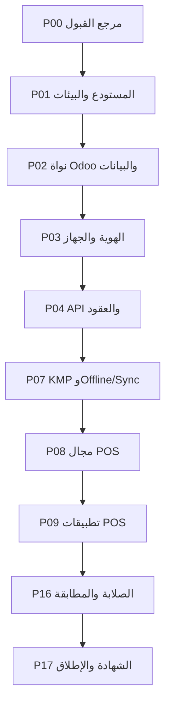

# المرحلة الثالثة: خطة الهيكلة والتطوير البرمجي خطوة بخطوة لبناء النظام الهجين المطابق لـLoyverse

> **نطاق المستند:** المرحلة الثالثة فقط. يحول هذا المستند قرارات المرحلتين الأولى والثانية إلى هيكل مستودع وملكية وحدات وتسلسل تنفيذ وبوابات قبول وخطة إصدار. لا يعيد تقييم المشاريع المفتوحة المصدر ولا يغير النظام الأساسي المختار.

| البيان | القيمة |
|---|---|
| تاريخ الخطة | 16 أغسطس 2026 |
| نظام السجل | Odoo Community 19.0 + PostgreSQL |
| التغطية القابلة لإعادة الاستخدام | **91.4%** |
| طبقة المطابقة المخصصة | **8.6%** |
| سجل النطاق | **51 Gap ID** |
| تصنيف الفجوات | 6 إعادة استخدام مهيمنة، 30 امتداداً، 10 بناءً مخصصاً، 5 مصفوفات مزود/عتاد |
| متوسط تعقيد الدمج | 3.4 من 5 |
| معيار النهاية | إغلاق البنود الـ51 جميعاً على مرشح إصدار واحد بأدلة قابلة لإعادة التشغيل |

## 1. النتيجة التنفيذية

ينفذ النظام بوصفه منظومة متعددة المكونات، لكن بمصدر حقيقة تجاري واحد:

1. **Odoo Community 19.0** يملك الكتالوج والمخزون والبيع والعملاء والموظفين والورديات والمحاسبة وZATCA.
2. **FastAPI مع Pydantic** يقدمان عقد REST/OpenAPI المتوافق ولا يعيدان تنفيذ منطق Odoo.
3. **Keycloak** يملك الهوية السحابية وOIDC/OAuth 2.0؛ ويظل تفويض السجل والإجراء في Odoo.
4. **RabbitMQ مع Celery** ينفذان Webhooks والمهام والموصلات بعد commit عبر transactional outbox.
5. **Superset** يقرأ reporting views مع RLS ولا يكتب بيانات تشغيلية.
6. **Kotlin Multiplatform مع Ktor وSQLDelight** يشاركون المجال والشبكة والتخزين والمزامنة بين Android وApple، مع واجهات أصلية لكل منصة.
7. **CUPS مع python-escpos** يشكلان بوابة طباعة الفرع، وتبقى SDKs الطرفية خلف adapters أصلية.

المسار الحرج ليس بناء الشاشات أولاً. المسار الحرج هو:

**مرجع قبول ثابت ← بيئة قابلة للتكرار ← نموذج موارد ومعرفات ← هوية وعقد API ← Local-first ومزامنة ← مجال POS ← تطبيقات POS ← التكاملات ← الصلابة ← شهادة المطابقة.**

تعمل Back Office والتقارير وKDS/CDS والطباعة على مسارات متوازية بعد اكتمال حدودها المشتركة. ولا يسمح لأي مسار بتجاوز بوابة الاعتماد الخاصة به، حتى لا تتحول الاختلافات إلى إعادة بناء واسعة في آخر المشروع.

## 2. القرارات المعمارية الملزمة

| الرمز | القرار | أثره البرمجي |
|---|---|---|
| AD-01 | Odoo/PostgreSQL هما الكاتب النهائي لبيانات الأعمال | لا قاعدة أعمال مركزية ثانية ولا كتابة مباشرة من FastAPI أو العملاء أو workers |
| AD-02 | كل تغيير تجاري مركب ينفذ في Odoo method ذرية واحدة | لا تسلسل JSON-2 متعدد الاستدعاءات لبيع أو refund أو close shift |
| AD-03 | FastAPI طبقة مضادة للفساد | كل DTO ومعرف وخطأ عام مستقل عن model/res_id داخل Odoo |
| AD-04 | Keycloak يثبت الهوية وOdoo يفوض الإجراء | scopes تسمح بدخول المسار؛ record rules ودور الموظف يقرران التنفيذ |
| AD-05 | POS وKDS وCDS local-first | كل تغيير محلي وcommand outbox يثبتان في معاملة SQLDelight واحدة |
| AD-06 | idempotency من الجهاز إلى Odoo | command_id ثابت، request hash، قيد uniqueness، وإعادة response المخزن |
| AD-07 | الأحداث تبدأ من transactional outbox | لا نشر إلى RabbitMQ قبل ثبات معاملة Odoo |
| AD-08 | RabbitMQ نقل موثوق وليس سجلاً نهائياً | كل task idempotent، manual/late ACK، publisher confirms وDLQ |
| AD-09 | Superset read-only | المقاييس في views versioned، وSuperset metadata في قاعدة منفصلة |
| AD-10 | KDS/CDS يملكان قناة LAN مستقلة | mDNS، pairing، WebSocket/TLS، sequence، ACK وreplay |
| AD-11 | الدفع والطباعة والعتاد خلف ports | adapter لكل مزود أو عائلة طراز، مع capability manifest |
| AD-12 | ZATCA امتداد لوحدات Odoo العامة | لا محرك فوترة سعودي ثانٍ؛ المطلوب حالة POS وطابور واسترداد |
| AD-13 | نواة Odoo مثبتة على commit | الوظائف في addons؛ أي patch للنواة صغير وموثق ومختبر |
| AD-14 | العقود artifacts قابلة للتوليد | OpenAPI وJSON Schema وSQL migrations وfixtures مصادر مضبوطة |
| AD-15 | لا Feature Flag يغلق فجوة | العلم يستخدم rollout مؤقتاً؛ Gap ID لا يغلق إلا بعد اجتياز القبول |

### 2.1 خط الإصدارات المرجعي

| المكوّن | الإصدار المرجعي |
|---|---|
| Odoo Community | 19.0 على commit ثابت |
| Python لخدمات التكامل | 3.12؛ مع بقاء Odoo ضمن متطلبه الرسمي Python 3.10+ |
| FastAPI / Pydantic | 0.141.0 / 2.x المتوافق |
| Keycloak | 26.7.1 على OpenJDK 21 |
| Celery / RabbitMQ | 5.6.3 / 4.3.4 |
| Apache Superset | إصدار GA مدعوم من سلسلة 6.x |
| Kotlin / Ktor / SQLDelight | 2.4.10 / 3.5.2 / 2.3.2 |
| CUPS / python-escpos | 2.4.18 / 3.1 |

كل رقم في الجدول نقطة تجميد للبداية؛ يمر أي patch لاحق عبر compatibility وmigration وconformance gates نفسها.

## 3. الهيكل المستهدف

### 3.1 طبقات النظام وملكية القرار

| الطبقة | المكونات | تملك | لا تملك |
|---|---|---|---|
| واجهات المنتج | POS وDashboard وKDS وCDS وBack Office | العرض، الإدخال، lifecycle، حالات الخطأ | الحقيقة التجارية أو تعريف KPI |
| المجال المحلي | KMP reducers وSQLDelight repositories | draft وcache وoutbox وLAN journal | إيصال مركزي أو مخزون نهائي |
| حدود الموارد | FastAPI/Pydantic | REST، validation، mapping، errors، pagination | الضرائب والمخزون والقيود المالية |
| الهوية | Keycloak | الحساب، session، tokens، JWKS، refresh/revoke | صلاحية refund أو store record |
| مجال الأعمال | Odoo addons ووحداته العامة | المعاملات وقواعد البيع والمخزون والموظف وZATCA | بروتوكول العميل المحلي |
| الأحداث | Odoo outbox + RabbitMQ + Celery | تسليم العمل بعد commit | حقيقة الإيصال أو الدفع |
| التحليلات | PostgreSQL reporting views + Superset | projections ومخططات وRLS | تعديل البيانات |
| بوابة الفرع | CUPS + python-escpos + edge journal | تنفيذ print intent والحالة | إعادة بناء الإيصال |
| adapters | الدفع والطابعات والأجهزة | ترجمة contract موحد إلى SDK/جهاز | منطق POS العام |

### 3.2 طوبولوجيا التشغيل

| المنطقة | الخدمات | القاعدة |
|---|---|---|
| Public edge | reverse proxy وواجهات api/auth/backoffice | 443 فقط، rate limit وWAF وTLS |
| Application | FastAPI وOdoo وCelery وSuperset web | لا وصول عام مباشر إلى منافذ البيانات |
| Identity | Keycloak وقاعدة بياناته | قاعدة منفصلة ونسخ احتياطي مستقل |
| Data | PostgreSQL Odoo وRabbitMQ وSuperset metadata/reporting | أدوار DB منفصلة وأقل صلاحية |
| Branch edge | print gateway وCUPS | outbound إلى السحابة وLAN إلى الطابعات |
| Device | تطبيقات POS/KDS/CDS/Dashboard | HTTPS للسحابة وLAN للأقران المقترنين فقط |

## 4. هيكل المستودع الموحد

    repository/
      upstream/
        odoo/
      patches/
        odoo-19/
      server/
        odoo-addons/
          compat_core/
          compat_catalog/
          compat_pos/
          compat_inventory/
          compat_hr/
          compat_reporting/
          compat_sync/
          compat_webhooks/
          compat_devices/
          compat_payments/
          compat_sa_pos/
        migrations/
      services/
        compatibility-api/
          app/
          tests/
        workers/
          outbox-publisher/
          webhook-delivery/
          realtime-fanout/
          connector-jobs/
      clients/
        shared/
          model/
          money/
          auth/
          network/
          database/
          sync/
          lan/
          print-contract/
          payment-contract/
        android/
          pos/
          dashboard/
          kds/
          cds/
          hardware/
          payments/
        apple/
          pos/
          dashboard/
          kds/
          cds/
          hardware/
          payments/
      edge/
        print-gateway/
        printer-profiles/
      analytics/
        reporting-sql/
        superset-datasets/
        superset-dashboards/
        rls/
      contracts/
        openapi/
        resources/
        commands/
        events/
        sync/
        lan/
        printing/
        payments/
        errors/
      fixtures/
        canonical/
        money-tax/
        offline/
        reports/
        payments/
        printers/
        zatca/
      tests/
        conformance/
        contract/
        integration/
        visual/
        offline/
        lan/
        payments/
        hardware/
        zatca/
        performance/
        security/
      infra/
        containers/
        local/
        ci/
        integration/
        staging/
        production/
        branch-edge/
      docs/
        architecture-decisions/
        contracts/
        runbooks/
        release-evidence/

### 4.1 قواعد الاعتماد داخل المستودع

1. لا تستورد compatibility-api ملفات Python من Odoo؛ تتصل بعقد خدمة Odoo داخلي.
2. لا تتصل clients/shared بـPostgreSQL أو RabbitMQ.
3. لا تستورد وحدات Odoo SDK دفع أو طابعة خاصاً بمنصة الهاتف.
4. لا يكتب workers في جداول أعمال Odoo بـSQL؛ يعيد النتائج عبر domain methods.
5. لا تقرأ Superset قواعد Keycloak أو SQLDelight.
6. لا تكرر تطبيقات الهاتف حساب الضرائب بلا pricing snapshot وfixtures متطابقة مع Odoo.
7. لا يعيد print-gateway حساب QR أو مستند ZATCA.
8. يعتمد كل adapter على contract محايد ولا يمرر types خاصة بالمزود إلى POS domain.
9. يحظر اعتماد Odoo Enterprise أو مكتبة مغلقة في المسار العام؛ SDK المزود محصور في adapter المعني.

## 5. تقسيم الوحدات ومسؤولياتها

### 5.1 وحدات Odoo

| الوحدة | المسؤوليات | الفجوات الرئيسية |
|---|---|---|
| compat_core | external UUID، revision، device، tenant/store binding، dedup، audit | DATA-01، SEC-01 |
| compat_catalog | Items/Variants/Modifiers/Taxes/Discounts/Customers/Loyalty | CAT-01، CRM-01، POS-04، POS-05 |
| compat_pos | Tickets/Receipts/Refunds/Shifts/Cash/PIN/restaurant commands | POS-01، POS-06..POS-10 |
| compat_inventory | Purchase/Transfer/Adjustment/Count/MRP/Labels projection | INV-01..INV-05 |
| compat_hr | rights، Time Clock، Timecards، employee/store rules | EMP-01 |
| compat_reporting | semantic views، KPI definitions، exports، watermarks | REP-01، APP-02 |
| compat_sync | changelog، cursors، tombstones، command dedup، conflict hooks | OFF-02..OFF-05 |
| compat_webhooks | subscriptions، public event mapping، delivery journal | WH-01، WH-02 |
| compat_devices | print intents، profiles، station/display/device registry | KDS-03، CDS-01، PRN-03، HW-01 |
| compat_payments | payment intent/state/reference/reconciliation | PAY-01..PAY-03، POS-08 |
| compat_sa_pos | POS fiscal status، submission trigger، immutable references | SA-01، SA-02 |

### 5.2 خدمات FastAPI والعمال

| الوحدة | المسؤوليات | مبدأ الحماية |
|---|---|---|
| auth adapter | JWKS cache، issuer/audience، PAT، device binding، scope mapping | لا يعتمد على payload لتحديد التاجر أو المتجر |
| resource API | المسارات الـ34 والعمليات الـ57 وDTOs والصور | لا يعيد model name أو res_id |
| command API | idempotency headers، command envelope، Odoo service calls | method Odoo واحدة لكل أمر مركب |
| sync API | push batch، per-command ACK، delta cursor، tombstones | WebSocket hint لا يحل محل delta |
| error/pagination layer | envelope، UTC، limits 50/250، rate 300/300 | سلوك ثابت بكل الموارد |
| outbox publisher | قراءة أحداث Odoo ونشر مؤكد | لا يعلّم published قبل publisher confirm |
| webhook worker | batch/sign/retry/disable | task idempotent وحالة التسليم في Odoo |
| realtime fanout | إشارات تغير للمتجر/المحطة | لا يحمل الحقيقة الكاملة ولا يحتفظ بها نهائياً |
| connector worker | أعمال مزود طويلة وتنبيهات | لا ينشئ أثراً مالياً خارج domain command |

### 5.3 وحدات KMP والعملاء

| الوحدة المشتركة | المسؤولية | المستخدمون |
|---|---|---|
| model | resources وcommands وevents وrevisions | التطبيقات الأربعة |
| money | Decimal والعملة والضرائب/التقريب وفق snapshot | POS وDashboard |
| auth | OIDC state وtoken refresh وdevice session | التطبيقات الأربعة |
| network | Ktor REST/WebSocket وerror mapping | التطبيقات الأربعة |
| database | SQLDelight schema وtransactions وmigrations وencryption hooks | التطبيقات الأربعة |
| sync | outbox، dependency ordering، ACK، delta، tombstones، conflicts | POS أساساً وبقية التطبيقات للقراءة |
| lan | discovery/pairing/sequence/ACK/replay | POS وKDS وCDS |
| print contract | print intent وjob state وcapabilities | POS والـedge bridges |
| payment contract | payment state machine وadapter port | POS |

تبقى واجهات Android بـKotlin/Compose، وواجهات Apple بـSwiftUI/UIKit. يشارك KMP المنطق والتخزين والشبكة، ولا يفرض واجهة موحدة حين تختلف تجربة المنصة.

## 6. مسارات العمل والملكية

| المسار | الفريق القائد | المخرجات |
|---|---|---|
| WS-A النواة والبيانات | Odoo/Python/PostgreSQL | addons، migrations، domain methods، identifiers |
| WS-B API والهوية | FastAPI/Keycloak/Security | OpenAPI، OIDC، PAT، errors، scopes |
| WS-C الأحداث والتحليلات | Platform/Data | outbox، RabbitMQ/Celery، Webhooks، reporting/Superset |
| WS-D KMP وOffline | Distributed/Mobile Core | SQLDelight، sync، conflicts، LAN core |
| WS-E POS | Android + Apple + Odoo POS | التدفقات الأصلية والورديات والتذاكر والدفع |
| WS-F KDS/CDS | Mobile + LAN | التطبيقات المستقلة وpairing/replay |
| WS-G Back Office/Inventory | Odoo Web | القشرة والكتالوج والمخزون والموظفون والعملاء |
| WS-H Dashboard | Data + Mobile | KPIs والتنبيهات والتطبيقان |
| WS-I الطباعة والعتاد | Edge/Native Integration | CUPS/ESC-POS وSDKs ومختبر الأجهزة |
| WS-J الدفع | Payment Integration | state machine وprovider adapters والمصالحة |
| WS-K ZATCA/RTL/UI | Odoo EDI + UI/UX | حالات الفوترة والعربية والمطابقة البصرية |
| WS-L الجودة والتشغيل | QA Automation + SRE | conformance، CI/CD، telemetry، runbooks |

### 6.1 مسؤولية الموافقة

| القرار | المالك | المراجعون الإلزاميون |
|---|---|---|
| تغيير contract عام | Contract owner | Odoo، KMP، QA، Security |
| تغيير domain calculation | Odoo domain owner | Finance/Inventory QA وKMP |
| تغيير sync policy | Distributed systems owner | Odoo، Android، Apple، QA |
| إضافة payment provider | Payment owner | Security، Finance، Native، QA |
| إضافة printer/device | Hardware owner | Android/Apple/Edge، QA |
| تغيير KPI | Analytics owner | Odoo reporting وProduct QA |
| تغيير ZATCA state | Saudi EDI owner | Odoo/Finance، POS، QA |
| إغلاق Gap ID | QA conformance owner | مالك المجال ومالك المنتج |

## 7. نموذج البيانات والعقود قبل التنفيذ

### 7.1 نماذج Odoo الإضافية

| النموذج المنطقي | الحقول الجوهرية | القيد الحاسم |
|---|---|---|
| compat.external_id | tenant، resource_type، external_uuid، model، res_id، revision، deleted_at | UUID فريد داخل tenant/type |
| compat.device | uuid، store، app، platform، public_key، capabilities، revoked_at | جهاز واحد وهوية قابلة للإبطال |
| compat.device_session | device، employee، opened_at، last_seen، permission_snapshot | جلسة تشغيل فعالة وفق السياسة |
| compat.command_dedup | tenant، command_type، key، request_hash، result، status | uniqueness تمنع الأثر مرتين |
| compat.event_outbox | event_id، aggregate، type، sequence، payload_version، published_at | event_id وaggregate sequence فريدان |
| compat.sync_cursor | consumer، stream، watermark، schema_version | cursor opaque مقيد بالنطاق |
| compat.tombstone | resource_type، uuid، revision، deleted_at | لا حذف مادي قبل تجاوز retention |
| compat.ticket_meta | order، uuid، name، comment، revision، origin_device | UUID ثابت وrevision شرطي |
| compat.webhook_subscription | merchant، URL، events، secret_ref، API version، status | secret لا يخزن مكشوفاً |
| compat.webhook_delivery | subscription، batch_id، attempt، next_at، state، response | attempt journal idempotent |
| compat.payment | payment_id، receipt، provider، reference، state، amount، currency | payment_id/provider ref فريدان |
| compat.payment_attempt | payment، attempt_no، request_hash، result، checked_at | لا محاولة غير مدققة |
| compat.print_profile | store، role، model، interface، options، capabilities | scope متجر/دور |
| compat.print_job | job_id، source، payload_hash، state، attempts، reprint_of | job_id يمنع طباعة عمياء |
| compat.zatca_state | document، hash، chain_index، state، response، attempts | المستند/hash immutable |
| compat.audit_event | actor، device، action، target، before، after، time | سجل غير قابل للتعديل للمهمات الحساسة |

### 7.2 قواعد العقد

1. OpenAPI للإصدار 1.0 هو المصدر العام، وليس Python route أو Kotlin class.
2. لكل command schema وresponse وerror وidempotency behavior.
3. لكل event envelope موحد يتضمن event_id وaggregate_id وrevision وoccurred_at وschema_version.
4. كل external UUID ثابت ولا يكشف res_id.
5. كل cursor opaque ويحمل scope وwatermark ونسخة البروتوكول.
6. كل حذف ينتج tombstone.
7. كل amount يستخدم Decimal وISO 4217، وكل وقت UTC مع timezone عرض مستقل.
8. كل contract breaking change يحتاج إصداراً جديداً؛ الإضافة الاختيارية فقط داخل الإصدار.
9. يولد contract test وDTOs المشتركة من artifact مثبت، ولا يعدلها التطبيق يدوياً.
10. public Webhooks تظل منفصلة عن internal events الأغنى.

### 7.3 ترتيب بناء موارد API

| الدفعة | الموارد | سبب الترتيب |
|---:|---|---|
| 1 | Merchant/Stores/Employees/Devices/Payment Types | الهوية والنطاق والمرجعيات |
| 2 | Categories/Taxes/Discounts/Modifier Lists | تبعيات الكتالوج |
| 3 | Items/Variants/Inventory Levels | الكتالوج والمخزون |
| 4 | Customers/Loyalty | تدفق POS والعميل |
| 5 | Shifts/Cash Movements | الوردية والإغلاق |
| 6 | Receipts/Refunds/Images | النتيجة التجارية |
| 7 | Webhook Subscriptions/Deliveries | نشر التغييرات بعد استقرار الموارد |

## 8. استراتيجية التنفيذ والتبعيات

### 8.1 مبادئ الترتيب

1. يثبت القبول قبل كتابة المنتج.
2. يثبت نموذج الموارد والمعرفات قبل الواجهات.
3. يثبت OIDC والجهاز والتفويض قبل المسارات التجارية.
4. يثبت أمر تجاري ذري وidempotent قبل Offline.
5. يثبت Local-first ببيع نقدي واحد قبل توسيع POS.
6. يثبت sync وLAN قبل KDS/CDS.
7. يثبت payment state machine ومحاكي الأعطال قبل أول SDK مزود.
8. يثبت print intent وjob journal قبل أول طابعة فعلية.
9. تثبت semantic metrics قبل Dashboard.
10. تعمل المطابقة البصرية منذ أول شاشة، لكن بوابتها النهائية بعد اكتمال السلوك.

### 8.2 المسارات المتوازية

| المسار | يبدأ بعد | يعتمد عليه |
|---|---|---|
| P05 الأحداث وWebhooks | P02 وواجهة P04 الداخلية | public Webhooks، realtime، connectors |
| P06 التقارير وSuperset | P02 وتعريف البيانات | P12 Dashboard وBack Office analytics |
| P10 KDS/CDS وLAN | P07 وticket events من P08 | المطاعم والطباعة المطبخية |
| P11 Back Office والمخزون | P02؛ ويستفيد من P04 | الإدارة والتقارير والمخزون |
| P12 Dashboard | P06 وauth/network من P03/P07 | تطبيق المدير والتنبيهات |
| P13 الطباعة والعتاد | print contract من P07 وPOS/KDS من P09/P10 | الإيصال والمطبخ والأجهزة |
| P14 الدفع | payment contract من P08 وnative ports من P09 | إتمام موصلات الدفع |
| P15 ZATCA | P02 وP05 وreceipt من P08 | حالة الفاتورة السعودية في POS |

### 8.3 تقديرات الموجات

> التقديرات التالية **نطاقات هندسية** لفريق متعدد المسارات، وليست موعداً تعاقدياً. موصلات الدفع والعتاد تتغير باختلاف عدد الخلايا في المصفوفة.

| المرحلة | النطاق التقديري | السبب الأكبر للتفاوت |
|---|---:|---|
| P00 | 2–4 أسابيع | اكتمال الأدلة المرجعية |
| P01 | 3–5 أسابيع | runners وتوقيع تطبيقات Apple والبيئات |
| P02 | 5–8 أسابيع | mapping وmigrations والحسابات |
| P03 | 4–6 أسابيع | OIDC/PAT/device/PIN |
| P04 | 6–10 أسابيع | 34 مساراً و57 عملية |
| P05 | 5–8 أسابيع | retries والتوقيع والفشل |
| P06 | 4–7 أسابيع | تعريف KPI وRLS والـembedding |
| P07 | 8–12 أسبوعاً | sync والتعارض واختبارات الأعطال |
| P08 | 8–12 أسبوعاً | أوامر POS والورديات والتذاكر |
| P09 | 12–18 أسبوعاً | Android وApple بالتوازي |
| P10 | 8–12 أسبوعاً | أربع تطبيقات وحالات LAN |
| P11 | 8–12 أسبوعاً | المخزون والقشرة المبسطة |
| P12 | 6–10 أسابيع | تطبيقان وتقارير وتنبيهات |
| P13 | 10–18 أسبوعاً | عدد الطرازات والواجهات |
| P14 | 12–24+ أسبوعاً | عدد مزودي الدفع والبلدان والطرفيات |
| P15 | 4–8 أسابيع | حالات الفشل والاختبارات السعودية |
| P16 | 8–12 أسبوعاً | visual/security/performance/migrations |
| P17 | 4–8 أسابيع | المختبر والـpilot وإعادة الاختبار |

مع تنفيذ المسارات المتوازية بفريق كامل، يكون خط التخطيط الواقعي للمطابقة الشاملة **نحو 12–18 شهراً**؛ ولا يشمل ذلك انتظار عقود أو شهادات أو أجهزة من مزودي الدفع.

### 8.4 إصدارات داخلية قابلة للعرض

| الإصدار الداخلي | الشريحة الرأسية | البوابات اللازمة |
|---|---|---|
| R0 Foundation | بناء كل الخدمات والتطبيقات shells وgolden dataset | G00–G01 |
| R1 Online Cash Slice | صنف ← سلة ← دفع نقدي ← إيصال Odoo ← تقرير | G02–G04 وجزء G08 |
| R2 Offline Cash Slice | نفس البيع Offline ثم retry وإيصال واحد | G07 |
| R3 POS Core | tickets وrefunds وshifts وloyalty على المنصتين | G08–G09 |
| R4 Restaurant | KDS/CDS وLAN وbill/split/merge | G10 |
| R5 Operations | Back Office والمخزون والتقارير وDashboard | G06 وG11–G12 |
| R6 Devices | الطباعة والماسح والميزان والدرج | G13 |
| R7 Payments/Saudi | موصلات الدفع وZATCA | G14–G15 |
| RC Parity | RTL/UI/security/performance وكل البنود | G16 |
| GA | مرشح واحد مجتاز للـ51 Gap ID | G17 |

## 9. الخطة التفصيلية خطوة بخطوة

### P00 — تثبيت مرجع المطابقة ودليل القبول

**الهدف:** تحويل كل استنتاج سابق إلى حالة قبول قابلة للتنفيذ وإعادة التشغيل.

**المدخل:** المرحلتان الأولى والثانية وسجل الفجوات الـ51.

1. تثبيت إصدار Loyverse المرجعي وتاريخ الرصد لكل سطح.
2. تثبيت منصات وأنظمة التشغيل وأحجام الهاتف واللوحي والاتجاهات واللغة والسمة.
3. فهرسة كل شاشة وحالة ورسالة وخطأ وإجراء وصلاحية وربطها بـGap ID.
4. إنشاء golden dataset للأصناف والمتغيرات والموزون والمركب والضرائب والخصومات والنقاط والعملات.
5. إنشاء سيناريوهات مرجعية للبيع والتذاكر والتعارض والاسترداد والورديات والمخزون.
6. تثبيت نتائج التقارير والقيم المالية والتقريب لكل fixture.
7. تثبيت OpenAPI fixtures للمسارات الـ34 والعمليات الـ57 والأخطاء والحدود.
8. تثبيت أحداث Webhook الخمسة والتوقيع والدفعات والمحاولات.
9. تثبيت مصفوفة provider×country×OS×terminal للدفع.
10. تثبيت printer/device×interface×OS×firmware للطباعة والعتاد.
11. إنشاء مجلد conformance لكل Gap ID مع requirement وcases وexpected evidence.
12. تعريف من يملك اعتماد التغيير في المرجع وكيف يسجل baseline revision جديد.

**المخرجات:** baseline manifest، golden dataset، screen-state catalog، contract fixtures، payment/hardware matrices.

**الفجوات:** QA-01 أساساً، ومرجع لكل البنود.

**G00:** لا يوجد Gap ID بلا حالات قبول قابلة للقياس، ولا رقم مالي أو تقرير بلا نتيجة مرجعية.

### P01 — تأسيس المستودع والبناء والبيئات

**الهدف:** بناء كل مكوّن واختباره من commit واحد من دون خطوات يدوية مخفية.

**يبدأ بعد:** G00.

1. تثبيت Odoo 19.0 على commit وحفظ checksum وSBOM.
2. تثبيت إصدارات FastAPI وKeycloak وCelery/RabbitMQ وSuperset وKotlin/Ktor/SQLDelight وCUPS/python-escpos.
3. إنشاء هيكل المستودع وقواعد CODEOWNERS ومراجعة العقود.
4. إعداد Python lockfiles وlint/type/test لـOdoo والخدمات والـedge.
5. إعداد Gradle version catalog وبناء KMP وتطبيقات Android الأربعة.
6. إعداد Xcode projects/Swift packages وبناء تطبيقات Apple على runners macOS.
7. إعداد lint لـOpenAPI وJSON Schema وSQL migrations وSuperset assets.
8. إنشاء بيئات local وintegration وstaging ومختبر branch edge والعتاد.
9. إنشاء إدارة أسرار وشهادات وتوقيع تطبيقات وصور OCI موقعة.
10. إضافة OpenTelemetry وstructured logs وtrace/request/command IDs منذ أول commit.
11. إضافة فحص dependencies وsecrets وlicenses وcontainer images.
12. إنشاء ADR template وrunbook template وrelease evidence index.

**المخرجات:** builds قابلة للتكرار، صور خدمات مثبتة، app shells، CI pipelines، environment manifests.

**الفجوات:** SEC-01 وQA-01 كأساس عابر.

**G01:** بناء نظيف لكل خدمة وتطبيق، smoke test كامل، وإنشاء Integration environment آلياً.

### P02 — نواة Odoo ونموذج الموارد والمعرفات

**الهدف:** تثبيت الحقيقة المركزية وعلاقات الموارد قبل بناء العملاء.

**يبدأ بعد:** G01.

1. تفعيل وحدات Odoo العامة اللازمة: POS والمطعم والموظفون والولاء والمخزون والشراء وMRP والسعودية.
2. إنشاء addon skeletons وسياسة الاعتماد بينها.
3. تنفيذ compat.external_id وrevision وtombstone وaudit.
4. تنفيذ compat.device وdevice session وربط المتجر والموظف.
5. تنفيذ command dedup وevent outbox داخل PostgreSQL/Odoo ORM.
6. إنشاء resource dictionary لكل Merchant/Store/Device/Employee/Item/Variant/Receipt/Shift.
7. توسيع product/item projection للخيارات والمتاجر والمخزون الأمثل وmodifiers.
8. إنشاء ticket/receipt/shift/payment/fiscal projections.
9. كتابة domain methods ذرية للبيع وrefund والوردية والأوامر المركبة.
10. كتابة migrations وفهارس وuniqueness وretention.
11. تنفيذ mappers ثنائية الاتجاه واختبارات round-trip.
12. تحميل golden dataset وإثبات نتائج المال والضريبة والمخزون والتقارير الأساسية.
13. قياس query plans والفهارس على حجم بيانات مرجعي.
14. تثبيت سياسة patch للنواة وتشغيل اختبار يكشف أي تعديل خارج addons/patches.

**المخرجات:** Odoo addons الأساسية، schema/migrations، resource mapping، atomic commands، seed data.

**الفجوات:** DATA-01، CAT-01 جزئياً، POS-04، POS-09، POS-10، SEC-01.

**G02:** UUID ثابت عبر create/update/delete/upgrade، round-trip بلا فقد، وأمر بيع/استرداد ذري لا يكرر الأثر.

### P03 — الهوية والجهاز والصلاحيات

**الهدف:** فصل هوية الحساب عن صلاحيات المتجر وPIN التشغيلي.

**يبدأ بعد:** G02.

1. إنشاء Keycloak realm وclients منفصلة لـPOS/Dashboard/KDS/CDS/Back Office والخدمات.
2. ضبط Authorization Code + PKCE S256 للعملاء العامة وClient Credentials للخدمات.
3. ضبط JWKS والتدوير وrefresh/revoke وsession policies.
4. ربط Odoo auth_oauth بـKeycloak وربط subject بمستخدم/موظف.
5. بناء FastAPI auth middleware للتحقق من issuer/audience/time/signature.
6. تنفيذ merchant/store/device binding غير القابل للتجاوز من body.
7. تنفيذ scopes العامة ثم إعادة تفويض Odoo للـrecord/action.
8. تنفيذ Personal Access Token المتوافق ببصمة hash ودورة revoke.
9. تنفيذ device enrollment وpublic key وcapabilities وrevocation.
10. تنفيذ PIN والقفل والتبديل وmanager override وسجل audit.
11. إنشاء permission snapshot محدود العمر للاستخدام Offline.
12. اختبار lost device وrevoked token وexpired token وscope escalation وcross-store access.
13. اختبار sign-out مع unsynced data ومنع الحذف المدمر.

**المخرجات:** realm/config versioned، SSO، token validation، PAT، device registry، PIN domain.

**الفجوات:** API-02، POS-01، EMP-01 جزئياً، SEC-01، OFF-05 جزئياً.

**G03:** نجاح login/refresh/revoke/PAT/PIN/device flows، وفشل كل محاولة خارج النطاق بالنتيجة المرجعية.

### P04 — عقد REST العام وطبقة التوافق

**الهدف:** تقديم API ثابت مستقل عن Odoo ومهيأ للمزامنة والعملاء.

**يبدأ بعد:** G03.

1. كتابة OpenAPI 3.0 للإصدار 1.0 كاملاً قبل controllers.
2. إنشاء Pydantic DTOs وerror envelope وrequest/correlation middleware.
3. تنفيذ pagination وlimits 50/250 وUTC وsoft delete وtombstones.
4. تنفيذ rate limit 300 طلب/300 ثانية بالمعنى المرجعي.
5. بناء دفعات الموارد السبع بالترتيب المحدد في القسم 7.3.
6. تنفيذ image upload/download وPNG validation.
7. تنفيذ command endpoints مع Idempotency-Key وrequest hash.
8. استدعاء Odoo service methods عبر شبكة خاصة وحساب خدمة محدود وmTLS.
9. تمرير actor/device context موقعاً وإعادة فحصه داخل Odoo.
10. تحويل Odoo errors إلى أكواد عامة من دون traceback أو model names.
11. بناء SDK/DTO artifacts لـKMP واختبارات Python من OpenAPI.
12. إضافة negative tests للحقول والأنواع والنطاق والحذف والحدود.
13. تشغيل contract suite للمسارات الـ34 والعمليات الـ57.
14. تنفيذ compatibility test يضمن عدم تسرب res_id بعد أي تغيير.

**المخرجات:** OpenAPI frozen، FastAPI service، resource/command APIs، generated artifacts، contract report.

**الفجوات:** API-01، API-03، DATA-01، CAT-01، CRM-01.

**G04:** نجاح العقد كاملاً، عدم ظهور معرفات Odoo، وتطابق status/error/pagination/rate semantics.

### P05 — Outbox وRabbitMQ/Celery وWebhooks والاتصال الحي

**الهدف:** نقل الأحداث والأعمال غير المتزامنة بعد المعاملة من دون فقد أو أثر مكرر.

**يبدأ بعد:** G02 وواجهة أوامر P04.

1. تنفيذ outbox publisher بقفل سجلات وحالة نشر ومعرّف ثابت.
2. إعلان RabbitMQ exchanges وquorum queues وDLQ وdelivery limits كتعريفات versioned.
3. تفعيل publisher confirms وعدم تحديث published_at قبل التأكيد.
4. إنشاء Celery tasks idempotent مع manual/late ACK وretry/backoff/jitter.
5. تنفيذ Webhook subscription CRUD عبر FastAPI/Odoo.
6. تحويل internal events إلى الأحداث العامة الخمسة وpayload version.
7. تنفيذ batch حتى 100 وHMAC والعناوين المطلوبة.
8. تنفيذ سياسة المحاولات والحالة DISABLED والبريد/التنبيه المرجعي.
9. إنشاء delivery journal قابل للتدقيق وإعادة التشغيل الآمن.
10. إنشاء realtime fanout لإشارات المتجر/المحطة مع delta fallback.
11. إضافة metrics للـoutbox age والqueue depth وredelivery وdisabled subscriptions.
12. اختبار rollback وbroker outage وpublisher crash وworker crash وduplicate delivery وslow endpoint.
13. إثبات أن البيع ينجح عند تعطل RabbitMQ ويتراكم outbox فقط.

**المخرجات:** outbox publisher، Rabbit topology، Celery workers، Webhooks، realtime hints، failure suite.

**الفجوات:** WH-01، WH-02، OFF-02 جزئياً، SEC-01، QA-01.

**G05:** لا Webhook قبل commit، ولا فقد بعد commit ضمن retention، ولا أثر مكرر تحت redelivery.

### P06 — النموذج التحليلي وSuperset

**الهدف:** تثبيت تعريف الأرقام مرة واحدة وإتاحتها للويب والتطبيقات.

**يبدأ بعد:** G02، ويمكن بالتوازي مع P03–P05.

1. تعريف كل KPI بصيغة مكتوبة: Gross/Net sales، Refunds، Average ticket، Taxes، Tips، Receipts.
2. بناء reporting schema وviews/versioned metric definitions.
3. إنشاء dimensions للمتجر والموظف والصنف والفئة والدفع والوقت.
4. تحديد استراتيجية read-only primary views أو replica وإظهار data_as_of.
5. نشر Superset 6.x مع metadata DB مستقلة.
6. ربط Keycloak OIDC وتعيين الأدوار.
7. تفعيل RLS deny-by-default للتاجر والمتجر.
8. إنشاء datasets وdashboards وexports versioned.
9. تنفيذ embedded dashboard flow عبر guest token من Superset API.
10. إنشاء metric endpoints في FastAPI لتطبيق Dashboard الأصلي.
11. إنشاء stock alert rules والأحداث المقابلة.
12. مقارنة كل رقم وفترة وفلاتر مع golden dataset.
13. اختبار cross-tenant leakage وreplica lag وtimezone boundaries.

**المخرجات:** reporting views، metric catalog، Superset assets، RLS، metric API، golden report.

**الفجوات:** REP-01، APP-02، CRM-01 جزئياً.

**G06:** صفر فرق رقمي في مجموعة التقارير المرجعية، وعزل تاجر/متجر مثبت.

### P07 — KMP وSQLDelight ومحرك Offline/Sync والشريحة النقدية

**الهدف:** إثبات local-first وعدم الفقد أو التكرار قبل توسيع POS.

**يبدأ بعد:** G04، ويستخدم G03.

1. إنشاء KMP modules للموديلات والمال والهوية والشبكة وقاعدة البيانات والمزامنة.
2. إنشاء SQLDelight schemas مستقلة لكل تطبيق مع shared definitions عند الملاءمة.
3. ربط SQLCipher وKeystore/Keychain وحماية المفاتيح.
4. تنفيذ local_resource وticket/shift/outbox/cursor/tombstone/schema_meta.
5. تنفيذ معاملة محلية تجمع domain change وcommand outbox.
6. تنفيذ Ktor push batch وper-command ACK وretry/backoff.
7. تنفيذ delta pull وwatermark وopaque cursor وreset-required.
8. تنفيذ WorkManager وBackgroundTasks وManual Sync.
9. تنفيذ policy framework للتعارض، وبداية بسياسة التذكرة والموارد المرجعية.
10. تنفيذ Online/Offline capability matrix والرسائل.
11. تنفيذ حماية sign-out وmigration/recovery وdisk-full/corruption handling.
12. بناء أول vertical slice: صنف cached ← سلة ← نقد ← receipt pending ← sync ← Odoo ACK.
13. تشغيل fault injection عند local commit وHTTP send وOdoo commit وresponse وACK.
14. تشغيل جهازين وclock skew وduplicate/reorder وcursor expiry.
15. اختبار migration من كل schema version مع outbox غير فارغ.

**المخرجات:** KMP core، SQLDelight DB، sync engine، conflict framework، Offline cash slice، fault suite.

**الفجوات:** OFF-01..OFF-05، POS-06 جزئياً، POS-09/10 جزئياً، SEC-01.

**G07:** صفر فقد وصفر أثر مكرر وصفر resurrection في kill/retry/conflict/migration، وإيصال مركزي واحد للشريحة النقدية.

### P08 — مجال POS والورديات والتذاكر والموظفين

**الهدف:** إكمال قواعد POS في Odoo وKMP قبل إنهاء الواجهات الأصلية.

**يبدأ بعد:** G02 وG07.

1. تنفيذ cart commands للكمية والوزن والسعر المتغير والملاحظات.
2. تنفيذ modifiers وdining options والضرائب والخصومات والتقريب.
3. تنفيذ customer attach والولاء وearn/redeem وسجل الشراء.
4. تنفيذ open tickets والأسماء المسبقة والتعليقات والبحث والفرز وrevision.
5. تنفيذ split/merge/move/partial quantity وprint bill.
6. تنفيذ cash وsplit tender وtips وcash rounding وحالة النجاح.
7. تثبيت payment port وآلة الحالات قبل adapters الفعلية.
8. تنفيذ receipts وrefund/cancel والصلاحيات والمخزون والتدقيق.
9. تنفيذ shifts وopening cash وPay In/Out وexpected/actual وclose.
10. تنفيذ Time Clock وTimecards وdecimal hours وسجل التعديل.
11. إنشاء KMP reducers وuse cases المناظرة للأوامر والحالات.
12. إنشاء fixtures مشتركة Python/Kotlin لكل حساب وانتقال.
13. تشغيل جهازين على ticket واحد، وtimeout أثناء الدفع، وrefund بعد Offline sale.
14. إنشاء Back Office operational views الأولية لإدارة الموارد.

**المخرجات:** compat_pos/catalog/hr، KMP POS domain، state machines، golden domain suite.

**الفجوات:** POS-01 وPOS-04..POS-10، EMP-01، CRM-01، CAT-01 جزئياً.

**G08:** ينجح مسار نقدي كامل وticket متعدد الأجهزة وrefund وshift close مع تطابق المال والمخزون والتدقيق.

### P09 — تطبيق POS الأصلي على Android وiOS/iPadOS

**الهدف:** إغلاق تجربة POS على المنصتين فوق المجال والمزامنة نفسيهما.

**يبدأ بعد:** G07 وG08. ينفذ المساران P09-A وP09-B بالتوازي.

#### P09-A — Android

1. تنفيذ enrollment واختيار المتجر والجهاز وlogin/PIN/lock/switch.
2. تنفيذ phone navigation وFavorites والبحث والتصنيفات.
3. تنفيذ tablet two-pane وCustom Pages/Grid والتحرير وdrag/long-press.
4. تنفيذ item/modifier/comment/customer/discount/tax dialogs.
5. تنفيذ open tickets وsplit/merge/move وprint bill.
6. تنفيذ Charge وcash/split/tip/rounding/success.
7. تنفيذ receipts/refunds/cancel وshift/Pay In-Out/sync status.
8. ربط Compose state بالـKMP reducers وSQLDelight فقط.
9. تنفيذ WorkManager/lifecycle/permissions/Keystore.
10. تنفيذ portrait/landscape وphone/tablet وlight/dark وRTL hooks.
11. إضافة Compose UI tests وEspresso وgolden screenshots.
12. إضافة mock ports للطباعة والدفع والماسح قبل الأجهزة الفعلية.

#### P09-B — Apple

1. تنفيذ enrollment واختيار المتجر والجهاز وlogin/PIN/lock/switch.
2. تنفيذ iPhone navigation وFavorites والبحث والتصنيفات.
3. تنفيذ iPad two-pane وCustom Pages/Grid والإيماءات.
4. تنفيذ dialogs والسلة والعميل والولاء والخصم والضريبة.
5. تنفيذ tickets وsplit/merge/move وreceipts/refunds.
6. تنفيذ Charge وcash/split/tip/rounding/success.
7. تنفيذ shifts وPay In/Out والإغلاق وsync status.
8. ربط SwiftUI/UIKit بالـKMP framework وSQLDelight.
9. تنفيذ BackgroundTasks وKeychain وforeground/background/relaunch.
10. تنفيذ safe areas وkeyboard/multitasking وportrait/landscape وRTL.
11. إضافة XCTest/XCUITest وsnapshot tests وmemory pressure cases.
12. إضافة mock bridges للطباعة والدفع والعتاد.

**مهام مشتركة:**

1. إنشاء design token source واحد مع إسقاط Android وApple.
2. منع منطق حساب متباين في الواجهتين؛ كل calculation fixture مشترك.
3. تسجيل screen render وlocal commit وsync latency.
4. اختبار Online/Offline/slow/timeout/kill على الأجهزة المستهدفة.
5. اختبار ترقية التطبيق مع unsynced receipt وopen shift.

**المخرجات:** تطبيق POS قابل للتثبيت على Android وiPhone/iPad، UI suites، local-first telemetry.

**الفجوات:** POS-01..POS-10، OFF-04، OFF-05، RTL-01 جزئياً، UI-01 جزئياً.

**G09:** نجاح كل تدفقات POS المرجعية على المنصتين والأحجام والاتجاهات Online/Offline وبعد kill/relaunch.

### P10 — قناة LAN وتطبيقات KDS وCDS

**الهدف:** تشغيل المطبخ وشاشة العميل داخل الفرع مع الإنترنت أو بدونه.

**يبدأ بعد:** G07 وticket events من G08؛ يمكن أن يتوازى مع نهاية P09.

1. كتابة LAN protocol schema ونسخته واختبارات التوافق.
2. تنفيذ mDNS/DNS-SD وmanual IP discovery.
3. تنفيذ one-time pairing وتبادل مفاتيح وتخزين trust وrevoke.
4. تنفيذ WebSocket/TLS وheartbeat وsequence وACK وreplay وfull snapshot.
5. تنفيذ station/category routing وstore isolation.
6. بناء تطبيق KDS على Android وiPadOS كتطبيقين مستقلين.
7. تنفيذ ticket cards وserver/time/modifiers/comments.
8. تنفيذ green/yellow/red وعتبات 240/420 ثانية والصوت وdark.
9. تنفيذ item/order done وvoid وrecall وclear مع SQLDelight journal.
10. بناء تطبيق CDS على Android وiOS/iPadOS.
11. تنفيذ empty/active ticket/customer/points/payment/success/change/disconnected.
12. دعم POS واحد مع عدة CDS وعدة POS مع stations من دون عبور متجر.
13. تنفيذ cloud convergence حتى لا يظهر الحدث المحلي والمركزي مرتين.
14. اختبار packet loss/reorder/duplicate/Wi-Fi roam/restart/pair revoke.
15. اختبار استمرار POS→KDS/CDS عند تعطل السحابة بالكامل.

**المخرجات:** LAN core، KDS وCDS apps، station/pairing administration، replay suite.

**الفجوات:** KDS-01..KDS-03، CDS-01، CDS-02، POS-06 جزئياً، SEC-01.

**G10:** لا تضيع بطاقة أو حالة دفع، ولا sequence gap غير مستعاد، وتطابق حالات KDS/CDS المرجعية.

### P11 — Back Office والكتالوج والمخزون والعملاء والموظفون

**الهدف:** تقديم إدارة مبسطة مطابقة فوق محركات Odoo.

**يبدأ بعد:** G02؛ يستخدم G04 وG06 ويمكن أن يتوازى مع P07–P10.

1. بناء shell وقائمة Back Office وحالات Save/Cancel/Delete/errors.
2. تنفيذ Item/Variant/options الثلاثة وstore price/availability.
3. تنفيذ modifiers وlow/optimal stock وimport/export وصور الأصناف.
4. تنفيذ Customer Base والنقاط والزيارات والإنفاق والسجل وmerge/delete.
5. تنفيذ Employee access profiles وTimecards والتعديل والتدقيق.
6. تنفيذ Suppliers وPurchase Orders وAutofill والاستلام الجزئي والتكاليف.
7. تنفيذ Transfers وAdjustments وInventory History وValuation.
8. تنفيذ Inventory Count الكامل/الجزئي وExpected/Actual والفرق.
9. تنفيذ Production وDisassembly وتكلفة المكونات.
10. تنفيذ Label templates والأبعاد والباركود والمعاينة.
11. ربط التقارير والتصدير بـsemantic views لا بحسابات واجهة.
12. تطبيق record rules للتاجر والمتجر والدور.
13. اختبار round-trip import/edit/export وعمليات مخزون متزامنة.
14. تشغيل visual/navigation/form conformance على العربية والإنجليزية.

**المخرجات:** Odoo Back Office shell، catalog/CRM/HR/inventory workflows، labels، exports.

**الفجوات:** BO-01، CAT-01، INV-01..INV-05، EMP-01، CRM-01، REP-01 جزئياً.

**G11:** تطابق المستندات والحركات والتكاليف والحقول والأخطاء والصلاحيات مع golden dataset.

### P12 — تطبيق Dashboard الأصلي والتنبيهات

**الهدف:** إتاحة تجربة المدير الأصلية بالمقاييس المثبتة.

**يبدأ بعد:** G03 وG06، ويعيد استخدام KMP من G07.

1. بناء تطبيق Dashboard مستقل لـAndroid.
2. بناء تطبيق Dashboard مستقل لـiOS.
3. تنفيذ OIDC واختيار التاجر/المتجر والصلاحيات.
4. تنفيذ Receipts وNet sales وAverage ticket والفترة السابقة.
5. تنفيذ date range وtimezone وstore filters وdrill-down.
6. تنفيذ Items وstock alerts والفرز والبحث.
7. استهلاك metric endpoints وعدم إعادة حساب KPI محلياً.
8. تنفيذ cache محدود وdata_as_of وoffline read-only state.
9. تنفيذ FCM/APNs للتنبيهات مع deep links.
10. ربط Superset embedding للويب حيث يلزم، لا كتجربة الهاتف الأساسية.
11. إضافة Compose/SwiftUI UI tests وgolden charts.
12. اختبار تعدد المتاجر وRLS وتأخر replica والحدود الزمنية.

**المخرجات:** تطبيقان مستقلان، alerts، metric clients، dashboard conformance.

**الفجوات:** APP-01، APP-02، REP-01 جزئياً.

**G12:** تطابق كل KPI وfilter وdrill-down والتنبيه والصلاحية على المنصتين.

### P13 — بوابة الطباعة والطابعات والعتاد

**الهدف:** تحويل كل تكامل عتاد إلى capability معلنة واختبار قابل للتكرار.

**يبدأ بعد:** print contract من G07 وواجهات POS/KDS من G09/G10.

1. تثبيت Print/Scanner/Scale/Drawer/Display ports وcapability schemas.
2. بناء Python print-gateway داخل الفرع مع journal مشفر وdevice identity.
3. ربط CUPS عبر IPP والطابعات الشبكية وUSB المدعومة.
4. ربط python-escpos لـNetwork/USB/Serial والنص والصورة وQR/barcode/cut/drawer/buzzer.
5. تنفيذ job_id وpayload hash وحالات queued/sent/ack/failed/unknown.
6. فصل Reprint كأمر جديد يحمل reprint_of وعلامة واضحة.
7. تنفيذ receipt/kitchen/pre-bill/ZATCA print intents وقوالب RTL/raster.
8. تنفيذ kitchen category routing وadditions/voids/single item.
9. تنفيذ Android TCP 9100/Bluetooth RFCOMM/USB Host وSunmi/iMin adapters.
10. تنفيذ Apple Network/ExternalAccessory/AirPrint وStar/Epson adapters.
11. تنفيذ HID/camera/embedded-weight barcode والميزان والدرج.
12. إنشاء capability manifest لكل model/interface/firmware/OS.
13. معالجة paper out/cover open/disconnect/permission/unknown.
14. تشغيل HIL لكل خلية واختبار retry من دون طباعة عمياء.
15. قياس Arabic raster quality وQR readability والأبعاد الفعلية.

**المخرجات:** edge gateway، ports/adapters، profiles، print templates، HIL reports.

**الفجوات:** PRN-01..PRN-03، HW-01، INV-05، RTL-01 جزئياً.

**G13:** نجاح Test Print والإيصال والمطبخ وQR والحالة والعتاد لكل خلية مستهدفة بلا duplicate.

### P14 — بوابات الدفع والمصالحة

**الهدف:** تغطية مصفوفة مزودي الدفع بآلة حالة واحدة ومن دون تحصيل مكرر.

**يبدأ بعد:** payment port من G08 وnative bridges من G09.

1. تثبيت payment intent/attempt/reference/reconciliation schemas.
2. تنفيذ state machine: CREATED/INITIATING/PENDING/APPROVED/DECLINED/UNKNOWN/REFUND.
3. تنفيذ قفل المحاولة وidempotency وprovider reference uniqueness.
4. بناء provider simulator للـapprove/decline/timeout/late/duplicate/reversal.
5. تنفيذ check-status قبل أي retry بعد timeout.
6. تنفيذ refund/cancel/reversal/reconciliation وaudit.
7. إنشاء adapter template واختبارات contract إلزامية.
8. دمج كل مزود ضمن package منفصل على الخادم أو Android أو Apple حسب SDK.
9. تنفيذ terminal pairing وBluetooth/network readers.
10. تنفيذ Tap to Pay on iPhone ضمن الخلايا المشمولة.
11. ترميز country/OS/device/online-offline capabilities ومنع عرض وسيلة غير صالحة.
12. تأمين credentials وredaction وتقليل نطاق بيانات البطاقة.
13. تشغيل sandbox ثم terminal فعلي لكل مزود.
14. قطع الشبكة عند كل انتقال وتشغيل reconciliation حتى الاستقرار.
15. توثيق provider runbook وunknown SLA وتعطيل adapter مستقلاً.

**المخرجات:** payment core، simulator، provider adapters، terminal flows، reconciliation dashboard.

**الفجوات:** PAY-01..PAY-03، POS-08، SEC-01.

**G14:** كل خلية provider×country×OS×terminal تجتاز sale/refund/cancel/timeout/reconcile من دون حالة مالية غير قابلة للحل.

### P15 — ZATCA في تدفق POS

**الهدف:** ربط وحدات Odoo السعودية بتجربة POS وOffline والفشل المرجعية.

**يبدأ بعد:** receipt domain من G08 وoutbox من G05.

1. تثبيت إصدارات l10n_sa/l10n_sa_edi/l10n_sa_edi_pos واختبارها بالـfixtures.
2. تنفيذ onboarding وCSID/certificate secret handling.
3. ربط receipt/refund بالوثيقة وUBL/QR/hash والـchain.
4. جعل document_id وhash immutable بعد التوقيع.
5. تنفيذ حالات pending/submitted/accepted/warning/rejected في Odoo وKMP.
6. تنفيذ submission trigger وretry بنفس document_id.
7. منع duplicate أو hash-chain break عند timeout قبل/بعد الإرسال.
8. تنفيذ UX الذي يقرر متى يمكن إغلاق الإيصال وفق الحالة المرجعية.
9. تنفيذ Offline queue والحالة المرئية وrecovery.
10. ربط print intent بالوثيقة المعتمدة وعدم إعادة حساب QR في edge.
11. اختبار البيع والاسترداد والرفض والشهادة المنتهية وتعطل الخدمة.
12. تشغيل validator/sandbox ومراجعة XML/QR والنتيجة.
13. إضافة dashboards وrunbooks لـpending/rejected/chain error.

**المخرجات:** compat_sa_pos، KMP fiscal states، queue/retry، ZATCA evidence.

**الفجوات:** SA-01، SA-02، POS-09 جزئياً، RTL-01 في الإيصال.

**G15:** قبول عينات البيع والاسترداد، وعدم وجود وثيقتين أو chain مكسورة تحت fault injection.

### P16 — RTL والمطابقة البصرية والأمن والأداء والترقيات

**الهدف:** تحويل نظام وظيفي إلى مرشح مطابق وصلب وقابل للتشغيل.

**يبدأ بعد:** اكتمال الأسطح P09–P15، مع تنفيذ أجزاء منه باستمرار منذ P01.

1. تجميد design tokens والمقاييس والألوان والخطوط والأيقونات والحركات.
2. تشغيل visual matrix لكل screen-state على Android/iPhone/iPad/Back Office/KDS/CDS.
3. إغلاق RTL/bidi/number/currency/barcode/raster في كل سطح.
4. اختبار light/dark وportrait/landscape وsafe areas وkeyboard.
5. إكمال accessibility labels/focus/dynamic type/touch targets وفق السلوك المرجعي.
6. تنفيذ SAST/DAST/dependency/container/secret scans وSBOM.
7. اختبار MITM وdevice revoke وpairing attacks وcross-store/cross-tenant.
8. تشغيل load/soak على API وsync وWebhooks وreports وRabbitMQ.
9. قياس p50/p95/p99 وlocal commit/render/sync/KDS latency.
10. تشغيل chaos على Odoo/FastAPI/Rabbit/Celery/Superset/network/edge.
11. اختبار backup/restore وPostgreSQL PITR وKeycloak/Superset metadata recovery.
12. اختبار server-first/client-first deployment وprotocol compatibility.
13. اختبار Odoo وSQLDelight migrations من كل نسخة مدعومة مع outbox غير فارغ.
14. تطبيق expand→migrate→contract ومنع rollback الذي يخفض schema.
15. إنشاء dashboards والتنبيهات وrunbooks لكل فشل حرج.
16. إغلاق كل visual/performance/security defect من P0 إلى P2.

**المخرجات:** visual parity report، security/performance reports، migration matrix، recovery evidence، runbooks.

**الفجوات:** RTL-01، UI-01، SEC-01، QA-01، وبوابات الصلابة لكل البنود.

**G16:** لا ثغرة حرجة/عالية، لا gap بصري مفتوح، ونجاح الأعطال والترقية والاستعادة بلا فقد أو تكرار.

### P17 — شهادة المطابقة والـPilot والإطلاق

**الهدف:** إثبات التطابق على مرشح واحد وتحويله إلى إصدار قابل للعودة.

**يبدأ بعد:** G16 وكل البوابات السابقة.

1. تجميد commit نواة Odoo وإصدارات العقود والصور والتطبيقات وprofiles.
2. إنشاء بيئة نظيفة وتحميل golden dataset.
3. تشغيل مجموعة Gap IDs الـ51 كاملة على المرشح نفسه.
4. تشغيل المسارات الـ34 والعمليات الـ57 وWebhooks failure suite.
5. تشغيل Online/Offline/kill/retry/conflict/cursor/LAN replay.
6. تشغيل Android/iPhone/iPad والاتجاهات والعربية/الإنجليزية والسمات.
7. تشغيل مصفوفات الدفع والطباعة والعتاد الفعلية.
8. تشغيل ZATCA sale/refund/failure/chain tests.
9. مراجعة النتائج المالية والمخزنية والتقارير واللقطات.
10. منع أي quarantined test أو waiver أو استثناء P0/P1/P2.
11. توقيع artifacts وSBOM وrelease notes وmigration/rollback package.
12. تنفيذ pilot محدود بمتاجر وأجهزة ومزودين داخل المصفوفة.
13. مراقبة sync backlog وpayment unknown وprint failures وZATCA pending.
14. اختبار rollback التشغيلي من دون خفض schema أو فقد أوامر.
15. إعادة full conformance بعد إصلاحات pilot.
16. إصدار evidence index يربط كل Gap ID بنتيجة وartifact ونسخة.

**المخرجات:** parity certificate، signed artifacts، release evidence، pilot report، rollback package.

**الفجوات:** QA-01 وإغلاق جميع البنود.

**G17:** البنود الـ51 جميعها Passed، وكل بوابات G00–G16 ناجحة على artifact set واحد.

## 10. مصفوفة تتبع الفجوات إلى حزم التنفيذ

| Gap ID | مراحل التنفيذ | المالك الأساسي | دليل القبول |
|---|---|---|---|
| POS-01 | P03، P08، P09 | Identity + POS | login/PIN/lock/switch/override على الدور والجهاز وOffline |
| POS-02 | P09، P16 | Android/Apple UI | phone/tablet/portrait/landscape golden matrix |
| POS-03 | P09 | POS UI + KMP DB | Favorites/Custom Grid والتحرير والحفظ وإعادة التشغيل |
| POS-04 | P02، P08، P09 | Odoo POS + KMP | fixtures للوزن والسعر وmodifier/tax/discount/rounding |
| POS-05 | P08، P09 | Loyalty + POS | earn/redeem/history قبل وبعد sync |
| POS-06 | P07، P08، P09 | Sync + POS | جهازان وrevision/conflict/search/preset name |
| POS-07 | P08، P09 | Restaurant POS | split/merge/move/partial/pre-bill cases |
| POS-08 | P08، P09، P14 | POS + Payments | charge/split/tip/rounding/unknown/recovery |
| POS-09 | P02، P07، P08، P09، P15 | Receipt domain | visibility/refund/cancel/stock/audit/fiscal state |
| POS-10 | P02، P07، P08، P09 | Shift domain | opening/Pay In-Out/expected/actual/close Offline |
| APP-01 | P12 | Mobile Dashboard | تطبيقان مستقلان، OIDC، store scope والصلاحيات |
| APP-02 | P06، P12 | Analytics + Dashboard | KPIs والفترة السابقة والفلاتر والتنبيهات |
| KDS-01 | P10 | KDS apps | تثبيت مستقل وعرض حي وLAN-only |
| KDS-02 | P10، P16 | KDS state/UI | timers/colors/done/void/recall/clear/audio/dark |
| KDS-03 | P07، P10 | LAN + KDS | discovery/pairing/routing/persistence/replay |
| CDS-01 | P10 | CDS apps + LAN | manual IP/Pair/Unpair/multi-display/revoke |
| CDS-02 | P10، P16 | CDS state/UI | empty/long/customer/payment/change/disconnect/dark |
| BO-01 | P11، P16 | Odoo Web | navigation/forms/Save/Cancel/Delete/errors/visual |
| REP-01 | P06، P11، P12 | Analytics | رقم مطابق وfilter/export/RLS/timezone |
| CAT-01 | P02، P04، P11 | Catalog | create/import/edit/export/API round-trip |
| INV-01 | P11 | Purchase/Stock | PO/autofill/partial receipt/landed cost |
| INV-02 | P11 | Stock | transfer/adjust/history/valuation |
| INV-03 | P11 | Stock Count | full/partial/expected/actual/variance |
| INV-04 | P11 | MRP | production/disassembly/component cost |
| INV-05 | P11، P13 | Labels/Printing | dimensions/fields/barcode/quantity/printer output |
| EMP-01 | P03، P08، P11 | HR/POS | rights/clock/timecards/decimal hours/audit |
| CRM-01 | P02، P04، P08، P11 | CRM/Loyalty | visits/spend/history/points/import/merge/refund |
| OFF-01 | P07 | KMP Database | kill/reboot/migration/corruption بلا فقد |
| OFF-02 | P02، P05، P07 | Sync | outbox/dedup/partial ACK/retry/manual sync |
| OFF-03 | P07 | Conflict Engine | concurrent update/delete بلا lost update/resurrection |
| OFF-04 | P07، P09 | Capability Policy/UI | كل خلية Online/Offline وحالتها ورسالتها |
| OFF-05 | P03، P07، P16 | Lifecycle/Security | sign-out guard/recovery/schema/storage failure |
| DATA-01 | P02، P04 | Core Mapping | UUID ثابت وعلاقات بلا res_id |
| API-01 | P04 | FastAPI | 34 routes و57 operations contract suite |
| API-02 | P03 | Keycloak/Auth | code/PKCE/refresh/revoke/PAT/scopes/JWKS |
| API-03 | P04 | FastAPI | cursor/50-250/UTC/delete/errors/rate 300/300 |
| WH-01 | P05 | Odoo Events | subscription CRUD والأحداث الخمسة بعد commit |
| WH-02 | P05، P16 | Celery/Rabbit | batch/HMAC/retries/disable/fault injection |
| PAY-01 | P14 | Payment Adapters | كل provider/country/OS/terminal |
| PAY-02 | P08، P14 | Payment Core | transition/timeout/check/reconcile/refund |
| PAY-03 | P14 | Native Payments | pairing/Tap to Pay/readers/offline capability |
| PRN-01 | P13 | Android/Edge Print | TCP/Bluetooth/USB/embedded models |
| PRN-02 | P13 | Apple/Edge Print | Ethernet/Bluetooth/ExternalAccessory/AirPrint |
| PRN-03 | P10، P13 | Kitchen Print | routing/add/void/single/reprint/drawer |
| HW-01 | P13 | Hardware Ports | HID/camera/weight/scale/drawer/disconnect |
| SA-01 | P15 | Odoo Saudi EDI | accepted sale/refund XML/QR/states |
| SA-02 | P15، P16 | Fiscal Queue | disconnect/retry/no duplicate/hash chain |
| RTL-01 | P09–P16 | UI + Print | Arabic bidi/number/currency/barcode/raster suite |
| UI-01 | P00، P09–P12، P16 | UI Systems | كل screen-state وmotion/platform diff |
| SEC-01 | P01، P03، P05، P07، P10، P13، P14، P16 | Security | secrets/revoke/MITM/isolation/permissions/SBOM |
| QA-01 | P00، P01، P17 | QA Conformance | evidence index كامل للبنود الـ51 |

### 10.1 تدقيق تغطية المراحل

| المجال | الفجوات | المرحلة الحاسمة |
|---|---:|---|
| POS | 10 | P08–P09 |
| Dashboard/KDS/CDS | 7 | P10 وP12 |
| Back Office/Inventory/CRM | 10 | P11 |
| Offline/Sync | 5 | P07 |
| Data/API/Webhooks | 6 | P02–P05 |
| Payment/Print/Hardware | 7 | P13–P14 |
| ZATCA/RTL/UI/Security/QA | 6 | P15–P17 |
| **المجموع** | **51** |  |

## 11. استراتيجية الاختبار والتحقق

### 11.1 طبقات الاختبار

| الطبقة | الأدوات | ما تمنعه |
|---|---|---|
| Odoo domain | Python unittest وtransaction/freeze-time/property tests | أخطاء المجال والذرية والحساب |
| Odoo Web | HOOT وweb tours وvisual snapshots | انحدار Back Office/Owl |
| FastAPI | Pytest وOpenAPI contract/negative/fuzz tests | drift والأخطاء والنطاقات |
| Keycloak | OIDC integration suite | PKCE/refresh/revoke/JWKS/role mapping |
| Events | broker fault injection وCelery task tests | فقد أو تكرار الحدث والعمل |
| Reporting | SQL assertions وgolden datasets | اختلاف KPI وRLS |
| KMP | common unit/model-based/property tests | تباين Android/Apple في المجال |
| SQLDelight | migration/transaction/corruption tests | فقد local state |
| Android | JVM/Compose UI/Espresso/HIL | lifecycle وUI وpermissions والعتاد |
| Apple | XCTest/XCUITest/snapshot/HIL | relaunch/background/UI/SDK bridges |
| Sync | multi-device deterministic simulator | duplicate/lost update/resurrection |
| LAN | packet loss/reorder/duplicate/roam/replay | فقد KDS/CDS أو عبور متجر |
| Payment | simulator ثم sandbox/terminal | charge مكرر وUNKNOWN غير محلول |
| Printing | virtual printer ثم HIL | duplicate/cut/QR/status/model اختلاف |
| ZATCA | XML/QR fixtures وvalidator/sandbox | hash/chain/submission/refund خطأ |
| Visual | golden images وحركات موثقة | فرق القياس واللون والاتجاه |
| Security | SAST/DAST/MITM/secret/dependency scans | تسريب أو تجاوز أو سلسلة إمداد ضعيفة |
| Performance | load/soak/profile/network shaping | latency/backlog/leak |

### 11.2 أبعاد مصفوفة المطابقة

- المنصة: Android، iPhone، iPad، Back Office web، branch edge.
- الشكل: هاتف، لوحي، KDS، CDS، طابعة/طرفية.
- الاتجاه: عمودي وأفقي.
- اللغة: العربية RTL والإنجليزية LTR.
- السمة: light/dark حيث ينطبق.
- الاتصال: Online، Offline، بطيء، timeout، packet loss، reconnect.
- الدور: كاشير، مدير، صلاحية محدودة، override.
- النطاق: متجر واحد ومتاجر متعددة وتاجر آخر لمحاولة العزل.
- البيانات: فارغ، طويل، حدود قصوى، حذف، conflict، refund، shift مفتوح.
- العتاد: كل model/interface/firmware في baseline.
- الترتيب: server-first وclient-first وold-client/new-server والعكس.

### 11.3 اختبارات الأعطال الإلزامية

| نقطة القطع | النتيجة المطلوبة |
|---|---|
| قبل local commit | لا أمر ولا أثر جزئي |
| بعد local commit وقبل HTTP | الأمر يبقى unsynced ويعاد |
| بعد وصول FastAPI وقبل Odoo | retry بنفس command_id |
| بعد Odoo commit وقبل response | dedup يعيد النتيجة نفسها |
| بعد response وقبل local ACK | retry لا يكرر الإيصال |
| بعد outbox commit وقبل Rabbit publish | publisher يستأنف |
| بعد Rabbit delivery وقبل worker ACK | task يعاد بلا أثر مكرر |
| أثناء تعديل ticket على جهازين | conflict policy مرجعية ولا lost update |
| أثناء payment timeout | check-status/reconcile لا charge جديد |
| أثناء print timeout | الحالة unknown ولا reprint عمياء |
| أثناء KDS sequence gap | replay أو full snapshot |
| أثناء ZATCA submit | نفس document/hash ولا وثيقة ثانية |
| أثناء DB migration مع outbox | rollback/recovery بلا فقد |

### 11.4 بنية دليل القبول

    tests/conformance/GAP-ID/
      requirement.md
      cases.yaml
      fixtures/
      expected/
      automation/
      visual-evidence/
      hardware-evidence/
      result.json

يحمل result.json: Gap ID، commit، contract version، server/app builds، device/OS، dataset hash، environment، النتيجة، وartifacts. لا يغلق البند بفيديو أو لقطة غير مرتبطة بالنسخة والبيانات.

## 12. CI/CD وإدارة الإصدارات

### 12.1 خطوط البناء

| الحدث | الاختبارات والأعمال |
|---|---|
| كل Pull Request | lint/type/unit، schema validation، Odoo/SQLDelight migration checks، contract subset، secret/dependency scan |
| تغيير contracts | compatibility diff، generated artifact refresh، consumer contract tests، موافقة المالكين |
| دمج main | بناء صور Odoo/FastAPI/workers/edge، KMP، Android apps، Apple apps، integration suite |
| ليلي | full API، multi-device sync، broker/Webhook faults، visual subset، reporting golden |
| أسبوعي | full visual matrix، load/soak قصير، backup/restore rehearsal، security active tests |
| مختبر العتاد | queue محجوزة للطابعات والطرفيات والأجهزة مع firmware مسجل |
| مرشح إصدار | full 51-gap conformance، ZATCA، HIL، performance، migration، recovery |

### 12.2 artifacts غير القابلة للالتباس

كل إصدار يسجل:

- Odoo upstream commit وpatch-set hash.
- صور OCI digest لـOdoo وFastAPI وworkers وSuperset/Keycloak configuration والـedge.
- OpenAPI/event/sync/LAN/print/payment contract versions.
- Android APK/AAB hashes وKMP version.
- iOS/iPadOS archive/build hashes.
- PostgreSQL/Odoo migration revision وSQLDelight schema version.
- Keycloak realm/config revision.
- Superset datasets/dashboard export revision.
- RabbitMQ policy/topology revision.
- printer/payment capability manifest revision.
- golden dataset hash وconformance report ID.

### 12.3 قواعد التوافق والترقية

| المجال | القاعدة |
|---|---|
| API | v1.0 لا يتغير كاسراً؛ التغيير الكاسر مسار إصدار جديد |
| Sync | تفاوض protocol version ودعم النسخة الحالية والسابقة أثناء rollout |
| Events | المستهلك يقبل الإصدارات المدعومة ويرسل غير المدعوم إلى DLQ |
| LAN | رفض واضح للنسخة غير المدعومة ومسار إعادة اقتران/ترقية |
| Client DB | migrations أمامية من كل إصدار مستخدم فعلياً مع outbox غير فارغ |
| Odoo | لا ترقية upstream commit قبل server/financial/contract suite |
| Keycloak | realm changes versioned؛ secrets لا تدخل export |
| Superset | metadata migration وdataset/dashboard import في staging أولاً |
| RabbitMQ | topology/policies declarative وتغييرات queue مدروسة من دون فقد backlog |
| Rollout | الخادم الجديد يدعم العميل السابق قبل نشر العميل الجديد |
| Rollback | لا يعتمد على خفض schema؛ يستخدم expand/migrate/contract |
| Feature flags | لعزل rollout أو adapter، لا لتجاوز Gap acceptance |

## 13. البيئات والتشغيل

| البيئة | الغرض | البيانات | الأجهزة الخارجية |
|---|---|---|---|
| Local | تطوير وحدة وخدمة | fixtures مصغرة | simulators |
| Integration | اختبار الخدمات معاً | golden dataset | virtual broker/printer/provider |
| Conformance | تشغيل المرجع الكامل | dataset ثابت غير قابل للتغيير | نماذج أجهزة محددة |
| Hardware Lab | طباعة/دفع/ماسح/ميزان/LAN | بيانات اختبار مخصصة | الأجهزة الفعلية |
| Staging | نسخة تشغيلية قبل الإصدار | بيانات اصطناعية بحجم مماثل | sandboxes وطرفيات اختبار |
| Pilot | تحقق محدود في ظروف تشغيل | بيانات تشغيل النطاق المحدود | خلايا baseline فقط |
| Production | التشغيل العام | بيانات فعلية | adapters معتمدة فقط |

### 13.1 ثوابت البيئات

1. جميع الخدمات تستخدم صوراً مثبتة، لا latest tags.
2. قواعد Keycloak وSuperset منفصلة عن Odoo.
3. Superset يتصل بدور read-only إلى reporting schema/replica.
4. RabbitMQ management وPostgreSQL وCUPS admin غير متاحة للعامة.
5. branch edge يسجل هويته ويستخدم outbound TLS، ولا يفتح منفذاً عاماً.
6. كل environment له issuer/audience/secrets/certificates مستقلة.
7. golden dataset لا يعدل يدوياً داخل Conformance؛ يعاد إنشاؤه من seed.
8. بيانات التشغيل لا تنسخ إلى بيئات الاختبار بلا إخفاء وسياسة مصرح بها.

## 14. استراتيجية قواعد البيانات والترحيل والعودة

### 14.1 PostgreSQL وOdoo

1. كل تغيير schema في addon migration versioned.
2. تضاف الأعمدة والجداول والفهارس أولاً من دون حذف القديم.
3. تعمل نسختا الكود خلال نافذة التوافق.
4. ينفذ backfill على دفعات قابلة للاستئناف مع watermark.
5. يتحقق من counts/checksums والعلاقات قبل تبديل القراءة.
6. يزال القديم في إصدار لاحق بعد إثبات عدم استخدامه.
7. تفحص الفهارس وlocks ووقت migration على نسخة بحجم Production.
8. يختبر PITR واستعادة outbox/dedup/payment/ZATCA invariants.

### 14.2 SQLDelight

1. ملف migration صريح لكل انتقال schema.
2. اختبار كل مسار من أقدم نسخة مدعومة إلى الحالية.
3. وجود open ticket وopen shift وunsynced receipt وpaired peer في بيانات الاختبار.
4. نسخة احتياطية مشفرة قبل migration الحساس.
5. لا destructive fallback لمسح DB عند فشل الهجرة.
6. بعد الهجرة، تعمل integrity checks ثم يستأنف sync.
7. عند الفشل يبقى التطبيق في recovery state ولا يسمح ببيع غير قابل للحفظ.

### 14.3 المكونات الأخرى

| المكوّن | أصل الترحيل | التحقق |
|---|---|---|
| Keycloak | realm/config scripts + DB migration الرسمية | login/refresh/revoke/service clients |
| Superset | metadata migration + assets exports | dashboards/RLS/guest token/queries |
| RabbitMQ | definitions/policies + queue migration runbook | backlog/ordering/confirms/consumers |
| CUPS/edge | image + printer profile revision | test print/status/recovery |
| Payment adapters | adapter/SDK version + capability manifest | sandbox/terminal/reconciliation |

## 15. المراقبة والتنبيه وRunbooks

### 15.1 المقاييس الإلزامية

| المجال | المقاييس |
|---|---|
| POS local | commit latency، DB errors، crash-free sessions، unsynced receipts |
| Sync | backlog count/age، ACK latency، retries، conflicts، cursor resets |
| API | p50/p95/p99، status/error، rate hits، auth/device denials |
| Odoo | transaction latency، deadlocks، command dedup hits، unpublished outbox age |
| Rabbit/Celery | queue depth، unacked، redelivery، retry، DLQ، worker saturation |
| Webhooks | pending، attempts، success، disabled، endpoint latency |
| LAN | paired peers، disconnects، sequence gaps، replay، station lag |
| Payments | states، UNKNOWN age، reconciliation result، duplicate prevention |
| Printing | queued age، failure/unknown، model/interface، reprints |
| Analytics | replica lag، data_as_of، query latency، RLS denials |
| ZATCA | pending age، accepted/warning/rejected، retry، chain failures |
| Migrations | schema versions، failure/recovery، clients below minimum |

### 15.2 Runbooks الإلزامية

- FastAPI/Odoo outage مع backlog محلي.
- RabbitMQ outage وoutbox accumulation.
- Celery redelivery وDLQ replay.
- Webhook endpoint بطيء أو اشتراك DISABLED.
- open ticket conflict لا يحل تلقائياً.
- payment UNKNOWN أو terminal batch mismatch.
- print job UNKNOWN أو paper/status failure.
- KDS/CDS sequence gap أو pairing revoke.
- SQLDelight migration/corruption/disk full.
- Keycloak outage أو key rotation.
- Superset/replica lag.
- ZATCA pending/rejected/certificate expiry/chain error.
- PostgreSQL restore وPITR ثم reconciliation.
- إيقاف adapter واحد من دون تعطيل بقية POS.

### 15.3 قواعد السجلات

1. correlation IDs موحدة: trace/request/command/event/aggregate/device/job/provider/fiscal document.
2. تنقيح tokens وPIN وsecrets وPAN وCSID والبيانات الشخصية من logs.
3. فصل audit التجاري عن diagnostic logs.
4. لا يسجل payload كامل افتراضياً؛ يسجل hash وresource UUID.
5. كل تجاوز واسترداد وإلغاء وتعديل وقت/مخزون يحمل actor/device/before/after.
6. كل تنبيه حرج يرتبط بـrunbook ومالك وعتبة زمنية.

## 16. هيكل الفريق والطاقة

### 16.1 التشكيل المستهدف للتنفيذ المتوازي

| التخصص | العدد المستهدف | المسؤولية |
|---|---:|---|
| Architecture/System Analysis | 2 | الحدود والعقود وتتبع الفجوات |
| Odoo Backend | 3–4 | addons والمجال والمخزون وZATCA |
| FastAPI/Platform | 2–3 | API وworkers وRabbitMQ والتكامل |
| Identity/Security | 1–2 | Keycloak وdevice security وthreat tests |
| KMP/Mobile Core | 2–3 | shared domain/DB/sync/LAN |
| Android | 2–3 | POS/Dashboard/KDS/CDS والعتاد |
| Apple | 2–3 | POS/Dashboard/KDS/CDS والعتاد |
| Odoo Web/UI | 1–2 | Back Office/Owl/RTL |
| Data/Superset | 1–2 | metrics/views/RLS/dashboards |
| Payment/Hardware | 2–4 | adapters والـedge والمختبر |
| QA Automation/Conformance | 3–4 | العقود وOffline/UI/HIL والأدلة |
| DevOps/SRE | 2 | CI/CD والبيئات والرصد والاستعادة |
| UI/UX Systems | 1–2 | tokens والقياسات والحركات والمراجعة |
| Saudi E-Invoicing | 1 جزئي/كامل | ZATCA fixtures والحالات |

التشكيل المستهدف الكلي: **24–32 شخصاً** بحسب عدد موصلات الدفع والعتاد. فريق أصغر من **14–18 شخصاً** ممكن، لكنه يقلل التوازي ويرفع المدة والمخاطر، خصوصاً في Apple وHIL والدفع.

### 16.2 قواعد إدارة العمل

1. فريق المجال يملك fixture قبل code review.
2. كل Workstream له حد WIP لا يتجاوز حزمتين كبيرتين.
3. لا يبدأ adapter جديد قبل نجاح template contract للadapter السابق.
4. لا تعتمد فرق الواجهة mock schema غير ناتج من contracts.
5. تنعقد مراجعة gap أسبوعية بالـIDs لا بنسبة إنجاز عامة.
6. تعرض البوابات نتائج آلية وأدلة، لا عرضاً يدوياً فقط.
7. يخصص capacity ثابت لإصلاح flakiness؛ لا يسمح بتراكم اختبارات quarantined.
8. يدير فريق QA evidence index منذ P00 لا في نهاية المشروع.

## 17. سجل المخاطر وخطة خفضها

| الخطر | الاحتمال | الأثر | الإجراء المبكر | بوابة الكشف |
|---|---|---|---|---|
| اختلاف حساب KMP عن Odoo Offline | متوسط | حرج | pricing snapshot وfixtures مشتركة من P02 | G07/G08 |
| تعدد استدعاءات Odoo لمعاملة واحدة | متوسط | حرج | method ذرية واختبار rollback | G02 |
| فقد الحدث بين DB وRabbit | متوسط | عالٍ | transactional outbox وpublisher confirms | G05 |
| duplicate sale/payment | عالٍ دون ضبط | حرج | dedup وidempotency وreconciliation | G07/G14 |
| تعارض ticket بين جهازين | عالٍ | عالٍ | revision/policy/model-based tests | G07/G08 |
| انحراف KPI بين Odoo/Superset/app | متوسط | عالٍ | semantic views وgolden SQL | G06/G12 |
| خلط Keycloak roles وOdoo rights | متوسط | عالٍ | authN/authZ separation واختبارات سلبية | G03 |
| ضغط Superset على Odoo | متوسط | متوسط/عالٍ | reporting schema/replica | G06/G16 |
| sequence gaps في LAN | عالٍ | عالٍ | journal/ACK/replay/full snapshot | G10 |
| قيود iOS على USB/Bluetooth | عالٍ | عالٍ | spike HIL مبكر لكل interface | G13 |
| اختلاف firmware للطابعة | عالٍ | متوسط/عالٍ | capability manifest وfixture ثنائي | G13 |
| SDK دفع غير متاح لبلد/منصة | عالٍ | حرج | إثبات وصول SDK/terminal في P00 | G00/G14 |
| timeout بعد نجاح charge | متوسط | حرج | UNKNOWN/check-status وعدم retry العمياء | G14 |
| فشل local migration مع unsynced data | متوسط | حرج | migration matrix وrecovery state | G07/G16 |
| ترقية Odoo تكسر addons | متوسط | عالٍ | commit pin واختبار upstream منفصل | G01/G16 |
| ازدواج ZATCA أو chain break | منخفض مع ضبط | حرج | immutable document وidempotent retry | G15 |
| تغير المرجع أثناء التطوير | متوسط | عالٍ | baseline versioned وchange control | G00 |
| اتساع السطح الأمني | متوسط | حرج | threat model منذ P01 وMITM/HIL | G16 |

## 18. تعريف الجاهزية والاكتمال

### 18.1 Definition of Ready للمهمة

لا تدخل المهمة التنفيذ إلا إذا:

- لها Gap ID أو infrastructure owner واضح.
- لها expected behavior وnegative cases.
- عقودها وfixtures وdependencies معروفة.
- بيئة اختبارها وأجهزتها متاحة أو محاكيها جاهز.
- أثر migration/security/telemetry محدد.
- مالك القبول ومراجعوه مسجلون.

### 18.2 Definition of Done للمهمة البرمجية

- الكود في الوحدة الصحيحة ولا يكسر حدود الملكية.
- unit/integration/negative tests مضافة.
- migration مضافة أو ثبت عدم الحاجة إليها.
- contract محدث ومتوافق أو لم يتغير وثبت آلياً.
- telemetry ورسالة خطأ وتشخيص مضافة.
- Offline/RTL/platform cases اختبرت حيث تنطبق.
- security review وsecret redaction مكتملان.
- documentation/runbook/ADR محدث حسب الأثر.
- لا dependency غير مثبت أو patch غير موثق.

### 18.3 اكتمال Gap ID

1. كل cases في requirement.md Passed.
2. كل منصة/جهاز/اتجاه/لغة/دور/حالة ذات صلة مجتازة.
3. النتيجة المالية والبيانية مطابقة للـgolden fixture.
4. Online/Offline/failure/retry/conflict مجتازة عند انطباقها.
5. الصلاحيات والحالات السلبية والرسائل مجتازة.
6. visual diff مجتاز إذا كان للبند واجهة.
7. HIL مجتاز إذا كان للبند دفع أو عتاد.
8. result.json وartifacts مرتبطان بمرشح محدد.
9. لا waiver أو quarantine أو اختبار يدوي غير قابل للتكرار.

### 18.4 اكتمال المطابقة بنسبة 100%

- Gap IDs الـ51 جميعها Passed.
- المسارات الـ34 والعمليات الـ57 كاملة.
- أحداث Webhook الخمسة والتوقيع والـretry والـdisable كاملة.
- كل خلايا الدفع والطباعة والعتاد في baseline مجتازة.
- Android/iPhone/iPad/RTL/dark/orientation مجتازة.
- fault injection يثبت عدم فقد أو تكرار بيع أو دفع أو مخزون أو حدث.
- ZATCA sale/refund/failure/hash chain مجتازة.
- لا P0 أو P1 أو P2 مؤجلة.
- migration/backup/restore/rollout/rollback مجتازة على مرشح الإصدار.

## 19. حزمة البدء لأول 90 يوماً

### الأيام 1–30

1. إنشاء baseline manifest ومجلدات Gap IDs.
2. بناء golden dataset للحسابات والتقارير.
3. تثبيت Odoo commit وإصدارات المكونات.
4. إنشاء هيكل المستودع وCI الأولي.
5. بناء app/service shells.
6. كتابة resource dictionary وOpenAPI skeleton.
7. إنشاء threat model أولي ومصفوفة الأجهزة/الدفع.
8. تشغيل أول smoke build على Linux وmacOS وAndroid.

**نتيجة الشهر الأول:** G00 مكتملة، وG01 في نهايتها مع artifacts أولية.

### الأيام 31–60

1. تنفيذ external IDs وdevices وaudit وdedup/outbox.
2. تنفيذ أول atomic cash-sale command في Odoo.
3. إنشاء Keycloak realm وclients وPKCE/JWKS.
4. إنشاء FastAPI auth/resource skeleton.
5. إنشاء KMP modules وSQLDelight schema الأول.
6. تنفيذ contract/golden tests للأصناف والمال.
7. نشر Integration environment وOpenTelemetry baseline.
8. تنفيذ proof لـpublisher confirm وCelery idempotent task.

**نتيجة الشهر الثاني:** G01 كاملة، وG02/G03 في مسار قابل للاختبار.

### الأيام 61–90

1. إكمال G02 للمعرفات والأمر النقدي.
2. إكمال login/device/PIN flows الأساسية في G03.
3. تنفيذ دفعة API الأولى والثانية.
4. تنفيذ local transaction + command outbox في SQLDelight.
5. تنفيذ push/ACK proof ثم kill-after-commit test.
6. تنفيذ reporting metric definitions الأولى.
7. تنفيذ Webhook outbox→Rabbit→worker proof.
8. بناء POS shells تعرض صنفاً من local cache وتنفذ mock cash flow.
9. إصدار R0 Foundation وبدء R1 Online Cash Slice.

**نتيجة اليوم 90:** مسار رأسي أولي يعمل من العميل المحلي إلى Odoo مع هوية ومعرف ثابت وtrace، قبل توسيع الشاشات.

## 20. قائمة أول Backlog قابل للسحب

| المعرف | المهمة | تعتمد على | شرط القبول |
|---|---|---|---|
| INIT-001 | baseline manifest | لا شيء | كل Gap ID مرتبط بمرجع |
| INIT-002 | golden dataset | INIT-001 | totals/reports ثابتة |
| INIT-003 | pinned component manifest | لا شيء | hashes وصور مثبتة |
| INIT-004 | monorepo/CI skeleton | INIT-003 | build أخضر لكل مكوّن |
| CORE-001 | external UUID model | INIT-004 | round-trip وثبات |
| CORE-002 | device/audit models | CORE-001 | enroll/revoke/audit |
| CORE-003 | command dedup | CORE-001 | retry يعيد نفس النتيجة |
| CORE-004 | event outbox | CORE-003 | rollback لا ينشر |
| AUTH-001 | Keycloak realm/clients | INIT-004 | PKCE/service flows |
| AUTH-002 | Odoo subject binding | AUTH-001، CORE-002 | user/employee mapping |
| API-BOOT-001 | OpenAPI skeleton | INIT-001 | lint وversion ثابت |
| API-BOOT-002 | FastAPI error/auth middleware | AUTH-001 | negative auth/error tests |
| KMP-001 | shared models/money | API-BOOT-001 | fixtures مشتركة |
| KMP-002 | SQLDelight schema/outbox | KMP-001 | transactional local commit |
| SYNC-001 | push/ACK proof | CORE-003، KMP-002 | retry بلا duplicate |
| EVENT-001 | Rabbit/Celery proof | CORE-004 | confirm/redelivery |
| SLICE-001 | Online cash sale | CORE/API/KMP الأساسية | receipt واحد وtrace كامل |
| SLICE-002 | Offline cash retry | SLICE-001، SYNC-001 | kill/retry بلا فقد |

## 21. الحكم النهائي

هذه الخطة تبني النظام المدمج من الداخل إلى الخارج:

- تبدأ بإثبات المرجع والبيانات والعقود.
- تثبت مصدر الحقيقة والمعاملة والهوية.
- تثبت Offline وidempotency قبل اتساع POS.
- تبني تطبيقات POS الأصلية فوق مجال ومزامنة مشتركين.
- تضيف KDS/CDS والتقارير وBack Office في مسارات متوازية آمنة.
- تعزل الدفع والطباعة والأجهزة وZATCA خلف عقود واختبارات فعلية.
- تنتهي بشهادة واحدة تربط البنود الـ51 كلها بمرشح إصدار واحد.

لا يتغير قرار المرحلة الأولى: **Odoo Community 19.0 هو النواة**، ولا يتغير قرار المرحلة الثانية: **91.4% إعادة استخدام و8.6% طبقة مطابقة مخصصة**. تنظم هذه المرحلة كيفية تنفيذ الـ8.6% وربطها بالـ91.4% من دون إنشاء نظامي حقيقة أو تكرار قواعد الأعمال.

## 22. المراجع التقنية الأساسية

- [Odoo Community 19.0](https://github.com/odoo/odoo/tree/19.0)
- [Odoo 19 — External JSON-2 API](https://www.odoo.com/documentation/19.0/developer/reference/external_api.html)
- [FastAPI](https://github.com/fastapi/fastapi)
- [Keycloak](https://github.com/keycloak/keycloak)
- [Celery](https://github.com/celery/celery)
- [RabbitMQ — Reliability](https://www.rabbitmq.com/docs/reliability)
- [Apache Superset](https://github.com/apache/superset)
- [Kotlin Multiplatform](https://kotlinlang.org/docs/multiplatform/kmp-overview.html)
- [Ktor](https://ktor.io/)
- [SQLDelight](https://github.com/sqldelight/sqldelight)
- [OpenPrinting CUPS](https://github.com/OpenPrinting/cups)
- [python-escpos](https://github.com/python-escpos/python-escpos)
- [Loyverse Developer API](https://developer.loyverse.com/docs/)

---

**نقطة التوقف:** انتهت المرحلة الثالثة وخطة التنفيذ فقط.
