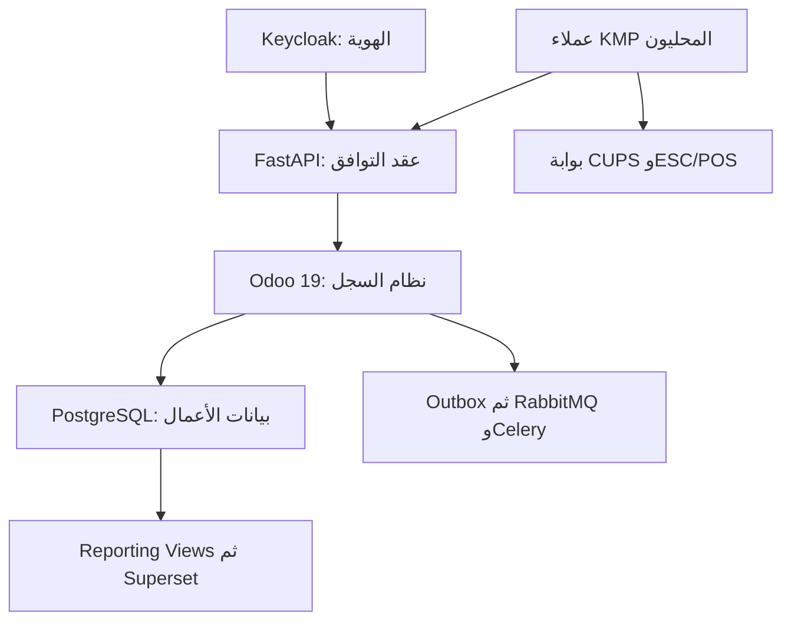

# المرحلة الثانية: تحليل الفجوات المتبقية وآلية تكامل الهيكل الهجين لمطابقة Loyverse

> **نطاق المستند:** تحليل الفجوات بعد تركيب المصادر المختارة في المرحلة الأولى، وتحديد حدود الملكية وعقود الربط وتدفقات البيانات وحالات الفشل واللغات والتقنيات اللازمة لتوحيدها. لا يتضمن هذا المستند ترتيب التنفيذ أو خطة التطوير المرحلية؛ فذلك نطاق المرحلة الثالثة.

| البيان | القيمة |
|---|---|
| تاريخ التقييم | 16 أغسطس 2026 |
| النظام الأساسي الثابت | Odoo Community 19.0 مع PostgreSQL |
| التغطية المستقلة للنواة | 85.5% |
| مساهمة المصادر الداعمة القابلة لإعادة الاستخدام | 5.9 نقطة مئوية |
| التغطية الهجينة القابلة لإعادة الاستخدام | **91.4%** |
| طبقة المطابقة المخصصة المتبقية | **8.6%** |
| متوسط تعقيد الدمج الموزون | 3.4 من 5 |
| عدد بنود الفجوة المعاد تقييمها | **51 بنداً** |
| قاعدة الملكية | مصدر حقيقة تشغيلي واحد؛ لا يوجد ERP أو POS ثانٍ موازٍ |

## 1. الخلاصة التنفيذية

التركيب الهجين المختار في المرحلة الأولى لا يرفع التغطية بمجرد جمع وظائف متشابهة؛ بل يفصل القدرات المتخصصة خلف حدود واضحة:

- **Odoo Community 19.0** يملك الحقيقة التجارية والمعاملات وقواعد المخزون والبيع والموظفين والعملاء والمحاسبة وZATCA.
- **FastAPI مع Pydantic** يوفّران عقد الموارد العام والتوافق مع REST/OpenAPI، من دون نسخ منطق الضرائب أو المخزون.
- **Keycloak** يثبت الهوية ويصدر رموز OAuth 2.0 وOpenID Connect، بينما تبقى صلاحية الإجراء والسجل والمتجر داخل Odoo.
- **Celery مع RabbitMQ** ينقلان العمل غير المتزامن بعد ثبات المعاملة، ولا يمثلان السجل النهائي للبيع أو الإيصال.
- **Apache Superset** يقرأ نموذجاً تحليلياً مشتقاً ولا يكتب في بيانات التشغيل.
- **Kotlin Multiplatform مع Ktor وSQLDelight** يوفّر منطق العملاء المشترك والشبكة والتخزين المحلي، لكنه لا يوفّر شاشات Loyverse أو قواعد المزامنة الدقيقة جاهزة.
- **CUPS مع python-escpos** يوفّران بوابة طباعة عامة، لكن SDKs الطابعات الطرفية وقيود Android وiOS تظل ضمن مصفوفة العتاد.

نتيجة إعادة تقييم بنود الفجوة الـ51 بعد الدمج:

| التصنيف | التعريف | العدد | النسبة من البنود |
|---|---|---:|---:|
| **R — إعادة استخدام مهيمنة** | المصدر المفتوح يوفّر معظم القدرة؛ المتبقي إسقاط عقد أو إعداد أو واجهة محدودة | 6 | 11.8% |
| **E — امتداد مخصص** | المصدر يوفّر محركاً أو بنية مهمة، لكن يلزم منطق تكامل وسلوك مخصص جوهري | 30 | 58.8% |
| **C — بناء مخصص مهيمن** | المصادر توفّر أدوات عامة فقط؛ معظم السلوك أو الواجهة المطلوبة غير موجود | 10 | 19.6% |
| **X — مصفوفة مزود أو عتاد** | الإغلاق يعتمد على SDK أو جهاز أو بلد أو اعتماد خارجي ولا تحسمه مكتبة عامة | 5 | 9.8% |
| **المجموع** |  | **51** | **100%** |

هذه الأعداد لا تساوي الأوزان الوظيفية. قد يكون بند عتاد واحد كبيراً في عدد الموصلات لكنه يضيف وزناً وظيفياً محدوداً، وقد تكون قاعدة تعارض واحدة صغيرة في عدد الملفات لكنها حاسمة لسلامة الإيراد.

## 2. خط الأساس الثابت من المرحلة الأولى

### 2.1 المكونات المختارة وأدوارها

| الطبقة | المكون الثابت | مسؤوليته | ما لا يملكه |
|---|---|---|---|
| نظام السجل | Odoo Community 19.0 + PostgreSQL | الكتالوج، المخزون، البيع، العملاء، الموظفون، الورديات، المحاسبة، ZATCA | عقد API المتوافق أو تخزين تطبيقات الهاتف |
| حدود الموارد | FastAPI 0.141.0 + Pydantic | REST versioned، التحقق، التحويل، الأخطاء، OpenAPI | قواعد الضرائب والمخزون والقيود المالية |
| الهوية | Keycloak 26.7.1 | OIDC/OAuth 2.0، الرموز، JWKS، refresh، revoke، هوية الخدمات | صلاحيات السجلات داخل Odoo أو PIN التشغيلي |
| العمل غير المتزامن | Celery 5.6.3 + RabbitMQ 4.3.4 | Webhooks، retries، موصلات، fan-out، أعمال طويلة | الحقيقة النهائية أو المعاملة المالية |
| التحليلات | Apache Superset 6.x GA | لوحات، فلاتر، embedding، RLS، الاستكشاف | تعديل الطلب أو المخزون |
| العملاء المحليون | Kotlin 2.4.10 + Ktor 3.5.2 + SQLDelight 2.3.2 | المجال المشترك، HTTP/WebSocket، SQLite، outbox محلي، migrations | شاشات وتدفقات Loyverse الجاهزة |
| طباعة الفرع | CUPS 2.4.18 + python-escpos 3.1 | IPP وESC/POS والطابعات الشبكية وUSB وSerial | ملكية الإيصال أو SDKs كل الطرازات |

### 2.2 الفجوة الموزونة بعد التركيب

| المجال | الحد الأقصى | التغطية بعد التركيب | المتبقي | حصة المجال من الفجوة الكلية 8.6 |
|---|---:|---:|---:|---:|
| A — نواة POS | 18.0 | 16.8 | **1.2** | 14.0% |
| B — المطاعم وKDS | 12.0 | 9.6 | **2.4** | 27.9% |
| C — Back Office والمخزون | 15.0 | 14.4 | **0.6** | 7.0% |
| D — المتاجر والموظفون | 10.0 | 8.6 | **1.4** | 16.3% |
| E — العملاء والولاء | 7.0 | 6.0 | **1.0** | 11.6% |
| F — التقارير وDashboard | 8.0 | 7.7 | **0.3** | 3.5% |
| G — الأجهزة والمدفوعات وCDS | 10.0 | 9.1 | **0.9** | 10.5% |
| H — API والتكاملات | 8.0 | 7.9 | **0.1** | 1.2% |
| I — المنصات وOffline | 8.0 | 7.3 | **0.7** | 8.1% |
| J — السعودية وZATCA | 4.0 | 4.0 | **0.0** | 0.0% |
| **المجموع** | **100.0** | **91.4** | **8.6** | **100%** |

أكبر كتلة متبقية هي **المطاعم وKDS**، ثم **المتاجر والموظفون**، ثم **نواة POS**. أما API والتكاملات فالبنية التحتية المختارة تغطي معظمها، لكن ذلك لا يعني أن عقد الموارد والحقول والأخطاء صار جاهزاً؛ بل يعني أن الأداة المناسبة لبنائه موجودة.

نسب الحصة مقربة مستقلاً إلى منزلة عشرية. وظهور **0.0** في مجال ZATCA يعني عدم الحاجة إلى محرك فوترة سعودي جديد؛ أما فجوة حالات POS وإعادة المحاولة في SA-02 فتُحسب بوصفها سلوكاً عابراً ضمن POS وOffline والتكامل، لا نقاطاً إضافية لمحرك ZATCA.

## 3. قواعد التصنيف وإغلاق الفجوة

### 3.1 معنى الحالات

| الرمز | نسبة القدرة التقريبية التي يوفّرها المصدر | نوع العمل المتبقي |
|---|---:|---|
| R | 70% فأكثر | mapping، إعداد، views، policy، contract veneer، اختبارات تطابق |
| E | من 30% إلى أقل من 70% | Odoo addon أو خدمة تكامل أو state machine أو واجهة أصلية مخصصة |
| C | أقل من 30% | تطبيق أو تجربة أو بروتوكول مجال جديد فوق الأدوات العامة |
| X | غير قابلة للقياس بمصدر عام واحد | adapter لكل مزود/جهاز/منصة مع اختبار فعلي واعتماد |

النسب في هذا الجدول تصف **درجة إعادة الاستخدام داخل البند**، ولا تغيّر حساب 91.4% و8.6% المعتمد في المرحلة الأولى.

### 3.2 بوابة الإغلاق

لا يعد البند مغلقاً لمجرد وجود المكتبة أو نجاح طلب تجريبي. الإغلاق يتطلب:

1. تطابق السلوك والنتيجة والحالة ورسالة الخطأ.
2. تطابق ملكية البيانات وعدم تسريب معرفات Odoo الداخلية.
3. سلامة Offline وإعادة المحاولة وعدم إنشاء بيع أو دفع مكرر.
4. تحقق Android وiOS والهاتف واللوحي والاتجاهين والدعم العربي حيث ينطبق.
5. اختبارات عقدية وبصرية وحالات فشل وعتاد فعلية بحسب البند.

## 4. الهيكل الموحد وحدود الملكية

> الأسهم تمثل مسارات اتصال، لا نقل ملكية. لا يكتب العميل أو Superset أو عامل Celery مباشرة في جداول أعمال Odoo.

### 4.1 مصفوفة مصدر الحقيقة

| نوع البيانات | الكاتب النهائي | نسخ مشتقة مسموحة | قاعدة منع الازدواج |
|---|---|---|---|
| الأصناف والمتغيرات والفئات والأسعار | Odoo | SQLDelight، reporting views، cache API | النسخة المحلية تحمل revision وليست سجلاً مركزياً |
| المخزون والحركات والتقييم | Odoo Stock | مستوى محلي مرئي وviews تحليلية | لا يعدل Superset أو العميل كمية مركزية مباشرة |
| العميل والنقاط وسجل الشراء | Odoo CRM/Loyalty | نسخة محلية محدودة وتقرير مشتق | كل earn/redeem أمر مجال في Odoo |
| الموظف والدور والمتجر | Odoo | claims مختصرة في Keycloak وsnapshot محلي | Keycloak يثبت الهوية؛ Odoo يقرر الإجراء |
| حساب الدخول وكلمة المرور وOIDC session | Keycloak | JWT قصير العمر وJWKS cache | لا تنسخ كلمة المرور إلى Odoo |
| PIN التشغيلي وتجاوز المدير | Odoo | verifier مشفر وsnapshot صلاحية محدود على الجهاز | لا يستخدم PIN بديلاً عن هوية الحساب السحابية |
| Open ticket | Odoo عند الاتصال؛ نسخة local-first أثناء الانقطاع | SQLDelight وKDS/CDS projections | المصالحة عبر revision وidempotency |
| الإيصال النهائي والاسترداد | Odoo | نسخة عرض محلية وreporting view | الإيصال غير قابل لإعادة الإنشاء من RabbitMQ |
| الدفع وحالته المالية | Odoo Payment domain | حالة مؤقتة داخل SDK/الجهاز | المرجع الطرفي ونتيجة المصالحة يسجلان مرة واحدة |
| الوردية وحركات النقد | Odoo | journal محلي غير متزامن | إقرار كل حركة على حدة ومنع الخروج مع unsynced |
| وثيقة ZATCA والحالة والتسلسل | Odoo localization/EDI | أحداث وعرض محلي | العامل يعيد المحاولة ولا يكتب وثيقة بديلة |
| اشتراك Webhook وحالة التسليم | Odoo | رسالة RabbitMQ وسجل عامل | outbox داخل معاملة المصدر هو نقطة الانطلاق |
| تعريف dashboard والمخطط | Superset metadata DB | embedding configuration | لا يمنح ملكية مقياس مالي؛ تعريف المقياس في reporting view |
| مهمة الطباعة | Odoo أو أمر POS موثق | CUPS spool وedge journal | الإيصال المالي لا يصبح ملف spool |

### 4.2 قواعد الحدود

1. **كل أمر تجاري مركب ينفذ داخل استدعاء Odoo واحد**؛ توضح وثائق Odoo 19 أن استدعاءات JSON-2 المتعددة لا يمكن ربطها في معاملة واحدة، ولذلك ينفذ split أو refund أو close shift بواسطة method مجال واحدة ذرية.
2. **FastAPI طبقة مضادة للفساد**: تعرض أسماء وموارد العقد الخارجي، وتحولها إلى أوامر Odoo من دون كشف أسماء النماذج أو res_id.
3. **الطابور يبدأ بعد المعاملة**: يسجل Odoo الحدث في outbox ضمن نفس معاملة التغيير، ثم ينشره عامل مستقل.
4. **القراءة التحليلية منفصلة**: Superset يتصل بحساب read-only إلى schema تقارير أو replica؛ لا يتصل بحساب Odoo التشغيلي.
5. **الحالة المحلية قابلة للمصالحة**: SQLDelight يملك cache وoutbox وack journal فقط، وكل سجل محلي يحمل UUID وrevision وحالة sync.
6. **العتاد خلف adapters**: لا تدخل تفاصيل Star أو Epson أو Sunmi أو مزود دفع في نماذج Odoo الأساسية؛ تحفظ في adapter contract وحقول مرجعية محايدة.

## 5. عقود التكامل بين المكونات

### 5.1 العميل المحلي مع FastAPI

| البند | العقد الملزم |
|---|---|
| النقل | HTTPS/TLS 1.2 أو أحدث للطلبات، وWebSocket Secure للتحديث الحي |
| التمثيل | JSON بموارد versioned؛ الصور multipart أو PNG وفق عقد المورد |
| الهوية | Bearer JWT من Keycloak، أو Personal Access Token المتوافق في مسارات API |
| هوية الجهاز | device UUID مسجل ومربوط بمتجر ومفتاح جهاز؛ لا يقبل merchant أو store من body وحده |
| الكتابة | command envelope يحمل command_id وresource UUID وbase_revision وidempotency key ووقت الجهاز |
| الإقرار | نتيجة مستقلة لكل command: accepted، applied، rejected، conflict، retryable |
| السحب | delta cursor مع upserts وtombstones وnext_cursor وserver_time |
| الاتصال الحي | إشعار خفيف يحمل resource type وUUID وrevision؛ يسترجع العميل الحالة الكاملة عبر delta |
| العودة عند الفشل | polling على cursor؛ WebSocket ليس قناة الحقيقة الوحيدة |

صيغة الأمر الموحدة المطلوبة مفاهيمياً:

| الحقل | الغرض |
|---|---|
| command_id | UUID ثابت عبر كل retries |
| idempotency_key | يمنع تكرار الأثر التجاري |
| device_id | يربط الأمر بالجهاز المسجل |
| employee_id | الموظف التشغيلي الذي نفذ الإجراء |
| store_id | نطاق المتجر بعد التحقق من الرمز والربط |
| aggregate_id | ticket أو receipt أو shift أو resource UUID |
| base_revision | كشف تعارض التعديل |
| occurred_at | وقت الحدث على الجهاز مع حفظ server_received_at مستقلاً |
| payload | بيانات الأمر بعد validation |
| client_schema_version | إدارة التوافق وهجرات العملاء |

### 5.2 FastAPI مع Odoo

| الجانب | الآلية |
|---|---|
| القناة | HTTPS خاص داخل الشبكة إلى JSON-2 أو controller داخلي مخصص |
| الاستدعاء | method Odoo واحدة لكل command تجاري مركب |
| الهوية الخدمية | حساب خدمة Odoo محدود مع API key لـJSON-2، أو service JWT إلى controller مخصص، مع mTLS بين الخدمات |
| التفويض | FastAPI يتحقق من token؛ خدمة Odoo تحل actor ثم تنفذ بالسياق والصلاحيات الفعلية من دون sudo شامل |
| المعرفات | جدول mapping ثابت بين UUID الخارجي وmodel/res_id الداخلي |
| منع التكرار | قيد فريد على tenant + idempotency_key + command type، مع حفظ request hash والنتيجة |
| الأخطاء | تحويل استثناءات Odoo إلى error envelope ثابت من دون traceback أو model names |
| التدقيق | request_id وcommand_id وactor_id وdevice_id في سجل تدقيق واحد |
| atomicity | لا تنفذ سلسلة create ثم stock ثم payment عبر ثلاث مكالمات؛ تجمع في method مجال واحدة |

نماذج Odoo المخصصة اللازمة على حد التكامل:

| النموذج المنطقي | الوظيفة |
|---|---|
| compat.external_id | UUID خارجي ثابت، نوع المورد، model، res_id، tenant، revision، deleted_at |
| compat.command_dedup | مفتاح idempotency، بصمة الطلب، الحالة، response snapshot، actor، device |
| compat.event_outbox | event_id، aggregate، event_type، payload version، occurred_at، publish state |
| compat.device | الجهاز، المتجر، المنصة، public key، آخر اتصال، حالة revoke |
| compat.sync_cursor | cursor scope، watermark، schema version، expiry |
| compat.webhook.subscription | URL، أنواع الأحداث، secret reference، status، API version |
| compat.webhook.delivery | batch، attempt، next_attempt_at، status، response code، disable reason |

### 5.3 Keycloak مع FastAPI وOdoo والعملاء

| التدفق | التطبيق |
|---|---|
| تطبيقات Android وiOS | Authorization Code مع PKCE S256 بوصفها public clients |
| Back Office واللوحات | Authorization Code؛ session داخل المتصفح، مع OIDC federation عند الحاجة |
| SSO داخل Odoo | وحدة auth_oauth مع إعداد Keycloak وامتداد binding صغير يربط subject بالمستخدم/الموظف |
| FastAPI إلى Odoo والعامل إلى الخدمات | Client Credentials لهوية الخدمة، من دون صلاحيات مستخدم شاملة |
| التحقق من JWT | تحقق محلي في FastAPI من issuer وaudience وexp وnbf والتوقيع عبر JWKS cache |
| التدوير والإلغاء | refresh وrevoke في Keycloak؛ device revoke في Odoo يبطل الاستخدام التجاري حتى لو بقي الرمز صالحاً تقنياً |
| claims | subject ثابت، merchant binding، أدوار عامة قليلة؛ لا تحمل كل record rule في الرمز |
| mapping | subject في Keycloak ↔ user/employee في Odoo عبر binding ثابت |
| Personal Access Token | metadata وبصمة hash في نموذج توافق؛ تعرض FastAPI principal/scopes نفسها بعد التحقق |
| PIN | منفصل عن OIDC؛ يستخدم للتبديل والقفل والتجاوز التشغيلي، ويقيد بنطاق الجهاز والمتجر |

لا يصبح Keycloak محرك صلاحيات المخزون أو المتجر. وجود scope في JWT يسمح بدخول المسار، ثم يحدد Odoo هل يحق لهذا الموظف تنفيذ Refund أو Pay Out على السجل المطلوب.

### 5.4 Odoo مع RabbitMQ وCelery

المسار الموثوق:

1. يغير Odoo بيانات الأعمال ويسجل حدث outbox في **المعاملة نفسها**.
2. يقرأ ناشر outbox السجلات المقفلة، وينشرها إلى exchange محدد النوع.
3. يستخدم الناشر **publisher confirms**؛ لا يعلّم الحدث منشوراً قبل التأكيد.
4. تستخدم الأعمال الحساسة **quorum queues** وسياسات dead-letter وحدود تسليم.
5. يستلم Celery الرسالة مع manual/late acknowledgement، وينفذ task idempotent.
6. لا يقر العامل الرسالة قبل حفظ نتيجة التسليم أو الحالة في Odoo.
7. عند الفشل يطبق backoff وjitter والحد الأقصى للعقد؛ بعد النفاد تنتقل المهمة إلى DLQ أو حالة DISABLED المحددة.

| نوع العمل | exchange/routing منطقي | قاعدة الترتيب |
|---|---|---|
| Webhooks | webhook.resource.event | ترتيب دلالي لكل اشتراك وaggregate حيث يلزم |
| KDS/CDS online events | realtime.store.station | sequence مستقل لكل متجر ومحطة |
| تنبيهات Dashboard | analytics.alert | dedup حسب metric/store/window |
| طباعة بعيدة | print.store.gateway | job_id ثابت؛ لا يعاد إنشاء الإيصال |
| موصلات الدفع غير المتزامنة | payment.provider.operation | serialization لكل payment reference |
| ZATCA retry | fiscal.document.operation | ترتيب وتفرد لكل وثيقة وسلسلة |

RabbitMQ يحقق **at-least-once** لا exactly-once؛ لذلك تكون exactly-once business effect نتيجة idempotency في Odoo، لا خاصية مفترضة في الطابور.

### 5.5 Odoo وPostgreSQL مع Superset

| البند | الآلية |
|---|---|
| مصدر البيانات | schema تقارير مخصص أو replica PostgreSQL read-only |
| تعريف المقاييس | views versioned للأرقام المرجعية: Net sales، Gross sales، Refunds، Average ticket، Taxes، Tips |
| الأبعاد | merchant، store، employee، item، category، payment type، hour/day، currency |
| العزل | Row-Level Security حسب merchant/store، مع deny-by-default |
| الهوية | OIDC مع Keycloak للأدوار الإدارية؛ يحصل FastAPI على guest token من Superset API ويقدمه للـembedding |
| التطبيق المتنقل | يستدعي metric endpoints في FastAPI للحصول على JSON مطابق؛ لا يعتمد على iframe لتجربة أصلية |
| الكتابة | ممنوعة كلياً إلى جداول Odoo؛ Superset metadata في قاعدة مستقلة |
| التأخر | يظهر server watermark وdata_as_of حتى لا تبدو الأرقام لحظية إذا كانت من replica أو materialized view |

### 5.6 POS مع KDS وCDS داخل الشبكة المحلية

هذا المسار هو أحد أكبر الفجوات المتبقية؛ KMP وKtor وSQLDelight يوفّرون الأدوات، لكن البروتوكول وسلوك المجال مخصصان.

| البند | العقد المطلوب |
|---|---|
| الاكتشاف | mDNS/DNS-SD على LAN مع إدخال IP يدوياً كمسار بديل |
| الاقتران | رمز/طلب لمرة واحدة، موافقة من POS، تبادل مفاتيح، ربط device IDs، وإمكانية revoke |
| القناة | WebSocket/TLS محلي أو اتصال آمن دائم فوق TCP |
| ترتيب الأحداث | sequence متزايد لكل station أو display؛ لا يعتمد على وقت الجهاز |
| الإقرار | ACK لكل sequence مع replay من آخر ACK بعد الانقطاع |
| الحفظ | journal في SQLDelight على الطرفين قبل العرض أو اعتبار الإرسال ناجحاً |
| التوجيه | category/station rules ثابتة من Odoo ومخزنة محلياً |
| Offline | POS هو مصدر مؤقت لأحداث التذكرة داخل الفرع؛ تتم مصالحتها لاحقاً مع Odoo |
| online convergence | حدث الخادم يحمل revision؛ لا ينسخ الحدث المحلي ذاته مرتين إلى الشاشة |
| KDS states | item/order done، void، recall، clear، timers، audio وحالات اللون ضمن state machine مخصصة |
| CDS states | empty، active ticket، customer/loyalty، payment pending، success/change، disconnected |

### 5.7 بوابة الطباعة مع CUPS وpython-escpos

| البند | العقد المطلوب |
|---|---|
| Print intent | JSON ثابت يحمل job_id، template_id، locale، direction، copies، printer role، payload hash |
| Edge gateway | خدمة Python داخل الفرع تستقبل job مصادقاً، تحفظ journal، ثم ترسل إلى CUPS أو python-escpos |
| CUPS | IPP/AirPrint/IPP Everywhere والطابعات الشبكية وUSB التي يغطيها النظام |
| python-escpos | Network، USB، Serial، text/image، barcode، QR، cut، drawer، buzzer بحسب profile |
| idempotency | job_id لا يطبع تلقائياً مرتين بعد timeout؛ إعادة الطباعة فعل مستقل بعلامة Reprint |
| الحالة | queued، sent، printer_ack إن توفر، failed، unknown، reprinted |
| القوالب | الإيصال والمطبخ والفاتورة الأولية وZATCA تولد من نموذج موحد مع مسار raster للعربية |
| الاستثناءات | SDKs الأصلية لـSunmi/iMin/Star/Epson وExternalAccessory تبقى adapters داخل التطبيق |

### 5.8 موصلات الدفع

لا يغلق المشروع المفتوح العام مصفوفة المزودين. يوحد الربط بواسطة interface واحد مع adapter لكل مزود:

| العملية | الحقول الدنيا |
|---|---|
| initiate | payment_id، amount، currency، device، terminal، idempotency_key |
| authorize/capture | provider reference، approval code، card metadata المسموح، timestamp |
| decline | code موحد، provider code محفوظ داخلياً، رسالة قابلة للعرض |
| cancel | مرجع العملية ونتيجة الإلغاء |
| refund | receipt/payment reference، amount، reason، employee |
| check status | provider reference بعد timeout أو انقطاع |
| reconcile | terminal batch، provider state، Odoo state، resolution audit |

آلة الحالة الموحدة:

| الحالة | الانتقالات المسموحة |
|---|---|
| CREATED | INITIATING أو CANCELLED |
| INITIATING | PENDING أو APPROVED أو DECLINED أو UNKNOWN |
| PENDING | APPROVED أو DECLINED أو UNKNOWN |
| UNKNOWN | APPROVED أو DECLINED أو RECONCILIATION_REQUIRED |
| APPROVED | REFUND_PENDING أو REFUNDED جزئياً/كلياً |
| REFUND_PENDING | REFUNDED أو REFUND_FAILED أو UNKNOWN |

لا يعاد إرسال charge عشوائياً عند timeout. ينفذ check status أو reconciliation بحسب SDK المزود، ويظل payment_id نفسه.

### 5.9 ZATCA

| المسؤولية | الموقع |
|---|---|
| إنشاء الوثيقة والضرائب والتسلسل والـhash/QR | Odoo l10n_sa وl10n_sa_edi وامتداد POS |
| حفظ CSID والشهادات والمفاتيح | مخزن أسرار Odoo والبنية التشغيلية المخصصة |
| Reporting/Clearance والحالة النهائية | Odoo EDI |
| إعادة المحاولة | outbox/Celery مع document_id ثابت، مع بقاء الحالة الرسمية في Odoo |
| عرض الحالة Offline/Online | عميل POS عبر projection: pending، submitted، accepted، warning، rejected |
| الطباعة | print intent من الوثيقة المعتمدة؛ لا يعيد edge حساب QR أو XML |

المتبقي ليس بناء محرك ZATCA جديداً، بل توحيد توقيت الإرسال وحالات الواجهة والطابور والتعافي مع تدفق POS المستهدف.

## 6. نموذج البيانات الوسيط وعقود المعرفات

### 6.1 المعرفات والإصدارات

| القاعدة | التطبيق |
|---|---|
| UUID خارجي ثابت | ينشأ على العميل للأوامر Offline أو في Odoo للموارد المركزية، ولا يتغير بعد المزامنة |
| منع كشف res_id | FastAPI لا يعيد أرقام Odoo الداخلية |
| revision | عدد متزايد أو token opaque لكل aggregate؛ يستخدم للمقارنة والسحب |
| tombstone | يحمل resource_id وdeleted_at وrevision بدلاً من اختفاء السجل |
| الوقت | تخزين UTC وserver_received_at؛ العرض حسب timezone المتجر |
| المال | Decimal بمقياس العملة؛ لا يستخدم float في Python/Kotlin/Swift |
| الكمية | Decimal مستقل بمقياس وحدة القياس |
| العملة | ISO 4217 مع currency في كل مستند مالي متعدد النطاق |
| locale | BCP 47 مع اتجاه منفصل؛ لا يستنتج RTL من النص وحده |

### 6.2 العلاقات المركزية

| المورد المتوافق | الإسقاط إلى Odoo | العلاقات الحرجة |
|---|---|---|
| Merchant | database/company binding | stores، users، subscription scope |
| Store | company/warehouse/location/POS config projection | devices، shifts، inventory، receipts |
| Device | compat.device + POS config/session binding | store، employee session، KDS/CDS peers |
| Item | product.template projection | variants، categories، modifiers، taxes |
| Variant | product.product projection | item، store price، inventory level |
| Modifier | product/add-on model projection | modifier list، option، order line |
| Customer | res.partner projection | points، receipts، visits |
| Employee | hr.employee/user projection | access profile، timecards، shifts |
| Open Ticket | POS order/domain aggregate | lines، customer، dining option، revision |
| Receipt | finalized POS order/accounting projection | payments، taxes، refunds، ZATCA document |
| Shift | POS session projection | employee/device/store، cash movements، totals |
| Inventory Level | product/location aggregate | variant، store، on_hand، updated_at |
| Webhook | compat subscription | event types، secret، deliveries |

### 6.3 النموذج المحلي في SQLDelight

| الجدول المنطقي | الغرض |
|---|---|
| local_resource | آخر projection صالح للعرض مع revision وsync state |
| local_ticket / local_ticket_line | التذكرة المفتوحة وتفاصيلها ومعاملتها المحلية |
| local_shift / cash_movement | الوردية وحركات النقد قبل الإقرار |
| command_outbox | الأوامر الثابتة وحالة المحاولة والإقرار والخطأ |
| delta_cursor | cursor لكل resource scope ومتجر |
| tombstone | حذف لم تتم إزالته حتى تجاوز جميع cursors ذات الصلة |
| peer_device | KDS/CDS pairing، public key، last sequence، revoke state |
| print_journal | job_id والحالة ونسخة checksum من intent |
| schema_meta | إصدار المخطط ونتيجة الهجرة ووقت آخر recovery |

يشفّر ملف SQLite ومفاتيح pairing والرموز بواسطة حماية المنصة وطبقة تشفير محلية؛ تبقى الرموز الطويلة ومفاتيح الجهاز في Android Keystore أو iOS Keychain، لا في جدول نصي.

## 7. بروتوكول المزامنة والاتساق

### 7.1 Push للأوامر

| المرحلة المنطقية | السلوك |
|---|---|
| Local commit | يحفظ التغيير وcommand_outbox في معاملة SQLite واحدة |
| Dispatch | Ktor يرسل batch مرتباً حسب اعتماد الأوامر، لا حسب created_at فقط |
| Validate | FastAPI يتحقق من schema والهوية والجهاز وidempotency |
| Apply | Odoo ينفذ method مجال ذرية ويكتب dedup + outbox |
| Ack | يعاد external UUID وrevision والنتيجة الخاصة بكل command |
| Local finalize | يحذف/يؤرشف outbox بعد إقرار ذلك command فقط |
| Retry | نفس command_id والمفتاح والحمولة؛ تغيير الحمولة مع المفتاح نفسه خطأ conflict |

### 7.2 Pull التفاضلي

| العنصر | القاعدة |
|---|---|
| cursor | opaque ومقيد بالـtenant والمتجر ونوع المورد وإصدار المخطط |
| الصفحة | حد افتراضي وأقصى متوافقان مع العقد العام |
| watermark | يمثل snapshot منطقي حتى لا تضيع تحديثات بين الصفحات |
| upsert | يحمل المورد الكامل أو projection المعتمد وrevision |
| delete | tombstone صريح |
| expiry | cursor منتهي يعيد reset-required لا بيانات ناقصة بصمت |
| live hint | WebSocket يسرع السحب ولا يحل محله |

### 7.3 قواعد الاتساق

| البيانات | نموذج الاتساق |
|---|---|
| إيصال مدفوع، refund، إغلاق وردية، وثيقة ZATCA | قوي داخل معاملة Odoo واحدة |
| Open ticket بين أجهزة المتجر | optimistic concurrency مع revision ومصالحة مرجعية |
| كتالوج ومخزون معروض على الجهاز | eventual consistency مع server watermark |
| KDS داخل LAN | ترتيب sequence لكل محطة مع replay |
| CDS | آخر projection كامل صالح مع sequence؛ لا يركب حالة من رسائل ناقصة |
| Webhooks | at-least-once delivery مع event_id وdedup للمستهلك |
| التقارير | eventual/read-only مع data_as_of واضح |
| الطباعة | at-least-once intent لكن أثر الطباعة محمي بـjob journal وإجراء Reprint مستقل |

قاعدة حل التعارض لكل مورد لا تخترعها البنية التحتية. تحفظ في policy versioned ويثبت سلوكها باختبارات مرجعية، خصوصاً Open tickets والعملاء والورديات. أما الإيصال النهائي فلا يحل بتفضيل آخر كاتب؛ يعاد الرد المخزن لمفتاح idempotency أو ينتقل إلى مصالحة صريحة.

## 8. حالات الفشل وحدود الاستمرار

| العطل | ما يستمر | ما يتوقف أو يتأخر | التعافي المطلوب |
|---|---|---|---|
| الإنترنت مقطوع وLAN يعمل | بيع Offline المسموح، وردية، KDS/CDS محلي، طباعة محلية، نقد | مزامنة، تقارير حية، خدمات سحابية، دفع يتطلب الشبكة | outbox ثم delta sync عند العودة |
| FastAPI غير متاح | العمليات المحلية المخولة | كل push/pull سحابي وlogin جديد عبر المسار | retry/backoff؛ لا حذف للأوامر |
| Odoo غير متاح | cache المحلي وتدفق LAN | الإقرار المركزي وكل أمر يتطلب حقيقة حديثة | FastAPI يعيد retryable؛ نفس command يعاد لاحقاً |
| Keycloak غير متاح | جلسة محلية ورمز صالح وPIN تشغيلي ضمن snapshot | login/refresh بعد انتهاء الرمز، إدارة الهوية | لا يسمح بتوسيع الصلاحيات Offline |
| RabbitMQ غير متاح | معاملات Odoo التجارية | Webhooks والتنبيهات والمهام | outbox يتراكم؛ publisher يستأنف من غير فقد |
| عامل Celery متوقف | البيع والتخزين المركزي | تسليم الأعمال غير المتزامنة | الرسائل غير المقررة تعاد؛ tasks idempotent |
| Superset متوقف | POS وBack Office التشغيلي وAPI | اللوحات والاستكشاف المضمن | لا أثر على البيع؛ تعود القراءة بعد الخدمة |
| replica التحليلية متأخرة | البيع والبيانات المركزية | حداثة Dashboard | إظهار data_as_of ومراقبة lag |
| KDS يفقد LAN | POS والبيع | عرض أحداث جديدة على KDS | journal + replay من آخر sequence |
| CDS يفقد LAN | POS والبيع | شاشة العميل تتحول إلى disconnected | full snapshot بعد إعادة الاقتران/الاتصال |
| بوابة الطباعة متوقفة | البيع حسب سياسة المتجر | الإيصال/المطبخ أو يستخدم fallback | job يبقى pending؛ reprint صريح بعد unknown |
| طابعة أعادت timeout | البيع المسجل | معرفة هل خرج الورق | query status إن أمكن؛ لا إعادة عمياء |
| مزود الدفع timeout | بقية POS | إتمام ذلك الدفع | check status ثم reconciliation؛ لا charge جديد |
| فشل SQLite أو migration | لا يسمح بكتابة غير قابلة للحفظ | البيع Offline على ذلك الجهاز | recovery محكوم ونسخة احتياطية مشفرة وسجل تشخيص |
| ZATCA غير متاح | السلوك وفق الحالة النظامية المثبتة | الإرسال أو الإغلاق بحسب نوع الوثيقة والحالة | retry بنفس document_id وحفظ hash chain |

## 9. سجل الفجوات التفصيلي بعد الدمج

> **الأولوية:** P0 حرجة للتشغيل أو سلامة البيانات؛ P1 لازمة للتطابق الوظيفي؛ P2 تطابق بصري أو إنتاجي لا يمنع المعاملة الأساسية.  
> **الحالة:** R إعادة استخدام مهيمنة؛ E امتداد مخصص؛ C بناء مخصص مهيمن؛ X مصفوفة مزود/عتاد.

### 9.1 POS وتجربة البيع

| ID | المطلوب مطابقته | ما يوفّره التركيب الهجين | الفجوة المتبقية بعد الدمج | حدود الربط والتقنيات | الحالة | معيار الإغلاق |
|---|---|---|---|---|---|---|
| POS-01 | دخول الجهاز، PIN الموظف، القفل والتبديل وتجاوز المدير | Odoo pos_hr والحقوق؛ Keycloak لهوية الحساب؛ KMP والتخزين الآمن للجهاز | فصل login السحابي عن PIN التشغيلي، snapshot صلاحيات Offline، سجل override، رسائل القفل والانتهاء | Python/Odoo، Kotlin common، Compose/SwiftUI، Keystore/Keychain، compat.device | E / P0 | تطابق كل انتقال ودور، ومنع إجراء حساس Offline بلا صلاحية صالحة |
| POS-02 | تخطيط هاتف منفصل ولوحي ثنائي اللوحة، عمودي وأفقي وفروق Android/iOS | KMP يشارك المجال؛ أدوات الواجهة الأصلية متاحة | بناء جميع الشاشات والقياسات وsafe areas ولوحة المفاتيح والتنقل والإيماءات لكل منصة | Kotlin/Compose وAndroid Views؛ Swift/SwiftUI/UIKit؛ design tokens | C / P0 | golden screenshots وتدفقات لمس لكل حجم واتجاه ومنصة |
| POS-03 | Favorites على الهاتف وCustom Pages/Grid على اللوحي مع drag وlong-press وترتيب محفوظ | Odoo يوفّر الكتالوج؛ SQLDelight يوفّر الحفظ المحلي | نموذج الصفحات والخلايا، أوضاع التحرير، قواعد السعة، ترتيب per-device أو per-employee، والمزامنة | KMP، SQLDelight، Compose drag gestures، UIKit/SwiftUI gestures، API mapping | C / P1 | نفس الترتيب والقيود والحفظ بعد restart وعلى جهاز ثانٍ وفق النطاق المرجعي |
| POS-04 | عناصر موزونة ومتغيرة السعر، modifiers، comments، dining option، ضرائب وخصومات سطر/تذكرة | Odoo يوفّر محركات المنتج والضريبة والخصم والمطعم | توحيد DTO والحساب والتقريب وترتيب الحوارات والقيود، وتمثيلها محلياً Offline | Odoo domain method، Decimal، KMP models، SQLDelight، FastAPI schemas | E / P1 | نفس totals والضرائب والخصومات والتقريب لكل fixture |
| POS-05 | العميل والنقاط وRedeem وسجل الشراء داخل POS | Odoo CRM وpos_loyalty؛ FastAPI للإسقاط؛ cache محلي | قواعد earn/redeem والحدود ونطاق المتجر والرسائل وسجل الزيارات وتجربة Offline | Python/Odoo، reporting aggregates، KMP، SQLDelight، contract API | E / P1 | رصيد وناتج استبدال وسجل مشتريات مطابقان قبل/بعد sync |
| POS-06 | Open tickets بأسماء مخصصة/مسبقة، تعليقات، بحث وفرز ومزامنة آنية | Odoo order/table؛ SQLDelight local-first؛ Ktor/WebSocket | نموذج preset names وحجز الاسم، البحث، revision، تعارض جهازين، LAN/cloud convergence | Odoo aggregate، FastAPI commands/delta، KMP sync، WebSocket، SQLDelight | E / P0 | تعديل متزامن وانقطاع/replay بلا فقد أو تكرار أو resurrection |
| POS-07 | Split وMerge وMove وPrint bill قبل الدفع | Odoo pos_restaurant يوفّر المحرك الأساسي | إسقاط التدفق المرجعي، الكميات الجزئية، النقل بين أسماء/طاولات، الذرية Offline، ورسائل الحواف | method Odoo واحدة لكل أمر، KMP state reducer، idempotency، print intent | E / P1 | نفس الخطوط والمجاميع والملكية بعد كل split/merge/move وتكرار الطلب |
| POS-08 | Charge، split payment، cash/card/tip/rounding وشاشة النجاح | Odoo payment domain؛ KMP للواجهة؛ adapters كحد موحد | تجربة الدفع الدقيقة وآلة الحالات المشتركة وربط كل provider ومعالجة unknown | Python/Odoo، Kotlin/Swift، provider SDKs، Decimal، payment adapter contract | E / P0 | لا بيع أو charge مكرر تحت timeout، وتطابق المبلغ والباقي والتقريب |
| POS-09 | إيصالات محلية/متجرية، التفاصيل، Refund وCancel بالصلاحيات | Odoo receipt/refund؛ API وlocal cache | نطاق الرؤية، offline availability، حالات refund/cancel، أسبابها، stock effect، audit والرسائل | Odoo transaction، compat API، SQLDelight projection، KMP UI | E / P0 | نفس السطور والحالة والمخزون والتدقيق بعد refund جزئي/كلي وcancel |
| POS-10 | Shift: opening cash، sales/refunds، Pay In/Out، expected/actual، الإغلاق والتقرير | Odoo POS sessions وحركات النقد؛ التخزين المحلي | نموذج الوردية المرجعي، إسناد employee/device، حركات Offline، reconciliation ومنع الإغلاق المكرر | Odoo shift aggregate، SQLDelight journal، idempotent commands، KMP UI | E / P0 | تطابق كل مجاميع الوردية وإعادة فتح التطبيق والانقطاع والإقرار الجزئي |

### 9.2 Dashboard وKDS وCDS

| ID | المطلوب مطابقته | ما يوفّره التركيب الهجين | الفجوة المتبقية بعد الدمج | حدود الربط والتقنيات | الحالة | معيار الإغلاق |
|---|---|---|---|---|---|---|
| APP-01 | تطبيق Dashboard مستقل لـAndroid وiOS بنفس نطاق Back Office | KMP يوفّر المجال والشبكة والتخزين؛ Keycloak الدخول | تطبيق مستقل كامل: navigation، جلسة، اختيار المتجر، push/deep links، حالات empty/error/offline | KMP، Compose، SwiftUI/UIKit، Ktor، SQLDelight، OIDC PKCE، FCM/APNs | C / P1 | تثبيت مستقل وتطابق الصلاحيات والشاشات والحالات على المنصتين |
| APP-02 | Receipts وNet sales وAverage ticket والمقارنة وdrill-down والتنبيهات | Odoo reporting views؛ Superset؛ FastAPI؛ KMP charts | تثبيت تعريف كل KPI والفترة السابقة وtimezone والفلاتر، API أصلي، وتنبيهات المخزون | PostgreSQL views، Superset/RLS، FastAPI metric DTOs، رسوم Compose/Swift | E / P1 | تطابق رقمي كامل على dataset مرجعي مع الفلاتر والمتاجر والفترات |
| KDS-01 | تطبيق KDS مستقل على Android وiPad | KMP يوفّر shell والمجال والتخزين والشبكة | بناء المنتج المستقل وإدارة station والتكوين والإطلاق واستعادة الجلسة | KMP، Compose، SwiftUI/UIKit، SQLDelight، Ktor، device registry | C / P0 | تطبيقان أصليان يعملان online وLAN-only ويستعيدان الحالة بعد kill |
| KDS-02 | بطاقات الطلب، timers وألوان، done item/order، void، recall/clear وصوت | لا يوفر أي مكون state machine مطابقاً؛ KMP مجرد أداة | بناء الحالة المرجعية كاملة، ترتيب العمليات، مؤقتات 240/420، dark mode، الصوت وسجل recall | Kotlin shared reducer، SQLDelight event journal، native timers/audio/UI | C / P0 | اجتياز كل انتقال ومؤقت ولون وإلغاء واستدعاء دون قفز أو فقد |
| KDS-03 | اكتشاف واقتران LAN، توجيه فئات، تسليم محلي، persistence وresync | Ktor وSQLDelight وواجهات الشبكة الأصلية | بروتوكول discovery/pairing والثقة وsequence/ACK/replay والتوجيه والمصالحة السحابية | mDNS/DNS-SD، WebSocket/TLS، Network.framework/NSD، KMP، device keys | E / P0 | استمرار POS→KDS بلا إنترنت ثم convergence بلا duplicate أو gap |
| CDS-01 | تطبيق CDS مستقل، بحث/IP، Pair/Unpair، وعدة شاشات لكل POS | KMP وKtor وSQLDelight يوفّرون الأساس | بناء pairing UX، trust store، تعدد الشاشات، manual IP، revoke وإعادة الربط | KMP، Compose، SwiftUI، mDNS، WebSocket/TLS، Keychain/Keystore | C / P0 | نفس خطوات الاقتران والقبول والحفظ والإلغاء مع أجهزة متعددة |
| CDS-02 | عرض ticket والتخفيض والضريبة والعميل والنقاط والبريد والدفع والباقي | Odoo يوفر بيانات العرض؛ القناة المحلية تنقل projection | بناء layouts والحالات والتفاعل المرجعي ومعالجة disconnect والطلب الطويل وdark/RTL | KMP UI، immutable display projection، sequence snapshots، bidi layout | C / P1 | تطابق empty/active/payment/success/disconnected على الهاتف واللوحي |

### 9.3 Back Office والتقارير والكتالوج والمخزون والموظفون والعملاء

| ID | المطلوب مطابقته | ما يوفّره التركيب الهجين | الفجوة المتبقية بعد الدمج | حدود الربط والتقنيات | الحالة | معيار الإغلاق |
|---|---|---|---|---|---|---|
| BO-01 | قشرة Back Office المختصرة والتنقل والنماذج والأزرار والحالات | Odoo يوفّر التطبيقات والبيانات لكنه يملك IA وتجربة مختلفة | بناء واجهات/قوائم مخصصة تخفي التعقيد الزائد وتطابق Save/Cancel/Delete/errors | Odoo XML views، Owl/JavaScript، SCSS، Python controllers/models | C / P1 | نفس خريطة التنقل والحقول والحالات والصلاحيات لكل دور |
| REP-01 | Sales Summary وتقارير Item/Category/Employee/Payment/Modifier/Tax/Receipts/Shifts | Odoo aggregates وPostgreSQL وSuperset تغطي معظم القدرة | تعريف semantic views والفلاتر والتصدير وترتيب الحقول وتنسيق الأرقام | SQL views، Superset datasets/RLS، FastAPI export، CSV | R / P1 | صفر فرق رقمي على dataset مرجعي، مع timezone وrefunds والضرائب |
| CAT-01 | Item/Variant حتى ثلاثة خيارات، أسعار وتوفر المتاجر، modifiers، low/optimal stock، import/export | product.template/product.product ومحركات Odoo أقوى؛ FastAPI للتحويل | عقد projection ثابت، external IDs، واجهة مبسطة، round-trip CSV وصور وvalidation | Python/Odoo ORM، compat mapping، Pydantic، XML/Owl، CSV | E / P0 | import→edit→export وAPI round-trip بلا فقد أو تبدل معرف |
| INV-01 | الموردون وPurchase Orders والحالات والاستلام الجزئي وAutofill والتكاليف | Odoo Purchase/Stock والموردون وإعادة الطلب | إسقاط حالات Loyverse وصيغة Autofill والتكاليف وتجربة الاستلام | Odoo Purchase/Stock methods، Owl/XML، FastAPI DTO | E / P1 | نفس الكمية والحالة والتكلفة وحركة المخزون في الاستلام الجزئي والكامل |
| INV-02 | Transfer Orders وStock Adjustments وHistory وValuation | Odoo Stock/Accounting يغطي المحركات | أنواع المستندات والأسباب والروابط والعرض per-store وقواعد التصدير | Python Stock ORM، reporting views، XML/Owl، API mapping | E / P1 | تطابق الحركة والمصدر والوجهة والتقييم والتاريخ لكل fixture |
| INV-03 | Inventory Count كامل/جزئي وExpected/Actual وshortage/surplus والسجل | Odoo inventory adjustments/cycle counts | تجربة العد والحالات وقفل النطاق وإظهار الفرق واعتماد المستند | Odoo Stock، Barcode عند الاستخدام، Owl/XML، audit | E / P1 | نفس نتيجة العد والحركة الناتجة مع تعديلين متزامنين وصلاحيات |
| INV-04 | Production وDisassembly لعنصر مركب وتكلفة المكونات | Odoo MRP وBoM وUnbuild يغطي معظم المحرك | إسقاط مبسط للمستندات والحسابات والواجهة وحقول API | Odoo MRP/ORM، XML، reporting mapping | R / P1 | نفس الكمية المستهلكة/المنتجة وتغير المخزون والتكلفة |
| INV-05 | طباعة Labels بالقوالب والأبعاد والباركود والسعر | QWeb وتقارير Odoo وبوابة CUPS/ESC-POS | قوالب المقاسات المرجعية، المعاينة، اختيار الكمية، barcode placement ومسار الطابعة | QWeb/XML/CSS، PDF/ZPL عند الجهاز، CUPS profiles | E / P2 | قياس فعلي صحيح ومسح barcode ناجح على كل قالب/طابعة مستهدفة |
| EMP-01 | Access Rights المسماة، Time Clock عبر PIN، Timecards وتعديلها وساعات عشرية | Odoo HR/POS وKeycloak وKMP device flow | توحيد access profile، Clock In/Out المحلي، حساب الساعات، سجل التعديل وصلاحية override | Python HR/POS، Kotlin/Swift، SQLDelight، Keycloak binding | E / P0 | نفس 0.25=15 دقيقة والتعديل والتدقيق والعمل Offline |
| CRM-01 | Customer Base وإحصاءات الزيارة والإنفاق والسجل والنقاط والاستيراد/التصدير | Odoo CRM/Loyalty؛ views وSuperset؛ compat API | تعريف الإحصاءات، merge/delete، scope، تجربة البحث وسجل الشراء والنقاط | Odoo ORM، PostgreSQL aggregates، FastAPI، KMP/Owl | E / P1 | تطابق customer KPIs والنقاط والسجل بعد import/merge/refund |

### 9.4 Offline والمزامنة

| ID | المطلوب مطابقته | ما يوفّره التركيب الهجين | الفجوة المتبقية بعد الدمج | حدود الربط والتقنيات | الحالة | معيار الإغلاق |
|---|---|---|---|---|---|---|
| OFF-01 | قاعدة أعمال أصلية local-first لكل تطبيق مع معاملات وهجرات | SQLDelight يوفّر SQLite typed schema وcompile-time migration checks؛ KMP يشارك المجال | تصميم schema لكل aggregate، التشفير، journaling، recovery وحدود حجم البيانات | KMP، SQLDelight/SQLite، SQLCipher، Keystore/Keychain | E / P0 | kill/reboot/migration لا يفقد ticket أو receipt pending أو shift |
| OFF-02 | Outbox ثابت، UUID، إقرار جزئي، idempotency، retry/backoff، Manual Sync | SQLDelight/Ktor وFastAPI/Odoo dedup وWorkManager/BackgroundTasks | بروتوكول command/ack وترتيب الاعتماد والـbackoff المرئي والتشغيل اليدوي | Kotlin coroutines، Ktor، SQLDelight، WorkManager، BackgroundTasks، Python | E / P0 | fault injection عند كل نقطة لا ينتج تكراراً وتختفي unsynced بعد ACK الصحيح فقط |
| OFF-03 | Delta sync وcursors وtombstones وحل تعارض Open tickets | FastAPI وSQLDelight يوفران الأدوات لا قواعد المجال | بناء changelog/watermark والسياسات versioned والمصالحة بين أجهزة متعددة | Odoo revision log، FastAPI cursor، KMP merge policies، SQLDelight | C / P0 | تعديل/حذف متزامن بلا lost update أو resurrection أو cursor gap |
| OFF-04 | مصفوفة Offline الحرفية والرسائل والقيود لكل وظيفة | KMP feature guards والحالة المحلية تسهّل التنفيذ | ترميز كل خلية: مسموح/مؤجل/ممنوع، سبب المنع، العودة بعد الاتصال | shared capability policy، native UI states، connectivity monitor | E / P0 | كل وظيفة تعطي الحالة والرسالة والنتيجة المرجعية Online/Offline |
| OFF-05 | منع الخروج مع unsynced، حماية reload، فشل DB، recovery وschema migration | SQLDelight migrations وlifecycle APIs والتخزين الآمن | سياسة sign-out/revoke، backup/recovery، migration rollback، تشخيص corruption | KMP lifecycle، SQLDelight verify، Android/iOS background APIs، telemetry | E / P0 | لا خروج مدمر؛ سيناريوهات فساد/نفاد مساحة/ترقية تستعيد أو توقف بأمان |

### 9.5 نموذج الموارد وAPI وWebhooks

| ID | المطلوب مطابقته | ما يوفّره التركيب الهجين | الفجوة المتبقية بعد الدمج | حدود الربط والتقنيات | الحالة | معيار الإغلاق |
|---|---|---|---|---|---|---|
| DATA-01 | معرفات وعلاقات Store/Device/Item/Variant/Receipt/Shift ثابتة | Odoo يوفّر النماذج؛ FastAPI/Pydantic طبقة الإسقاط | mapping دائم وrevision/tombstone وقواعد العلاقات وعدم تسريب res_id | compat.external_id، UUID، Odoo ORM، Pydantic schemas، migrations | E / P0 | ثبات المعرف عبر import/edit/delete/restore/upgrade وكل العلاقات صحيحة |
| API-01 | 34 مساراً و57 عملية REST versioned وJSON وصورة PNG | FastAPI/Pydantic/OpenAPI يوفّر البنية؛ Odoo يوفّر المجال | تنفيذ كل endpoint وDTO وfilter وupload والتحويل إلى methods ذرية | Python، FastAPI، Pydantic، OpenAPI، Odoo JSON-2/controllers | E / P0 | contract suite كامل للمسارات والحقول والأساليب والحدود |
| API-02 | PAT وOAuth 2.0/OIDC وrefresh/scopes/UserInfo/JWKS | Keycloak يغطي معظم OIDC/OAuth؛ FastAPI security؛ Odoo roles | PAT المتوافق، scope-to-record mapping، device binding، login/PIN separation | Keycloak، JWT/JWKS، PKCE، FastAPI dependencies، Odoo bindings | R / P0 | code/refresh/revoke/PAT والنطاقات تعطي السماح والمنع المرجعي |
| API-03 | Cursor، حدود 50/250، UTC، soft delete، أخطاء موحدة، rate limit | FastAPI/Pydantic وPostgreSQL يوفران معظم البنية | semantics الحرفية للcursor والتوقيت والحذف وerror codes والحد 300/300 ثانية | opaque cursor، Pydantic error model، gateway/app limiter، tombstones | R / P0 | تطابق status/error/headers والحدود واستمرار pagination تحت التحديث |
| WH-01 | مورد Webhooks والأحداث الخمسة والاشتراكات | Odoo outbox وFastAPI وCelery/RabbitMQ أساس قوي | نماذج الاشتراك، التقاط كل domain event، API CRUD، versioned payload | Odoo addon، transactional outbox، FastAPI، AMQP routing | E / P0 | الحدث الصحيح يصدر مرة دلالياً بعد commit ولا يصدر عند rollback |
| WH-02 | batches حتى 100، HMAC، API-version، retries حتى العقد ثم DISABLED | Celery/RabbitMQ يغطّيان delivery/retry/routing والموثوقية | تجميع العقد والتوقيع الدقيق والجدول الزمني والرسائل وحالة disable | Celery retry، quorum queues، HMAC، delivery journal، DLQ/observability | R / P0 | failure injection يثبت batch/signature/attempt count/backoff/disable بلا فقد |

### 9.6 الدفع والطباعة والأجهزة

| ID | المطلوب مطابقته | ما يوفّره التركيب الهجين | الفجوة المتبقية بعد الدمج | حدود الربط والتقنيات | الحالة | معيار الإغلاق |
|---|---|---|---|---|---|---|
| PAY-01 | مصفوفة مزودي Loyverse حسب البلد والمنصة والطرفية | Odoo payment abstraction وآلة موحدة مقترحة فقط | adapter منفصل لكل SumUp/Zettle/Teya/Tyro/Smartpay/Yoco/STORES/PAYGATE/SoftBank/CpayPro/KICC/NICE/Ezetap وغيرها ضمن النطاق | Python adapter، Kotlin/Java SDK، Swift/Obj-C SDK، provider APIs | X / P0 | sale/refund/cancel/status لكل مزود×بلد×منصة على بيئة وشروط فعلية |
| PAY-02 | آلة حالة موحدة ومعالجة timeout وrefund وreconciliation | Odoo payment domain وKMP وFastAPI وCelery | تنفيذ state machine والمرجع المحايد وunknown resolution وaudit | Python/Kotlin/Swift، idempotency، provider reference، reconciliation worker | E / P0 | قطع الشبكة في كل انتقال لا ينتج بيعاً مكرراً أو حالة بلا حل |
| PAY-03 | Pairing الطرفية وTap to Pay وقارئ Bluetooth/شبكة وقيود Offline | KMP وجسور المنصة؛ Odoo يسجل الأجهزة | UI وadapter لكل SDK ومتطلبات entitlement/بلد وطراز وسياسة offline | NFC/Contactless APIs، Bluetooth، Network، vendor SDKs، secure storage | X / P0 | اجتياز device×OS×country×online/offline matrix المنشورة |
| PRN-01 | طابعات Android عبر TCP/Bluetooth/USB وSunmi/iMin مدمجة | CUPS/python-escpos يغطيان جزءاً عاماً؛ KMP جسور | Android service وUSB permissions وRFCOMM وvendor SDKs وstatus لكل طراز | Kotlin، USB Host، Bluetooth Classic، TCP 9100، ESC/POS، vendor SDKs | X / P0 | test print/receipt/QR/cut/drawer/status فعلي لكل موديل وواجهة |
| PRN-02 | طابعات iOS عبر Ethernet/Bluetooth/USB للنماذج المستهدفة | CUPS/AirPrint للشبكي؛ KMP لا يلغي قيود iOS | ExternalAccessory وMFi وStar/Epson SDKs وdiscovery/status | Swift، Network.framework، ExternalAccessory، AirPrint، vendor SDKs | X / P0 | النتيجة المطابقة على iPhone/iPad لكل طراز واتصال مستهدف |
| PRN-03 | توجيه مطبخ، additions/voids، single item، reprint، drawer/cutter/buzzer | Odoo restaurant وprint intents وCUPS/escpos | قواعد routing والقالب والتغييرات والإلغاء والجريدة وعلامة reprint | Odoo addon، KMP، edge gateway، ESC/POS raster/text، profiles | E / P1 | طباعة الحفظ/التعديل/الإلغاء مرة صحيحة وفتح العتاد حسب السياسة |
| HW-01 | HID/camera/embedded-weight barcode/scale/drawer/local displays | KMP والجسور الأصلية وCUPS توفر أساساً جزئياً | adapter واختبار لكل فئة وطراز وصلاحية وفشل وformat barcode | CameraX/AVFoundation، USB/Bluetooth، GS1، scale protocols، ESC/POS | X / P1 | hardware-in-the-loop لكل جهاز مع انقطاع وصلاحية ورسالة صحيحة |

### 9.7 ZATCA وRTL والتطابق العابر

| ID | المطلوب مطابقته | ما يوفّره التركيب الهجين | الفجوة المتبقية بعد الدمج | حدود الربط والتقنيات | الحالة | معيار الإغلاق |
|---|---|---|---|---|---|---|
| SA-01 | فاتورة POS مبسطة وQR وCSID والإرسال والبيع/الاسترداد وحالات النتيجة | Odoo l10n_sa وl10n_sa_edi وl10n_sa_edi_pos تغطي القلب | إسقاط حالات POS والإيصال والحقول المرجعية وتوحيد الأخطاء | Python/Odoo EDI، UBL 2.1/XML، certificates، FastAPI/KMP projection | R / P0 | عينات البيع/الاسترداد تنتج XML/QR صحيحين وتقبلها بيئة ZATCA |
| SA-02 | Offline والفشل وإعادة الإرسال وعدم التكرار أو كسر التسلسل | Odoo EDI + outbox/Celery + local status | ربط checkout بالحالة المطلوبة، queue UX، retry policy، unknown/recovery | Odoo transaction، document idempotency، Celery، KMP status machine | E / P0 | قطع الاتصال قبل/بعد الإرسال لا ينتج وثيقتين أو hash chain مكسوراً |
| RTL-01 | RTL كامل في POS/Back Office/Dashboard/KDS/CDS والإيصالات العربية | Odoo يدعم RTL؛ Compose/SwiftUI يدعمان الاتجاه؛ raster print متاح | إصلاح كل layout ومزج رقم/عملة/باركود وقوالب الطباعة والحركات | CSS logical properties، Owl، Compose RTL، Swift layout direction، bidi/raster | E / P1 | golden tests عربية بلا قص أو انعكاس أو ترتيب أرقام خاطئ |
| UI-01 | الألوان والمقاييس والمكونات والحركات والإيماءات وdark وفروق المنصات | لا يوفر أي مشروع design system مطابقاً؛ توجد أدوات UI فقط | بناء tokens/components/states/animations لكل سطح ومنصة | SCSS/Owl، Compose، SwiftUI/UIKit، motion specs، screenshot harness | C / P2 | visual diff ضمن الهامش المعتمد لكل شاشة وحالة واتجاه |
| SEC-01 | هوية جهاز وتخزين آمن ومفاتيح اقتران وصلاحيات ونقل مشفر | Keycloak وTLS وKeystore/Keychain والبنية الخدمية | device PKI/revoke، local DB encryption، secret rotation، least privilege، redaction | OIDC، mTLS، Keycloak، Keystore/Keychain، SQLCipher، network policies | E / P0 | revoke وMITM وlost-device وlog scanning واختبارات الصلاحيات ناجحة |
| QA-01 | إثبات التطابق عبر الشاشة والبيانات والعقود والعتاد والمنصات | كل مشروع يختبر نفسه فقط | منظومة conformance واحدة تربط fixtures بالعقود واللقطات والفشل والعتاد | Odoo unittest/HOOT/tours، Pytest، Schemathesis، Espresso، XCUITest، HIL | E / P0 | لا يغلق أي ID قبل نجاح اختباره المرجعي الآلي واليدوي المطلوب |

### 9.8 ملخص التصنيف المحسوب

| التصنيف | المعرّفات | العدد |
|---|---|---:|
| R | REP-01، INV-04، API-02، API-03، WH-02، SA-01 | 6 |
| E | POS-01، POS-04..POS-10، APP-02، KDS-03، CAT-01، INV-01..INV-03، INV-05، EMP-01، CRM-01، OFF-01، OFF-02، OFF-04، OFF-05، DATA-01، API-01، WH-01، PAY-02، PRN-03، SA-02، RTL-01، SEC-01، QA-01 | 30 |
| C | POS-02، POS-03، APP-01، KDS-01، KDS-02، CDS-01، CDS-02، BO-01، OFF-03، UI-01 | 10 |
| X | PAY-01، PAY-03، PRN-01، PRN-02، HW-01 | 5 |
| **المجموع** |  | **51** |

## 10. مصفوفة الربط والبروتوكولات

| المنتج/المستهلك | البروتوكول | نمط الاتصال | المصادقة | الاتساق | هل يسمح بالكتابة؟ |
|---|---|---|---|---|---|
| Android/iOS ↔ Keycloak | HTTPS + OIDC/OAuth 2.0 | Authorization Code + PKCE، refresh، revoke | PKCE وclient registration | جلسة وهوية | هوية فقط |
| Android/iOS ↔ FastAPI | HTTPS/JSON وWSS | commands، delta، queries، live hints | JWT/PAT + device binding | local-first ثم convergence | عبر أوامر المجال |
| Back Office ↔ Odoo | HTTPS | web session/Odoo RPC داخلي | Odoo session مع SSO mapping | مباشر | نعم داخل Odoo |
| FastAPI ↔ Odoo | HTTPS خاص + JSON-2/controller | request/response | service identity + user context signed | معاملة Odoo لكل command | نعم عبر methods فقط |
| Odoo ↔ PostgreSQL | PostgreSQL wire داخل شبكة البيانات | ORM transaction | DB role مقيد | ACID | Odoo فقط |
| Outbox publisher ↔ RabbitMQ | AMQP 0-9-1 over TLS | exchange/queue + publisher confirm | service certificate/credential | at-least-once | رسائل فقط |
| Celery ↔ RabbitMQ | AMQP 0-9-1 over TLS | consume/manual ack/retry | service credential | at-least-once | رسائل فقط |
| Celery ↔ Odoo/FastAPI | HTTPS خاص | نتيجة task أو command idempotent | service client | حسب aggregate | عبر خدمة المجال فقط |
| Superset ↔ reporting PostgreSQL | PostgreSQL over TLS | read queries | read-only role | read snapshot/eventual | **لا** |
| Odoo/FastAPI ↔ Superset | HTTPS/API/embedded SDK | guest token، dashboard metadata | OIDC/service credential | metadata | لا يغير أعمال Odoo |
| POS ↔ KDS/CDS | mDNS ثم WSS على LAN | discovery، pairing، sequence، ACK/replay | مفاتيح جهاز مقترنة | ordered per peer | projections/commands محددة |
| POS/Odoo ↔ Print edge | HTTPS/WSS محلي | print intent + status | device certificate/pair key | job journal | print jobs فقط |
| Print edge ↔ CUPS | IPP | spool/status | شبكة فرع مقيدة | queue semantics | طباعة |
| Print edge ↔ ESC/POS | TCP 9100/USB/Serial | bytes/device commands | عزل مادي/شبكي | device-specific | طباعة ودرج |
| POS ↔ مزود الدفع | SDK/API المزود عبر TLS | terminal/app-to-app/cloud | credentials المزود | provider-specific | دفع فقط |
| Odoo ↔ ZATCA | HTTPS + UBL/XML | reporting/clearance | CSID/certificates | وثيقة مالية ذرية | وثائق ZATCA |

### 10.1 التدفقات التجارية الحرجة

#### بيع Online

| الترتيب المنطقي | المكوّن | الأثر |
|---:|---|---|
| 1 | عميل POS | يحفظ draft محلياً وينشئ command UUID |
| 2 | FastAPI | يتحقق من العقد والرمز والجهاز والمفتاح |
| 3 | Odoo method واحدة | يثبت الطلب والدفع/الحالة والمخزون وdedup وoutbox في معاملة واحدة |
| 4 | FastAPI | يعيد receipt UUID وrevision والنتيجة |
| 5 | SQLDelight | يثبت ACK ويحوّل draft إلى projection نهائي |
| 6 | Outbox/RabbitMQ/Celery | يرسل Webhooks والتنبيهات والطباعة البعيدة بعد commit |

#### بيع Offline ثم مزامنة

| الترتيب المنطقي | المكوّن | الأثر |
|---:|---|---|
| 1 | SQLDelight | يثبت ticket/shift/payment-local وcommand في معاملة محلية |
| 2 | POS/KDS/CDS | يتبادلون projection محلياً مع sequence/ACK |
| 3 | Ktor sync | يرسل نفس command_id عند عودة الاتصال |
| 4 | Odoo | يطبق مرة واحدة أو يعيد response المخزن من dedup |
| 5 | Delta pull | يجلب canonical revision وأي تغييرات مركزية |
| 6 | العميل | يصالح projection ويحافظ على audit للأصل المحلي |

#### Webhook

| الترتيب المنطقي | المكوّن | الأثر |
|---:|---|---|
| 1 | Odoo | يكتب تغيير المورد وevent outbox معاً |
| 2 | Publisher | ينشر بعد commit وينتظر confirm |
| 3 | Celery | يجمع حتى حد batch ويوقع payload |
| 4 | Endpoint خارجي | يعيد 2xx أو خطأ/timeout |
| 5 | Delivery journal | يسجل المحاولة ويجدول retry أو يثبت success/disabled |

#### دفع انتهى بـtimeout

| الترتيب المنطقي | المكوّن | الأثر |
|---:|---|---|
| 1 | POS | يحتفظ payment_id ويعرض processing/unknown |
| 2 | Adapter | يستعلم عن provider reference بدلاً من إنشاء charge جديد |
| 3 | Odoo | يسجل نتيجة status أو reconciliation مرة واحدة |
| 4 | POS | يجلب canonical state ويكمل أو يطلب تدخلاً واضحاً |

## 11. إصدار العقود والتوافق

| العقد | وحدة الإصدار | قاعدة التوافق |
|---|---|---|
| API العام | path version مثل v1.0 + OpenAPI artifact | لا حذف أو تغيير معنى حقل داخل الإصدار؛ الإضافة اختيارية فقط |
| Internal Odoo service | service_version في الطلب والـmethod | FastAPI لا يعتمد على model fields مباشرة؛ يعتمد DTO خدمة |
| Event envelope | event_schema_version + event_type | المستهلك يرفض إصداراً غير مدعوم إلى DLQ، لا يفسره تخميناً |
| Sync protocol | protocol_version + client_schema_version | server يعلن minimum_supported ويعيد upgrade-required صريحاً |
| Resource projection | resource_version + revision | migration تحويلية موثقة بين الإصدارات |
| Local database | integer schema version ومجموعة ملفات migration | الهجرة ذرية ومختبرة من كل إصدار مستخدم فعلياً |
| Print intent | template_version + payload_hash | edge لا يطبع قالباً مجهولاً؛ يطلب نسخة مدعومة |
| Payment adapter | adapter contract version + provider SDK version | كل adapter يثبت capabilities ولا يدّعي عملية غير مدعومة |
| Reporting metrics | metric_definition_version + data_as_of | مقارنة الفترات لا تجمع نسختين مختلفتين من تعريف المقياس |

العقود المصدرية تحفظ كملفات قابلة للتوليد والاختبار:

- OpenAPI لـREST.
- JSON Schema للأحداث وprint intents.
- SQL migrations لـSQLDelight وOdoo.
- Fixtures مرجعية للحسابات والمزامنة.
- Capability manifests للدفع والطابعات والأجهزة.

## 12. اللغات والتقنيات المطلوبة لتوحيد البيئة

### 12.1 مصفوفة اللغات

| الطبقة | اللغة الأساسية | لغات/تقنيات مرافقة | الاستخدام الملزم |
|---|---|---|---|
| Odoo backend | **Python 3.10+**؛ يثبت runtime موحد على Python 3.12 | Odoo ORM، PostgreSQL SQL، cron، controllers | قواعد المجال، المعاملات، النماذج، ZATCA، outbox |
| Odoo web/POS/Back Office | **JavaScript ES modules** | Owl، XML/QWeb، SCSS/CSS، HTML | الشاشات المخصصة، RTL، الحالات، التقارير والقوالب |
| Compatibility API | **Python 3.12** | FastAPI، Pydantic 2، ASGI، OpenAPI | DTO، validation، mapping، cursors، errors، rate limits |
| Workers/connectors | **Python 3.12** | Celery، AMQP client، cryptography، provider SDKs الخادمية | Webhooks، retries، integrations، alerts |
| Identity | **Java/OpenJDK 21 runtime** | Keycloak configuration، OIDC، FreeMarker/CSS للواجهة | تشغيل Keycloak؛ Java فقط إن لزم SPI مخصص |
| Analytics | Python/Flask runtime الخاص بـSuperset | SQL، Jinja المحدود، TypeScript/JS للـembedded SDK | dashboards، datasets، RLS، embedding |
| Shared mobile domain | **Kotlin 2.4.10** | Coroutines، Serialization، Ktor 3.5.2، SQLDelight 2.3.2 | models، reducers، sync، networking، local DB |
| Android | **Kotlin** | Jetpack Compose، Android Views، WorkManager، Keystore، CameraX | POS/Dashboard/KDS/CDS والعتاد والخلفية |
| Android SDK bridge | Java interoperability | SDKs الدفع والطابعات والأجهزة | استدعاء SDKs التي تعرض Java APIs |
| iOS/iPadOS | **Swift 6 toolchain** | SwiftUI، UIKit، BackgroundTasks، Network.framework، Keychain | POS/Dashboard/KDS/CDS والعتاد ودورة الحياة |
| iOS SDK bridge | Objective-C interoperability | ExternalAccessory وSDKs الموردين | ربط المكتبات غير المتاحة بواجهة Swift صافية |
| Print edge | **Python 3.12** | CUPS/IPP، python-escpos، local SQLite journal | spool، ESC/POS، profiles، job status |
| قواعد البيانات | **PostgreSQL + SQL** مركزياً؛ SQLite محلياً | SQLDelight migrations، SQLCipher/حماية المنصة | الحقيقة المركزية، projections، outbox، cache |
| الاختبارات | Python، Kotlin، Swift، JavaScript | Pytest، Odoo tests، HOOT، Espresso، XCUITest، contract/golden/HIL | إثبات التطابق لا تشغيل المنتج |

### 12.2 الإصدارات المرجعية المجمدة

| المكوّن | الإصدار المرجعي في هذا التحليل | سياسة التثبيت |
|---|---|---|
| Odoo Community | 19.0 | commit/patch ثابت ضمن فرع 19.0 |
| Python لخدمات التكامل | 3.12 | صورة OCI ثابتة وlockfile |
| FastAPI | 0.141.0 | patch ثابت مع Pydantic 2 المتوافق |
| Keycloak | 26.7.1 | الصورة الرسمية؛ OpenJDK 21 |
| Celery | 5.6.3 | lockfile واختبار retry/ack |
| RabbitMQ | 4.3.4 | صورة ثابتة وquorum queue policies |
| Apache Superset | أحدث GA مدعوم من 6.x عند freeze | لا يستخدم RC؛ metadata migration مجربة |
| Kotlin | 2.4.10 | version catalog موحد |
| Ktor | 3.5.2 | engine خاص بكل منصة ومجموعة اختبارات مشتركة |
| SQLDelight | 2.3.2 | schema/migration verification في CI |
| CUPS | 2.4.18 | package/image ثابتة في edge |
| python-escpos | 3.1 | printer profiles مثبتة ومختبرة |

### 12.3 تقنيات الربط العابرة

| المجال | التقنية الموحدة | سبب الحاجة |
|---|---|---|
| العقود | OpenAPI 3، JSON Schema، Pydantic، Kotlin Serialization | توليد/تحقق متسق ومنع drift |
| الهوية | OAuth 2.0، OIDC، JWT، JWKS، PKCE، mTLS للخدمات | فصل هوية المستخدم عن الخدمة والجهاز |
| الأحداث | AMQP 0-9-1، transactional outbox، publisher confirms، manual ACK | عدم فقد الحدث بين DB والطابور |
| real-time | WebSocket Secure مع delta fallback | تحديث حي لا يصبح مصدراً وحيداً |
| LAN | mDNS/DNS-SD، WebSocket/TLS، sequence/ACK/replay | KDS/CDS أثناء انقطاع الإنترنت |
| الطباعة | IPP، AirPrint/IPP Everywhere، ESC/POS، TCP 9100، USB، Serial | توحيد المسار العام مع adapters الطرفية |
| الدفع | provider SDKs خلف interface موحد، idempotency، reconciliation | اختلاف المزود والمنصة والبلد |
| الفوترة السعودية | UBL 2.1/XML، QR، CSID، signing/hashing، HTTPS | استمرار محرك Odoo السعودي |
| الزمن والمال | UTC، timezone المتجر، Decimal، ISO 4217 | منع فروق التقارير والتقريب |
| المراقبة | OpenTelemetry traces، structured JSON logs، metrics | ربط command عبر العميل وAPI وOdoo والعامل |
| الأسرار | secret manager، Keystore، Keychain، certificate rotation | عدم تخزين رموز ومفاتيح بنص صريح |

### 12.4 معنى «بيئة واحدة»

توحيد البيئة لا يعني إجبار كل المكونات على لغة واحدة. Keycloak مبني على Java، والعملاء الأصليون يحتاجون Kotlin وSwift، وOdoo/FastAPI/Celery يعملون بـPython. التوحيد يتحقق عبر:

1. **عقد واحد للموارد والأحداث** بدلاً من مشاركة classes أو جداول بين الخدمات.
2. **نظام سجل واحد** في Odoo/PostgreSQL.
3. **سلسلة هوية واحدة** في Keycloak مع mapping ثابت إلى Odoo.
4. **إصدارات مثبتة** وصور OCI وlockfiles لكل runtime.
5. **معرّفات correlation مشتركة** من الجهاز حتى Odoo والعامل والطباعة.
6. **منظومة اختبار توافق واحدة** تستخدم fixtures ذاتها في Python وKotlin وSwift.
7. **سياسة secrets وTLS ومراقبة موحدة** عبر كل الخدمات.

## 13. الهيكل المنطقي للكود والوحدات

> هذه خريطة ملكية تقنية، وليست ترتيب تنفيذ.

| الحزمة/المجال المنطقي | المحتوى | اللغة | الاعتماد المسموح |
|---|---|---|---|
| contracts/api | OpenAPI وschemas والأمثلة والأخطاء | YAML/JSON | المصدر الذي تولد منه SDKs والاختبارات |
| contracts/events | event envelopes وprint/payment capability schemas | JSON Schema | Odoo وworkers وKMP |
| server/odoo-addons/core-compat | external IDs، devices، revisions، dedup، audit | Python/XML/CSV | Odoo core modules فقط |
| server/odoo-addons/pos-domain | tickets، shifts، receipts، refunds، loyalty projections | Python/JS/XML | point_of_sale والمطعم والموظفون والولاء |
| server/odoo-addons/sync | command methods، changelog، cursors، tombstones | Python/PostgreSQL | core-compat والمجالات |
| server/odoo-addons/events | outbox وwebhook subscriptions/deliveries | Python | core-compat |
| server/odoo-addons/reporting | semantic views وmetric versions | Python/SQL | جداول Odoo للقراءة المشتقة |
| server/odoo-addons/device-integration | print intents وpayment/device references | Python | لا يحتوي SDK جهاز بعينه في core |
| services/compat-api | REST، auth adapters، mapping، pagination، errors | Python/FastAPI | Odoo service contract، Keycloak |
| services/workers | Webhooks، alerts، provider callbacks، async jobs | Python/Celery | RabbitMQ وOdoo service contract |
| clients/shared | entities، reducers، sync، Ktor، SQLDelight | Kotlin Multiplatform | contracts المولدة فقط |
| clients/android | POS/Dashboard/KDS/CDS UIs وجسور العتاد | Kotlin/Java | clients/shared وAndroid SDKs |
| clients/apple | POS/Dashboard/KDS/CDS UIs وجسور العتاد | Swift/Obj-C | KMP framework وApple/vendor SDKs |
| edge/print-gateway | print journal، CUPS، ESC/POS، profiles | Python | print intent contract فقط |
| analytics | datasets، dashboards، RLS، embedded configuration | SQL/YAML/JS | reporting schema read-only |
| tests/conformance | API، sync، visual، failure، payment، printer، ZATCA fixtures | متعدد | كل مكوّن من خارج حدوده العامة |

### 13.1 قواعد الاعتماد

- لا تستورد FastAPI كود Odoo الداخلي؛ تستدعي عقد خدمة.
- لا يتصل KMP بـPostgreSQL أو RabbitMQ.
- لا يستورد Odoo SDK طابعة أو دفع خاص بمنصة الهاتف.
- لا يكتب Celery في PostgreSQL بأوامر SQL؛ يعيد النتيجة عبر Odoo method.
- لا تقرأ Superset جداول Keycloak أو SQLDelight.
- لا تعيد تطبيقات Android وiOS خوارزمية الضرائب؛ تستعمل projection ومحركاً مشتركاً للاستخدام Offline مع مصالحة Odoo.
- لا يستخدم print gateway قاعدة بيانات الإيصالات لإعادة تركيب وثيقة مالية.

## 14. طوبولوجيا التشغيل والشبكات وDNS

### 14.1 مناطق التشغيل

| المنطقة | المكونات | الاتصالات المسموحة |
|---|---|---|
| Public edge | reverse proxy/WAF وواجهات api وauth وbackoffice | 443 فقط من الإنترنت |
| Application | FastAPI، Odoo web/workers، Celery، Superset web | اتصالات خدمة محددة إلى data/identity |
| Identity | Keycloak وعقده | HTTPS من edge والخدمات؛ DB خاص |
| Data | PostgreSQL Odoo، Keycloak DB، Superset metadata DB، RabbitMQ | لا وصول مباشر من تطبيقات الهاتف أو الإنترنت |
| Analytics | reporting replica/schema وSuperset workers | قراءة من reporting فقط |
| Branch edge | print gateway وCUPS وLAN discovery | اتصال outbound آمن للسحابة واتصال محلي بالأجهزة |
| Device | POS/KDS/CDS/Dashboard | HTTPS للسحابة وLAN peers المقرونة فقط |

### 14.2 أسماء الخدمة

| النطاق | الأسلوب |
|---|---|
| الواجهات العامة | سجلات DNS بأدوار ثابتة مثل api وauth وbackoffice وanalytics تحت النطاق التشغيلي الفعلي |
| الخدمات الداخلية | service discovery داخلي لأدوار odoo وcompat-api وrabbitmq وworkers وsuperset وdatabases |
| تعدد التجار | tenant mapping من host/token إلى database/company؛ لا يقبل اسم قاعدة بيانات من العميل |
| داخل الفرع | mDNS/DNS-SD service types مخصصة لـKDS وCDS وprint edge مع TXT metadata غير حساسة |
| منع التسريب | PostgreSQL وRabbitMQ management وCUPS admin ليست لها سجلات عامة |

### 14.3 المنافذ والبروتوكولات

| المنفذ/البروتوكول | الاستخدام | النطاق |
|---|---|---|
| TCP 443 | HTTPS/WSS/OIDC/API | عام أو خاص حسب الخدمة |
| TCP 5432 | PostgreSQL | data network فقط |
| TCP 5671 | AMQP over TLS | application↔RabbitMQ فقط |
| TCP 631 | IPP/CUPS | branch LAN الموثوق فقط |
| TCP 9100 | RAW/ESC-POS لبعض الطابعات | print edge↔printer فقط |
| UDP 5353 | mDNS | broadcast domain للفرع فقط |
| USB/Bluetooth | طابعة/قارئ/ميزان/طرفية | جهاز أو edge محلي |

## 15. الأمن عبر حدود الدمج

| التهديد | التحكم الملزم |
|---|---|
| token مسروق | access token قصير، refresh rotation، secure storage، device binding، revoke |
| جهاز مفقود | compat.device revoke، حذف مفاتيح الجلسة محلياً، منع sync حتى إعادة التسجيل |
| إعادة command | idempotency unique constraint + request hash + response replay |
| تغيير payload مع المفتاح نفسه | 409 conflict وتسجيل audit |
| تجاوز متجر/تاجر | اشتقاق النطاق من token/device binding وإعادة فحص Odoo record rules |
| تزوير LAN peer | pairing one-time، مفاتيح جهاز، TLS، allowlist، revoke |
| MITM | TLS والتحقق الصارم؛ mTLS للخدمات والـedge حيث ينطبق |
| سر في logs | structured redaction للرموز وPIN وpayment secrets وCSID |
| وصول Superset زائد | read-only DB role، RLS deny-by-default، منع SQL Lab على بيانات حساسة حسب الدور |
| مهمة مكررة | idempotent task + delivery journal + manual ACK بعد الحفظ |
| طباعة مكررة | job_id journal وReprint كأمر جديد واضح |
| تعديل مالي مباشر | لا SQL خارج ORM/domain methods؛ فصل service accounts |
| local DB مكشوفة | تشفير الملف، Keystore/Keychain، عدم تخزين secrets في columns عادية |
| supply-chain drift | lockfiles، hashes، SBOM، فحص CVE، صور موقعة |

## 16. المراقبة والتدقيق

### 16.1 معرّفات الربط

| المعرّف | النطاق |
|---|---|
| trace_id | الرحلة كاملة بين العميل وFastAPI وOdoo والعامل |
| request_id | طلب HTTP واحد |
| command_id | أمر تجاري ثابت عبر retries |
| event_id | حدث outbox/Webhook ثابت |
| aggregate_id | ticket/receipt/shift/payment/resource |
| device_id | الجهاز المصدر |
| print_job_id | مهمة الطباعة |
| provider_reference | مرجع مزود الدفع |
| fiscal_document_id | وثيقة ZATCA |

### 16.2 المقاييس الحرجة

| المجال | المقاييس |
|---|---|
| Sync | outbox depth، oldest command age، ack latency، conflict rate، cursor reset rate |
| API | latency/error/rate-limit حسب endpoint وtenant، idempotency replay count |
| Odoo | transaction latency، deadlocks، command failures، outbox unpublished age |
| Rabbit/Celery | queue depth، unacked، redelivery، retry، DLQ، worker saturation |
| Webhooks | success rate، attempt distribution، disabled subscriptions، endpoint latency |
| KDS/CDS | peer disconnects، sequence gaps، replay count، station lag |
| Payments | unknown rate، reconciliation age، duplicate prevention hits، provider latency |
| Printing | queued age، unknown status، failure by model/interface، reprint rate |
| Analytics | replica lag، data_as_of، query latency، RLS denials |
| ZATCA | pending age، accepted/warning/rejected، retry، chain validation failures |
| Mobile DB | migration failure، corruption، disk full، recovery attempts |

لا تحمل المقاييس PAN أو PIN أو tokens أو محتوى إيصال حساس. ويربط audit التجاري actor وdevice والإجراء والنتيجة قبل/بعد بالقدر اللازم، من دون جعل سجل التطبيق بديلاً عن السجل المحاسبي.

## 17. مخاطر الدمج المتبقية

| الخطر | الاحتمال | الأثر | سبب الخطر | السيطرة البنيوية |
|---|---|---|---|---|
| تكرار منطق الضرائب بين KMP وOdoo | متوسط | حرج | حاجة Offline | fixtures مشتركة، Decimal، versioned pricing snapshot، Odoo مرجع المصالحة |
| أوامر متعددة لمعاملة واحدة | متوسط | حرج | استخدام JSON-2 على نحو إجرائي | method مجال واحدة لكل command |
| فقد حدث بين DB وRabbitMQ | متوسط | عالٍ | نشر مباشر أثناء المعاملة | transactional outbox + publisher confirms |
| بيع أو دفع مكرر بعد timeout | عالٍ دون ضبط | حرج | at-least-once وشبكات الهاتف | idempotency + status check + reconciliation |
| تعارض Open tickets | عالٍ | عالٍ | أجهزة متعددة وOffline | revision + policy version + conflict fixtures |
| انحراف تعريف التقارير | متوسط | عالٍ | Odoo/Superset/app تحسب مستقلاً | semantic views versioned ومصدر KPI واحد |
| خلط هوية Keycloak بصلاحيات Odoo | متوسط | عالٍ | نظاما أدوار | Keycloak authenticates؛ Odoo authorizes |
| تحميل قاعدة Odoo بتحليلات | متوسط | متوسط/عالٍ | Superset queries | reporting schema/replica وread-only |
| فجوات LAN وترتيب KDS | عالٍ | عالٍ | broadcast وانقطاع Wi-Fi | sequence/ACK/journal/replay وfull snapshot |
| تعدد طرازات الطباعة | عالٍ | متوسط/عالٍ | profiles وSDKs مختلفة | capability manifests وHIL matrix |
| اختلاف SDKs الدفع حسب البلد | عالٍ | حرج | عقود وأجهزة مختلفة | adapter مستقل ومصفوفة اعتماد فعلية |
| ترقية مكون تكسر العقد | متوسط | عالٍ | منظومة متعددة runtimes | version freeze، contract tests، migration rehearsal |
| فشل local migration | متوسط | حرج | بيانات غير متزامنة على الجهاز | migration verification، backup/recovery، منع destructive logout |
| ازدواج ZATCA عند retry | منخفض مع ضبط | حرج | timeout قبل معرفة النتيجة | document idempotency والحالة داخل Odoo |

## 18. منظومة التحقق اللازمة لإغلاق الفجوات

| طبقة التحقق | الأداة/الأسلوب | ما تثبته |
|---|---|---|
| Odoo domain | Python unittest وtransaction tests | الذرية، الحساب، المخزون، الحقوق، ZATCA |
| Odoo UI | HOOT وweb tours وvisual snapshots | Back Office/Owl/RTL والحالات |
| API | Pytest + OpenAPI contract/fuzz tests | 34 مساراً و57 عملية والحقول والأخطاء والحدود |
| Identity | OIDC flow tests | PKCE/refresh/revoke/JWKS/PAT/scopes/device binding |
| Outbox/queue | fault injection | rollback، confirm loss، redelivery، worker crash، DLQ |
| Sync | deterministic multi-device simulator | cursors، tombstones، conflicts، retries، clock skew |
| Android | unit/Compose UI/Espresso | الواجهات، lifecycle، WorkManager، permissions |
| iOS/iPadOS | XCTest/XCUITest | الواجهات، BackgroundTasks، pairing، platform behavior |
| Visual | golden images لكل منصة وحجم واتجاه | UI-01 وRTL-01 |
| LAN | network shaping وpacket loss/reorder | KDS/CDS sequence/replay/resync |
| Payments | provider sandbox ثم جهاز فعلي | sale/refund/cancel/timeout/reconcile |
| Printing/HW | hardware-in-the-loop | كل model/interface/cut/drawer/status/QR |
| Analytics | reference dataset assertions | تعريف KPI والفلاتر وRLS وdata_as_of |
| ZATCA | validator/sandbox/fixtures | UBL/QR/signing/reporting/refund/failure |

### 18.1 شروط قبول التكامل ككل

| البوابة | شرط النجاح |
|---|---|
| ملكية البيانات | لا يوجد writer ثانٍ لأي aggregate مركزي |
| المعاملة | كل بيع/refund/close shift ينتهي مرة واحدة تحت retry |
| Offline | لا فقد ولا تكرار بعد kill/reboot/network partition |
| التزامن | كل جهاز يصل إلى canonical revision أو conflict صريح قابل للحل |
| API | لا انحراف عن schema أو error/rate/pagination contract |
| الأحداث | لا webhook قبل commit ولا فقد بعد commit ضمن سياسة الاحتفاظ |
| التقارير | الأرقام مطابقة والـtenant/store isolation مثبت |
| العتاد والدفع | كل عنصر في المصفوفة المستهدفة مجتاز على جهاز فعلي |
| ZATCA | الوثائق والحالات والتسلسل مقبولة في الاختبارات الرسمية |
| بصري ومنصات | الشاشات والحركات وRTL وdark والفروق اجتازت golden/reference flows |

## 19. الحكم النهائي للمرحلة الثانية

بعد تركيب Odoo وFastAPI وKeycloak وCelery/RabbitMQ وSuperset وKMP/Ktor/SQLDelight وCUPS/python-escpos، أصبحت **91.4%** من القدرة قابلة لإعادة الاستخدام، لكن المكونات لا تتحول تلقائياً إلى منتج واحد. طبقة **8.6%** المتبقية تتمركز في أربع فئات:

1. **سلوك المنتج الأصلي:** POS وDashboard وKDS وCDS والواجهات الدقيقة.
2. **أنظمة موزعة:** Offline، delta sync، التعارض، LAN، idempotency، والاستعادة.
3. **حدود التوافق:** الموارد والمعرفات والأحداث والأخطاء والمقاييس.
4. **مصفوفات خارجية:** الدفع والطابعات والأجهزة واختلافات المنصات.

الربط الصحيح هو نظام متعدد اللغات لكن موحد بالعقود: Odoo الكاتب التجاري الوحيد؛ FastAPI حد الموارد؛ Keycloak هوية لا محرك سجلات؛ RabbitMQ/Celery نقل موثوق بعد المعاملة؛ Superset قراءة مشتقة؛ SQLDelight حالة محلية قابلة للمصالحة؛ وبوابة الطباعة منفذ لمهمة لا مالك للإيصال.

بهذه الحدود، يمكن إغلاق البنود الـ51 من دون تشغيل POS أو ERP ثانٍ ومن دون إنشاء قاعدتي حقيقة. ويظل **ترتيب تنفيذ هذه الوحدات وتجزئتها إلى إصدارات وخطة العمل خطوة بخطوة خارج هذا المستند** وضمن المرحلة الثالثة فقط.

## 20. المصادر الأولية

### Odoo 19

- [Odoo Community — المستودع الرسمي وفرع 19.0](https://github.com/odoo/odoo/tree/19.0)
- [Odoo 19 — External JSON-2 API ومعاملات الاستدعاء](https://www.odoo.com/documentation/19.0/developer/reference/external_api.html)
- [Odoo 19 — التثبيت من المصدر ومتطلب Python/PostgreSQL](https://www.odoo.com/documentation/19.0/administration/on_premise/source.html)
- [Odoo 19 — Point of Sale](https://www.odoo.com/documentation/19.0/applications/sales/point_of_sale.html)
- [Odoo 19 — Restaurant](https://www.odoo.com/documentation/19.0/applications/sales/point_of_sale/restaurant.html)
- [Odoo 19 — Hardware and Network](https://www.odoo.com/documentation/19.0/applications/sales/point_of_sale/hardware_network.html)
- [Odoo 19 — Saudi Arabia and ZATCA](https://www.odoo.com/documentation/19.0/applications/finance/fiscal_localizations/saudi_arabia.html)
- [Odoo 19 — Owl Components](https://www.odoo.com/documentation/19.0/developer/reference/frontend/owl_components.html)
- [Odoo 19 — Testing](https://www.odoo.com/documentation/19.0/developer/reference/backend/testing.html)

### API والهوية

- [FastAPI — المستودع والإصدارات](https://github.com/fastapi/fastapi/releases)
- [FastAPI — OAuth2 Scopes](https://fastapi.tiangolo.com/advanced/security/oauth2-scopes/)
- [FastAPI — Security Reference](https://fastapi.tiangolo.com/reference/security/)
- [Keycloak 26.7.1 — إعلان الإصدار](https://www.keycloak.org/2026/08/keycloak-2671-released)
- [Keycloak — Server Administration Guide](https://www.keycloak.org/docs/latest/server_admin/index.html)
- [Keycloak — OpenID Connect Layers](https://www.keycloak.org/securing-apps/oidc-layers)
- [Keycloak — Server Developer Guide وOpenJDK 21](https://www.keycloak.org/docs/latest/server_development/index.html)

### الأحداث والعمل غير المتزامن

- [Celery 5.6.3 — Tasks وRetry وIdempotency](https://docs.celeryq.dev/en/stable/userguide/tasks.html)
- [Celery 5.6.3 — Configuration وLate Acknowledgement](https://docs.celeryq.dev/en/stable/userguide/configuration.html)
- [RabbitMQ — Publisher Confirms وConsumer Acknowledgements](https://www.rabbitmq.com/docs/confirms)
- [RabbitMQ — Quorum Queues](https://www.rabbitmq.com/docs/quorum-queues)
- [RabbitMQ — Reliability Guide](https://www.rabbitmq.com/docs/reliability)

### التحليلات

- [Apache Superset — دعم الإصدارات](https://github.com/apache/superset/wiki/Release-Process)
- [Superset — Embedded Dashboards](https://superset.apache.org/user-docs/using-superset/embedding/)
- [Superset — Row-Level Security](https://superset.apache.org/admin-docs/security/)
- [Superset — Production Metadata Database](https://superset.apache.org/admin-docs/configuration/configuring-superset/)
- [Superset — PostgreSQL](https://superset.apache.org/user-docs/databases/supported/postgresql/)

### العملاء المحليون

- [Kotlin Multiplatform — Overview](https://kotlinlang.org/docs/multiplatform/kmp-overview.html)
- [Kotlin Multiplatform — Native and Cross-platform](https://kotlinlang.org/docs/multiplatform/native-and-cross-platform.html)
- [Ktor — Multiplatform Client Engines](https://ktor.io/docs/client-engines.html)
- [Ktor — Client WebSockets](https://ktor.io/docs/client-websockets.html)
- [SQLDelight 2.3.2 — Overview وSchema/Migrations](https://sqldelight.github.io/sqldelight/2.3.2/)
- [SQLCipher — تشفير SQLite](https://github.com/sqlcipher/sqlcipher)
- [Android — Offline-first Data Layer](https://developer.android.com/topic/architecture/data-layer/offline-first)
- [Android — WorkManager Persistent Work](https://developer.android.com/develop/background-work/background-tasks/persistent)
- [Apple — BackgroundTasks](https://developer.apple.com/documentation/backgroundtasks)
- [Apple — Bonjour](https://developer.apple.com/documentation/network/bonjour)
- [Apple — Keychain Services](https://developer.apple.com/documentation/security/keychain_services)
- [Apple — ExternalAccessory](https://developer.apple.com/documentation/externalaccessory)

### الطباعة

- [OpenPrinting CUPS — الأنظمة والبروتوكولات المدعومة](https://openprinting.github.io/cups/)
- [CUPS — IPP Implementation](https://openprinting.github.io/cups/doc/spec-ipp.html)
- [CUPS — الإصدارات الرسمية](https://github.com/OpenPrinting/cups/releases)
- [python-escpos — التوثيق](https://python-escpos.readthedocs.io/)
- [python-escpos — الإصدارات](https://github.com/python-escpos/python-escpos/releases)

### عقد Loyverse المرجعي

- [Loyverse Developer API](https://developer.loyverse.com/docs/)
- [Loyverse — العمل دون اتصال](https://help.loyverse.com/help/offline-work-of-pos)
- [Loyverse — Open Tickets](https://help.loyverse.com/help/m-open-tickets)
- [Loyverse — Dashboard](https://help.loyverse.com/help/using-dashboard)
- [Loyverse — KDS Configuration](https://help.loyverse.com/help/kds-configuration)
- [Loyverse — استخدام KDS](https://help.loyverse.com/help/kitchen-display-system)
- [Loyverse — CDS Configuration](https://help.loyverse.com/help/customer-display-system)
- [Loyverse — عمل CDS](https://help.loyverse.com/help/how-customer-display-works)
- [Loyverse — الطابعات المدعومة](https://help.loyverse.com/help/supported-printers)
- [Loyverse — طابعات المطبخ](https://help.loyverse.com/help/using-kitchen-printers)

---

**نقطة التوقف:** انتهت المرحلة الثانية فقط. لا يحتوي هذا المستند على خطة الهيكلة والتنفيذ الزمنية أو ترتيب التطوير أو تقسيم الإصدارات الخاصة بالمرحلة الثالثة.
